# Arduino 教程

## 开始Arduino的使用 

（1）安装Arduino IDE

我们先到arduino官方的网站<https://www.arduino.cc/>下载最新版本的arduino开发软件,进入网站之后点击界面上的SOFTWARE,，选择DOWNLOADS进入下载页面，如下图：


Arduino 软件有很多版本，有wodows,mac linux系统的（如下图），而且还有过去老的版本，你只需要下载一个适合系统的版本。

这里我们以WINDOWS系统的为例给大家介绍一下下载和安装的步骤。


WINDOWS系统的也有两个版本，一个版本是安装版的，一个是下载版的不用安装，直接下载文件到电脑，解压缩就可以用了。

两个版本都可以正常使用，看你自己的喜好了。选择一个版本，然后将Arduino开发软件下载到我们的电脑。


一般情况下，我们点击JUST DOWNLOAD就可以下载了。

（2）ArduinoUno Plus 开发板

在开始所有的项目之前，我们首先要了解下面这片arduino uno Plus开发板，因为这个智能车的核心就是这个开发板。


UNO Plus开发板是我们最新推出的一款易用型开源控制器，硬件上与Arduino UNO相比并没有大的变动。外观上我们将蓝色换成了红色，给你们一种新的体验。硬件上，我们用ATMEGA328P-AU代替了8U2，使用type-c接口，外观美观正反面都可以接。

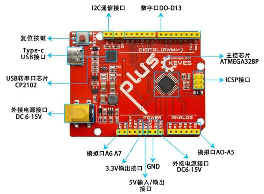

它具有14个数字输入/输出引脚（其中6个可用作PWM输出），8个模拟输入，一个16 MHz石英晶体，一个USB连接，一个电源插孔，1个ICSP接头和一个复位按钮。

它包含支持微控制器所需的一切；只需使用USB电缆将其连接到计算机，或使用AC-DC适配器或电池为其供电即可开始使用。

|微控制器|ATmega328P-PU|
|-|-|
|工作电压|5V|
|外接电压端口输入电压|DC7-12V|
|数字引脚|14 (D0-D13) (其中包含6个PWM输出口)|
|PWM引脚|6 个(D3, D5, D6, D9, D10, D11)|
|模拟输入引脚|6 个(A0-A5)|
|每个I / O引脚的直流电流|20 mA|
|3.3V引脚的直流电流|50 mA|
|5V引脚的直流电流|最大2A|
|Flash Memory|32 KB（其中引导程序使用0.5 KB）|
|SRAM|2 KB (ATmega328P-PU)|
|EEPROM|1 KB (ATmega328P-PU)|
|时钟频率|16 MHz|
|LED按键|D13|

（3）安装开发板驱动文件

接下来是开发板驱动的安装，这次我们安装的是Keyes Uno Plus
开发板的驱动，这个开发板的USB转串口芯片是CP2102。在ARDUINO
开发软件1.8以上的版本里就已经包含了这个芯片的驱动程序，这样我们使用起来会非常方便。一般插上USB，电脑就会识别到硬件，WINDOWS就会自动安装CP2102的驱动。


如果驱动安装不成功，或者你想手动安装驱动，请打开电脑的设备管理器

显示CP2102的驱动没有安装成功，有一个黄色的感叹号。我们双击硬件更新驱动


浏览计算机查找驱动程序，先找到我们安装或者下载的ARDUINO开发软件，


里面有个DIRVERS文件夹，打开文件夹就能看到CP210X系列芯片的驱动，


我们选择这个文件夹，然后点击确定，驱动安装成功。


这个时候再打开设备管理器，我就可以看到CP2102的驱动程序已经安装成功了，刚刚的那个黄色的感叹号不见了。

（4）Arduino IDE设置和工具栏介绍

装好了开发板的驱动，我们下面要了解Arduino开发软件的使用了，首先我们点击电脑桌面上的图标，打开Arduino IDE。


为了避免在将程序上载到板上时出现任何错误，必须选择正确的Arduino板名称，该名称与连接到计算机的电路板相匹配。转到Tools→Board，然后选择你的板。


然后再选择正确的COM口（安装驱动成功后可看到对应COM口）。


我们的程序上传到板之前，我们必须演示Arduino IDE工具栏中出现的每个符号的功能。


A - 用于检查是否存在任何编译错误。

B - 用于将程序上传到Arduino板。

C - 用于创建新草图的快捷方式。

D - 用于直接打开示例草图之一。

E - 用于保存草图。

F - 用于从板接收串行数据并将串行数据发送到板的串行监视器。

### 库文件的添加

把库文件复制到Arduino IDE软件目录下的libraries文件夹中即可。


（6）启动你的第一个程序

上面我们学习了怎么下载软件和安装开发板的驱动，那下面我们就开始正式开始第一个程序，打开文件选择例子，选择第一个文件BASIC里面的BLINK程序


按照前面方法设置板和COM口，IDE右下角显示对应板和COM口。


点击图标开始编译程序，检查错误，检查无误。


点击点击图标开始上传程序，上传成功。


程序上传成功，板载的LED灯亮一秒钟，灭一秒钟，恭喜你的第一个程序完成了！

## 多功能小乌龟智能车安装

安装1

安装所需零件


安装（丝印A,B字母朝上）


完成


安装2

安装所需零件


安装（注意电机对应位置）


完成 
安装3

安装所需零件 

安装 

完成


安装完后需先给A，B电机插线


循迹传感器插线


安装4

安装所需零件


安装 

完成


安装5

安装所需零件


分步安装1


分步安装2（安装时需要安图所示90°朝前安装）


完成

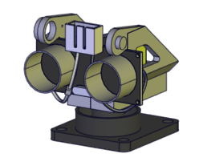

安装6

安装所需零件


安装


完成


安装7

安装所需零件


安装


完成


安装8

安装所需零件

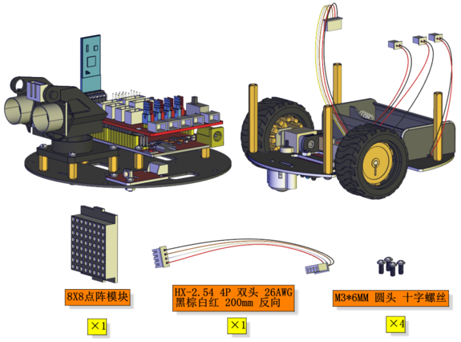

安装（安装前先按图穿线）

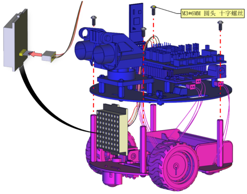

完成


安装部分完成后进行接线

电机A接线图


电机B接线图

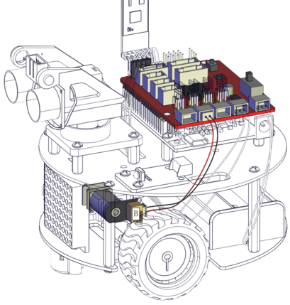

循迹传感器接线图


超声波接线图


点阵接线图


舵机接线图


红外接收传感器接线图


电池盒接线图


完成渲染效果图

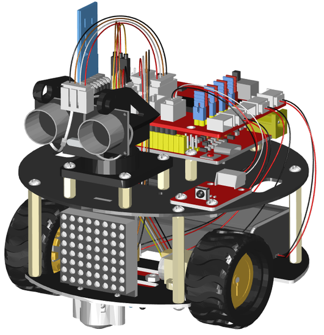

### 接线

把舵机接到驱动板的10号引脚后叠加到PULS控制板上如下图


### 上传程序

(1)复制下面的程序或者打开资料下的舵机复位程序

```
#define servoPin 10  //舵机接数字口10
int pos; //舵机的角度变量
int pulsewidth; //舵机的脉宽变量
void setup() {
  pinMode(servoPin, OUTPUT);  //舵机引脚设置为输出
  procedure(90); //设置舵机的角度为0度
}
void loop() {
   procedure(90);              // 转动到pos角度
}
//控制舵机的函数
void procedure(int myangle) {
  pulsewidth = myangle * 11 + 500;  //计算出脉宽值
  digitalWrite(servoPin, HIGH);
  delayMicroseconds(pulsewidth);   //高电平持续的时间，就是脉宽
  digitalWrite(servoPin, LOW);
  delay((20 - pulsewidth / 1000));  //周期是20ms，所以低电平持续剩下的时间
}
```


(2)开发板连接好电脑，选择好开发板和串口，点击上传程序，程序上传成功后舵机自动转到90度的位置

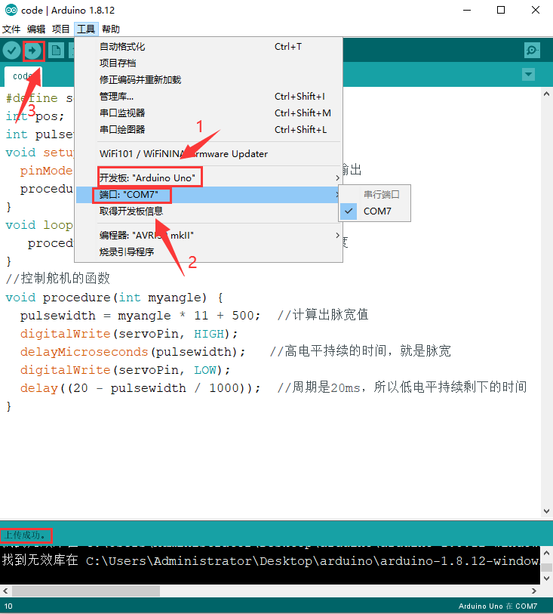

## 实验课程

keyes

### 第1课 LED灯项目

前面所有的东西都已经准备完毕，我们正式开始桌面小车的编程项目。前面我们从简单的传感器和模块开始，循序渐进完成模块传感器的测试项目，现在再来完成几个不同类型的机器人，最后我们把所有学到的知识结合到一起，完成一个综合的项目：多功能桌面小车。

注意：本项目中的各传感器/模块上标有（G）表示负极，是连接到控制板或传感器扩展板上的G或-或GND；标有（V）表示正极，是连接到控制板或扩展板上的V或VCC或+或5V。

项目介绍：

前面我们安装了keyes UNO Plus开发板的驱动。接下来的项目我们就要由简单到复杂，一步一步探索Arduino的世界了。首先我们要来完成经典的“Arduino点亮LED”，也就是Blink项目。Blink对于学习Arduino的爱好者而言，是最基础的项目是新手必须经历的一个练习。

LED
，发光二极管的简称。由含镓（Ga）、砷（As）、磷（P）、氮（N）等的化合物制成。当电子与空穴复合时能辐射出可见光，因而可以用来制成发光二极管。在电路及仪器中作为指示灯，或者组成文字或数字显示。

为了实验的方便，我们将LED发光二极管做成了一个模块，在第一个项目中，我们用一个最基本的测试代码来控制LED，亮一秒钟，灭一秒钟，来实现闪烁的效果。你可以改变代码中LED灯亮灭的时间，实现不同的闪烁效果。LED模块信号端S为高电平时LED亮起，S为低电平时LED熄灭。


LED模块参数：

控制接口: 数字口

工作电压: DC 3.3-5V

排针间距: 2.54mm

LED显示颜色：红色

项目组件：

|keyes UNO Plus开发板*1|Keyes brick L298P 电机驱动扩展板 V1*1|keyes 草帽LED白发红模块*1|
|-|-|-|
||||
|USB线*1|3Pin 双母头杜邦线*1|18650双节电池盒*1|18650电池*2 （电池自配）|
||||

接线图：


由上图我们可以看到，扩展板是堆叠在开发板上的，LED模块的-接到了扩展板的G,LED模块的+接到了扩展板的5V，LED模块的S已经接到了扩展板上的D9接口，接好线之后我们开始编写代码：

项目代码：

/\*

小乌龟智能车

课程1.1

LED闪烁

http://www.keyes-robot.com

\*/

void setup()

{

pinMode(9, OUTPUT);// 设置数字口9为输出模式

}

void loop() // 反复循环

{

digitalWrite(9, HIGH); // 设置数字口9为高电平，打开LED

delay(1000); // 等待1秒

digitalWrite(9, LOW); // 设置数字口9为低电平，关闭LED

delay(1000); // 等待1秒

}

//\*\*\*\*\*\*\*\*\*\*\*\*\*\*\*\*\*\*\*\*\*\*\*\*\*\*\*\*\*\*\*\*\*\*\*\*\*\*\*\*\*\*\*\*\*\*\*\*\*\*\*\*\*\*\*\*\*\*\*\*\*\*\*\*\*\*\*

项目结果：

点击上传程序，你应该看到D9脚接着的LED打开和关闭，而且间隔的时间是一秒钟。

代码说明:

pinMode(9，OUTPUT) -
在使用Arduino的引脚之前，你需要告诉开发板它是INPUT还是OUTPUT。我们使用一个内置的“函数”pinMode()来做到这一点。

digitalWrite(9，HIGH) -
当使用引脚作为OUTPUT时，可以将其命令为HIGH（输出5伏）或LOW（输出0伏）。

项目拓展：

前面我们控制了LED模块亮1秒钟,灭一秒钟
，现在我们来拓展一下思路，通过改变delay的时间来改变LED 灯闪烁的频率。

代码如下:

/\*

小乌龟智能车

课程1.2

LED闪烁

http://www.keyes-robot.com

\*/

void setup()

{

pinMode(9, OUTPUT);// 设置数字口9为输出模式

}

void loop() // 反复循环

{

digitalWrite(9, HIGH); // 设置数字口9为高电平，打开LED

delay(100); // 等待0.1秒

digitalWrite(9, LOW); // 设置数字口9为低电平，关闭LED

delay(100); // 等待0.1秒

}

//\*\*\*\*\*\*\*\*\*\*\*\*\*\*\*\*\*\*\*\*\*\*\*\*\*\*\*\*\*\*\*\*\*\*\*\*\*\*\*\*\*\*\*\*\*\*\*\*\*\*\*\*\*\*\*\*\*\*\*\*\*\*\*\*

怎么样是不是很好理解，就是通过改变delay
这个代码的时间，来改变3脚LED亮和灭的频率，不多说，我们上传代码。看看这个LED灯闪烁的频率是不是比之前快了？

### 第2课 LED 亮度的调节 

项目介绍：

前面课程中，我们详细的介绍了通过代码控制LED亮灭，实现闪烁的效果。这节课我们使用PWM来控制LED亮度不断地变化，模拟我们呼吸的效果。

PWM是使用数字手段来控制模拟输出的一种手段。使用数字控制产生占空比不同的方波（一个不停在高电平与低电平之间切换的信号)来控制模拟输出。一般来说端口的输入电压只有两个0V与5V。如果想要改变灯的亮度怎么办呢个？有同学说串联电阻，对，这个方法是正确的。但是，如果想要得到不同的亮度，且在不同亮度之间来回变动怎么办呢？不可能不停地切换电阻吧。这种情况下就需要使用PWM了，那它是怎么控制的呢？


对于Arduino的数字端口电压输出只有LOW与HIGH两个，对应的就是0V与5V的电压输出，可以把LOW定义为0，HIGH定义为1，1秒内让Arduino输出500个0或者1的信号。如果这500个全部为1，那就是完整的5V，如果全部为0，那就是0V。如果010101010101这样输出，刚好一半，端口输出的平均电压就为2.5V了。这个和放映电影是一个道理，咱们所看的电影并不是完全连续的，它其实是每秒输出25张图片。在这种情况下，人的肉眼是分辨不出来的，看上去就是连续的了。PWM也是同样的道理，如果想要不同的电压，就控制0与1的输出比例控制就可以了。当然这和真实的连续输出还是有差别的，单位时间内输出的0,1信号越多，控制的就越精确。

项目组件：

|keyes UNO Plus 开发板*1|Keyes brick L298P 电机驱动扩展板 V1*1|keyes 草帽LED白发红模块*1|
|-|-|-|
||||
|USB线*1|3Pin 双母头杜邦线*1|18650双节电池盒*1|18650电池*2 （电池自配）|
||||

接线图：

Arduino的PWM引脚在3，5，6，9，10，11,上一小节的接线刚刚好在9脚，所以我们这个接线不用变


项目代码：

我们来看Arduino代码:

int ledPin = 9; // 定义LED灯接数字口9

int brightness;

void setup () {

pinMode (ledPin, OUTPUT); //初始化LED为输出模式

}

void loop () {

for (brightness = 0; brightness \< 255; brightness = brightness + 1) {

analogWrite (ledPin, brightness); //变亮

delay (5); // 延迟5ms

}

for (brightness = 255; brightness \> 0; brightness = brightness - 1) {

analogWrite (ledPin, brightness); //变暗

delay (5); // 延迟5ms

}

}

项目结果：

代码下载完成后，我们可以看到LED会有个逐渐由亮到灭的一个缓慢过程，而不是直接的亮灭，如同呼吸一般，均匀变化。

代码说明:

当我们需要重复执行某句话时，我们可以使用for语句。

for语句格式如下：


for循环顺序如下：

第一轮：1 → 2 → 3 → 4

第二轮：2 → 3 → 4

…

直到2不成立，for循环结束。

知道了这么个顺序之后，回到代码中：

for (int value = 0; value \< 255; value=value+1){

...}

for (int value = 255; value \>0; value=value-1){

...}

这两个for语句实现了value的值不断由0增加到255，随之在从255减到0，在增加到255……,无限循环下去。

再看下for里面，涉及一个新函数analogWrite()。

我们知道数字口只有0和1两个状态，那如何发送一个模拟值到一个数字引脚呢？就要用到该函数。观察一下Arduino板，查看数字引脚，你会发现其中6个引脚旁标有“~”，这些引脚不同于其他引脚，它们可以输出PWM信号。

函数格式如下：

analogWrite(pin,value)

analogWrite()函数用于给PWM口写入一个0~255的模拟值。所以，value是在0~255之间的值。特别注意的是，analogWrite()函数只能写入具有PWM功能的数字引脚，也就是3，5，6，9，10，11引脚。

PWM是一项通过数字方法来获得模拟量的技术。数字控制来形成一个方波，方波信号只有开关两种状态（也就是我们数字引脚的高低）。通过控制开与关所持续时间的比值就能模拟到一个0到5V之间变化的电压。开（学术上称为高电平）所占用的时间就叫做脉冲宽度，所以PWM也叫做脉冲宽度调制。

通过下面五个方波来更形象的了解一下PWM。


PWM示意图

上图绿色竖线代表方波的一个周期。每个analogWrite(value)中写入的value都能对应一个百分比，这个百分比也称为占空比(Duty Cycle)，指的是高电平在周期内占的时间比值，也就是：占空比=高电平时间 /
周期时间。图中，从上往下，第一个方波，占空比为0%，对应的value为0。LED亮度最低，也就是灭的状态。高电平持续时间越长，也就越亮。所以，最后一个占空比为100%的对应value是255，LED最亮。50%就是最亮的一半了，25%则相对更暗。

PWM比较多的用于调节LED灯的亮度。或者是电机的转动速度，电机带动的车轮速度也就能很容易控制了，在玩一些Arduino机器人时，更能体现PWM的好处。

项目拓展：

我们不改变灯的脚位，只是改变程序里面delay的值，看看它如何改变渐变效果。

/\*

小乌龟智能车

课程2.2

呼吸灯

http://www.keyes-robot.com

\*/

int ledPin = 9; // 定义LED灯接数字口9

void setup () {

pinMode (ledPin, OUTPUT); //初始化LED为输出模式

}

void loop () {

for (int brightness = 0; brightness \< 255; brightness = brightness + 1)
{

analogWrite (ledPin, brightness); //变亮

delay (30); // 延迟30ms

}

for (int brightness = 255; brightness \> 0; brightness = brightness - 1)
{

analogWrite (ledPin, brightness); //变暗

delay (30); // 延迟30ms

}

}

//\*\*\*\*\*\*\*\*\*\*\*\*\*\*\*\*\*\*\*\*\*\*\*\*\*\*\*\*\*\*\*\*\*\*\*\*\*\*\*\*\*\*\*\*\*\*\*\*\*\*\*\*\*\*\*\*\*\*

上传代码到开发板，看LED渐变的效果是不是慢了一些。

### 第3课 循迹传感器项目 

项目介绍：


这个3路循迹传感器模块上自带有三个电位器，用于调节循迹传感器敏感度。循迹传感器其实也是红外传感器，这里的循迹传感器模块用到的元件是TCRT5000红外对管，TCRT5000红外对管具有一个高发射功率红外发射二极管和一个高灵敏度红外接收管。当发射管的红外信号经反射被接收管接收后，接收管的电阻会发生变化，在电路上一般以电压的变化体现出来。电阻的变化取决于接收管所接收的红外信号强度，常表现在反射面的颜色和反射面接收管的距离。在检测的时候，黑色高电平有效，白色是为低电平有效。

红外对管寻迹：

当乌龟车在白色底面行驶时，装在车下的红外发射管发射红外信号，经白色发射后，被接收管接收，一旦接收管接收到信号，输出端将输出低电平（0）；当乌龟车行驶到黑线时，红外线信号被黑色吸收后，将输出高电平（1），从而实现了通过红外线检测信号的功能。将检测到的信号送到单片机的I/O口，当I/O口检测到的信号为高电平（1）时，表明乌龟车处于黑色的引线上；同理，当I/O口检测到的信号为低电平（0）时，表明乌龟车处于白色地面上。

参数：

工作电压：DC 3.3-5V

接口：5PIN接口（PH2.0mm-5P 卧贴插座 ）

输出信号：数字信号

检测高度：0—3cm

尺寸：40\*32\*9mm

重量：6.8g

定位孔大小：直径3mm


项目组件：

|keyes UNO Plus 开发板*1|Keyes brick L298P 电机驱动扩展板 V1*1|keyes 草帽LED白发红模块*1|Keyes connectors 循迹传感器*1|
|-|-|-|-|
||||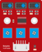|
|XH2.54转PH2.0 5P 连接线*1|3Pin 双母头杜邦线*1|USB线*1|18650双节电池盒*1|18650电池*2 （电池自配）|
|||||

接线图:


循迹传感器接扩展板的D11、D7、D8引脚（左11，中7，右8）。

项目代码：

/\*

小乌龟智能车

课程3.1

循迹传感器

http://www.keyes-robot.com

\*/

int L_pin = 11; //左边循迹传感器的引脚接数字口11

int M_pin = 7; //中间循迹传感器的引脚接数字口7

int R_pin = 8; //右边循迹传感器的引脚接数字口8

int val_L, val_R, val_M; // 定义三个传感器的变量值

void setup()

{

Serial.begin(9600); // 启动串口监视器，并设置波特率为9600

pinMode(L_pin, INPUT); // 左边循迹传感器设置为输入

pinMode(M_pin, INPUT); // 中考循迹传感器设置为输入

pinMode(R_pin, INPUT); // 右边循迹传感器设置为输入

}

void loop()

{

val_L = digitalRead(L_pin);//读取左边传感器的值

val_R = digitalRead(R_pin);//读取右边传感器的值

val_M = digitalRead(M_pin);//读取中间传感器的值

Serial.print("left:");

Serial.print(val_L);

Serial.print(" middle:");

Serial.print(val_M);

Serial.print(" right:");

Serial.println(val_R);

delay(500);// 延迟500ms

}

//\*\*\*\*\*\*\*\*\*\*\*\*\*\*\*\*\*\*\*\*\*\*\*\*\*\*\*\*\*\*\*\*\*\*\*\*\*\*\*\*\*\*\*\*\*\*\*\*\*\*\*\*\*\*\*\*\*\*\*\*\*\*\*\*\*\*\*\*\*\*\*\*\*\*\*\*

项目结果：

上传代码带开发板，打开串口监视，设置波特率为9600。可以看到左中右三个循迹传感器的状态，在没有接收到信号的时候，三个传感器都是高电平状态，显示的数值是1。如果我们用白纸去遮挡传感器，传感器的状态都变成了0。


代码说明：

Serial.begin(9600)-初始化串口,串口通信波特率为9600  ，

pinMode- 定义单片机PIN脚模式是输入还是输出，input是输入，output是输出，

digitalRead-读取引脚电平状态，一般有两种状态，HIGH或者LOW。

项目拓展：

上面我们了解了循迹传感器的工作原理，接下来我们在第9脚接上一个LED
灯，然后通过读取循迹传感器的状态，来控制LED的亮和灭。如下图接线：


我们开始来编写代码：

/\*

小乌龟智能车

课程3.2

循迹传感器

http://www.keyes-robot.com

\*/

int L_pin = 11; //左边循迹传感器的引脚接数字口11

int M_pin = 7; //中间循迹传感器的引脚接数字口7

int R_pin = 8; //右边循迹传感器的引脚接数字口8

int val_L, val_R, val_M; // 定义三个传感器的变量值

void setup()

{

Serial.begin(9600); // 启动串口监视器，并设置波特率为9600

pinMode(L_pin, INPUT); // 左边循迹传感器设置为输入

pinMode(M_pin, INPUT); // 中考循迹传感器设置为输入

pinMode(R_pin, INPUT); // 右边循迹传感器设置为输入

pinMode(9, OUTPUT);

}

void loop() {

val_L = digitalRead(L_pin);//读取左边传感器的值

val_R = digitalRead(R_pin);//读取右边传感器的值

val_M = digitalRead(M_pin);//读取中间传感器的值

Serial.print("left:");

Serial.print(val_L);

Serial.print(" middle:");

Serial.print(val_M);

Serial.print(" right:");

Serial.println(val_R);

if (val_L == LOW || val_M == LOW || val_R == LOW) //检测到信号

{

digitalWrite(9, HIGH);//LED 灯亮

}

else//如果没有检测到信号

{

digitalWrite(9, LOW);//LED 灯灭

}

}

//\*\*\*\*\*\*\*\*\*\*\*\*\*\*\*\*\*\*\*\*\*\*\*\*\*\*\*\*\*\*\*\*\*\*\*\*\*\*\*\*\*\*\*\*\*\*\*\*\*\*\*\*\*\*\*\*\*\*\*\*\*\*\*\*\*\*\*\*\*\*\*\*\*\*\*\*

上传代码到开发板，用我们的手去一个个的靠近传感器，我们看看LED灯的状态发生了改变没有？当我们用手去遮挡循迹传感器的时候，我们可以看到LED灯亮起来了。

### 第4课 舵机控制项目 


项目介绍：

舵机是一种位置伺服的驱动器，主要是由外壳、电路板、无核心马达、齿轮与位置检测器所构成。其工作原理是由接收机或者单片机发出信号给舵机，其内部有一个基准电路，产生周期为20ms，宽度为1.5ms
的基准信号，将获得的直流偏置电压与电位器的电压比较，获得电压差输出。

舵机有很多规格，但所有的舵机都有外接三根线，分别用棕、红、橙三种颜色进行区分，由于舵机品牌不同，颜色也会有所差异，棕色为接地线，红色为电源正极线，橙色为信号线。

舵机的转动的角度是通过调节PWM（脉冲宽度调制）信号的占空比来实现的，标准PWM（脉冲宽度调制）信号的周期固定为20ms（50Hz），理论上脉宽分布应在1ms到2ms
之间，但是，事实上脉宽可由0.5ms 到2.5ms
之间，脉宽和舵机的转角0°～180°相对应。


对应的舵机角度值如下:

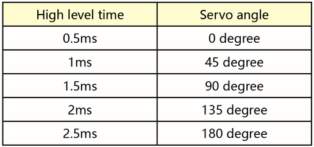

舵机参数：

工作电压：DC 4.8V〜6V

可操作角度范围：大约 About 180°(在 500→2500 μsec)

脉波宽度范围：500→2500 μsec

空载转速：0.12±0.01 sec/60（DC 4.8V） 0.1±0.01 sec/60（DC 6V）

空载电流：200±20mA（DC 4.8V） 220±20mA（DC 6V）

停止扭力：1.3±0.01kg·cm（DC 4.8V） 1.5±0.1kg·cm（DC 6V）

停止电流：≦850mA（DC 4.8V） ≦1000mA（DC 6V）

待机电流：3±1mA（DC 4.8V） 4±1mA（DC 6V）

项目组件：

|keyes UNO Plus 开发板*1|Keyes brick L298P 电机驱动扩展板 V1*1|Keyes SG90 9G 舵机|
|-|-|-|
||||
|USB线*1|18650双节电池盒*1|18650电池*2 （电池自配）|
|||

接线图：

接线注意：舵机连接到G（GND）、V（VCC）、10，舵机的棕色线是与Gnd(G)相连，红色线与5v(V)相连，橙色线是与数字10相连的。接舵机的时候必须要外接供电，因为驱动舵机的电流要求比较大，一般峰值的情况下接近1A，开发板的电流远远不够。如果不接外接电源，很有可能烧坏开发板。


项目代码1：

/\*

小乌龟智能车

课程4.1

伺服舵机

http://www.keyes-robot.com

\*/

\#define servoPin 10 //舵机接数字口10

int pos; //舵机的角度变量

int pulsewidth; //舵机的脉宽变量

void setup() {

pinMode(servoPin, OUTPUT); //舵机引脚设置为输出

procedure(0); //设置舵机的角度为0度

}

void loop() {

for (pos = 0; pos \<= 180; pos += 1) { // 从0到180度

procedure(pos); // 转动到pos角度

delay(15); //控制舵机转动的速度

}

for (pos = 180; pos \>= 0; pos -= 1) { // 从180到0度

procedure(pos); // 转动到pos角度

delay(15);

}

}

//控制舵机的函数

void procedure(int myangle) {

pulsewidth = myangle \* 11 + 500; //计算出脉宽值

digitalWrite(servoPin, HIGH);

delayMicroseconds(pulsewidth); //高电平持续的时间，就是脉宽

digitalWrite(servoPin, LOW);

delay((20 - pulsewidth / 1000)); //周期是20ms，所以低电平持续剩下的时间

}

//\*\*\*\*\*\*\*\*\*\*\*\*\*\*\*\*\*\*\*\*\*\*\*\*\*\*\*\*\*\*\*\*\*\*\*\*\*\*\*\*\*\*\*\*\*\*\*\*\*\*\*\*\*\*\*\*\*\*\*\*\*\*\*\*\*\*\*\*\*\*\*\*\*\*\*\*\*\*\*\*\*\*

在上传代码成功，我们可以看到舵机在0°到180°角度范围来回摆动。

其实我们还可以有一种更简单的方法控制舵机，就是使用Arduino的舵机库文件，可以参考Arduino
官方的使用说明：<https://www.arduino.cc/en/Reference/Servo>，

以下是使用了舵机库文件的程序,接线图不变


项目代码2:

/\*

小乌龟智能车

课程4.2

伺服舵机

http://www.keyes-robot.com

\*/

\#include \<Servo.h\>

Servo myservo; // 创建舵机类实例

int pos = 0; // 舵机角度变量

void setup() {

myservo.attach(10); // 舵机接数字口10

}

void loop() {

for (pos = 0; pos \<= 180; pos += 1) { // 从0到180度

// in steps of 1 degree

myservo.write(pos); // 转动到pos角度位置

delay(15); // 等待15ms以控制舵机转动速度

}

for (pos = 180; pos \>= 0; pos -= 1) { // 从180到0度

myservo.write(pos); // 转动到pos角度位置

delay(15); // 等待15ms以控制舵机转动速度

}

}

//\*\*\*\*\*\*\*\*\*\*\*\*\*\*\*\*\*\*\*\*\*\*\*\*\*\*\*\*\*\*\*\*\*\*\*\*\*\*\*\*\*\*\*\*\*\*\*\*\*\*\*\*\*\*\*\*\*\*\*\*\*\*\*\*\*\*\*\*\*\*\*\*\*\*

项目结果：

上传代码成功，上电后，舵机也是在0°到180°角度范围来回摆动。这两个项目的效果是一样的
，通常我们使用库文件来控制的比较多。

代码说明:

\#include
\<Servo.h\>是Arduino自带的Servo函数及其语句，下面是舵机函数的几个常用语句：  
1、attach（接口）——设定舵机的接口，只有9或10接口可用。  
2、write（角度）——用于设定舵机旋转角度的语句，可设定的角度范围是0°到180°。  
3、read（）——用于读取舵机角度的语句，可理解为读取最后一条write()命令中的值。  
4、attached（）——判断舵机参数是否已发送到舵机所在接口。  
注：以上语句的书写格式均为“舵机变量名.具体语句（）”例如：myservo.attach(9)。

### 第5课 超声波模块项目 

项目介绍：

超声波传感器，它可以检测前方是否存在障碍物，并且检测出传感器与障碍物的详细距离。它的原理和蝙蝠飞行的原理一样，就是超声波模块发送出一种频率很高，人体无法听到的超声波信号。这些超声波的信号若是碰到障碍物，就会立刻反射回来，在接收到返回的信息之后，通过判断发射信号和接收信号的时间差，计算出传感器和障碍物的距离。

超声波参数：


工作电压：DC 5V

工作电流：15mA

工作频率：40khz

最大探测距离：3-4m

最小探测距离：2cm

感应角度：不大于15度

高精度：可达3mm

项目组件：

|keyes UNO Plus 开发板*1|Keyes brick L298P 电机驱动扩展板 V1*1|keyes 草帽LED白发红模块*1|HC-SR04超声波传感器*1|
|-|-|-|-|
|||||
|HX-2.54 4P 双头 连接线*1|3Pin 双母头杜邦线*1|USB线*1|18650双节电池盒*1|18650电池*2 （电池自配）|
|||||

超声波模块知识：

原理：看超声波的图可知，像是有两个眼睛，其一边是发射超声的，一边是接收超声波的，然后检测从发射遇到障碍物返回被接收到所需的时间t，再根据声音在空气中的传播速度大概是343m/s,
距离 = 速度 \* 时间 ，
由于超声波发射返回是两段路程了，所以需要除以2，故超声波测到的 距离
=（速度 \* 时间）/2

超声波模块的使用方法及时序图：

1、使用GPIO引脚给SR04的Trig引脚至少10μs的高电平信号，触发SR04模块测距功能；

2、触发后，模块会自动发送8个40KHz的超声波脉冲，并自动检测是否有信号返回。这步会由模块内部自动完成。

3、如有信号返回，Echo引脚会输出高电平，高电平持续的时间就是超声波从发射到返回的时间。


超声波模块的电路图


接线图：

接线注意：超声波传感器模块的VCC引脚连接至keyestudio V5
传感器扩展板的5v(V)，Trig引脚至数字12(S)，Echo引脚至数字13(S)，Gnd引脚至Gnd(G)。


项目代码：

/\*

小乌龟智能车

课程5.1

超声波传感器

http://www.keyes-robot.com

\*/

int trigPin = 12; // TRIG接数字口12

int echoPin = 13; // Echo接数字口13

long duration, cm, inches;

void setup() {

//启动串口

Serial.begin (9600);

//定义引脚模式

pinMode(trigPin, OUTPUT);//输出

pinMode(echoPin, INPUT);//输入

}

void loop() {

digitalWrite(trigPin, LOW);//拉低2us

delayMicroseconds(2);

digitalWrite(trigPin, HIGH);// 该传感器至少需要10us高电平触发

delayMicroseconds(10);

digitalWrite(trigPin, LOW);

// 读取echo高电平时间

duration = pulseIn(echoPin, HIGH);

// 转换成距离

cm = (duration / 2) / 29.1;

inches = (duration / 2) / 74;

Serial.print(inches);

Serial.print("in, ");

Serial.print(cm);

Serial.print("cm");

Serial.println();

delay(200);

}

//\*\*\*\*\*\*\*\*\*\*\*\*\*\*\*\*\*\*\*\*\*\*\*\*\*\*\*\*\*\*\*\*\*\*\*\*\*\*\*\*\*\*\*\*\*\*\*\*\*\*\*\*\*\*\*\*\*\*\*\*\*\*\*\*\*\*\*\*\*\*\*\*\*\*

项目结果：

上传好测试代码到开发板，打开串口监视器，设置波特率为9600，我们可以看到超声波模块显示的距离，单位是厘米和英寸。用手阻挡超声波模块，我们看到显示距离的数值变小了。

(注意：上传好程序，采用电池供电，把驱动板上的拨码开关拨到ON的位置，因为USB供电过低，超声波无法正常工作)


代码说明:

int trigPin- 这个是定义发射超声波的脚位，通常是输出，

int echoPin - 这个是定义接收超声波的脚位，通常是输入。

我们可以使用以下公式计算距离：

cm = (duration/2) / 29.1-

inches = (duration/2) / 74-

（9）项目拓展：

我们刚刚测出了超声波显示的距离，那我们动动脑筋，能不能用测出的距离来做一些控制呢，如果控制一个LED灯的亮和灭。我们来试一下，在D9脚接上一个LED灯模块。


/\*

小乌龟智能车

课程5.2

超声波传感器控制LED

http://www.keyes-robot.com

\*/

int trigPin = 12; // TRIG接数字口12

int echoPin = 13; // Echo接数字口13

long duration, cm, inches;

void setup() {

Serial.begin (9600); //启动串口

pinMode(trigPin, OUTPUT); //输出

pinMode(echoPin, INPUT);//输入

pinMode(9, OUTPUT);

}

void loop()

{

digitalWrite(trigPin, LOW);//拉低2us

delayMicroseconds(2);

digitalWrite(trigPin, HIGH);// 该传感器至少需要10us高电平触发

delayMicroseconds(10);

digitalWrite(trigPin, LOW);

// 读取echo高电平时间

duration = pulseIn(echoPin, HIGH);

// 转换成距离

cm = (duration / 2) / 29.1;

inches = (duration / 2) / 74;

Serial.print(inches);

Serial.print("in, ");

Serial.print(cm);

Serial.print("cm");

Serial.println();

delay(50);

if (cm \>= 2 && cm \<= 10) { //距离在2~10cm范围内，LED亮

digitalWrite(9, HIGH);

}

else { //否则LED灭

digitalWrite(9, LOW);

}

}

//\*\*\*\*\*\*\*\*\*\*\*\*\*\*\*\*\*\*\*\*\*\*\*\*\*\*\*\*\*\*\*\*\*\*\*\*\*\*\*\*\*\*\*\*\*\*\*\*\*\*\*\*\*\*\*\*\*\*\*\*\*\*\*\*

上传好测试代码到开发板，我们用手去靠近超声波传感器，看LED
灯亮起来了没有。

### 第6课 红外接收原理及应用

项目介绍：

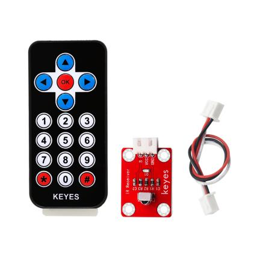红外遥控在日常生活中随处可见，它被用来控制各种家电，如电视、音响、录影机和卫星信号接收器。红外遥控是由红外发射和红外接收系统组成的，也就是一个红外遥控器和红外接收模块和一个能解码的单片机组成的。 

红外发射的遥控器发射的38K红外载波信号是由遥控器里的编码芯片对其进行编码。它是以一段引导码，用户码，数据码，数据反码组成，利用脉冲的时间间隔来区别是0还是1信号(高电平低电平之比约为1:1时被认为是信号0)，而编码就是由这些0
、1信号组成。同一个遥控器的用户码是不变的，用数据吗不同来分辨遥控器按的键不同。当按下遥控器按键时，遥控器发送出红外载波信号，红外接收器接收到信号时程序对载波信号进行解码，通过数据码的不同来判断按下的是哪个键。单片机由接收到的01信号进行解码，由此判断遥控器按下的是什么键。

红外接收我们用的是一个红外接收模块，主要由红外接收头组成，它是集接收、放大、解调一体的器件，它内部IC就已经完成了解调，能够完成从红外线接收到输出与TTL电平信号兼容的所有工作，输出的就是数字信号。他适用于红外线遥控和红外线数据传输。接收器做成的红外接收模块只有三个引脚，信号线，VCC，GND。与arduino和其他单片机连接通信非常方便。

红外接收的参数：

工作电压：3.3-5V（DC）

接口：3PIN接口

输出信号：数字信号

接收角度：90度

频率：38khz  
接收距离：3米

右图为红外接收模块的实物图和电路图

项目组件：

|keyes UNO Plus 开发板*1|Keyes brick L298P 电机驱动扩展板 V1*1|keyes 草帽LED白发红模块*1|keyes brick 红外接收传感器*1|JMP-1 17键红外遥控*1|
|-|-|-|-|-|
||||||
|USB线*1|3Pin 双母头杜邦线*1|XH2.54-3Pin+杜邦母双*1|18650双节电池盒*1|18650电池*2 （电池自配）|
|||||

接线图：

接线注意：由于红外接收传感器输入的数字信号，将红外接收传感器模块的“-”、“+”和S引脚分别用导线连接到keyestudio传感器扩展板G（GND）、V（VCC）、A1，模拟口在数字口不够的情况下，模拟口也可以当数字口使用，模拟口A0相当于数字口14，A1相当于数字口15，以此类推。


项目代码：

在编写代码之前，要先导入红外的库文件，具体步骤请参考，（如何导入arduino库文件）这个文档。

/\*

小乌龟智能车

课程6.1

红外接收

http://www.keyes-robot.com

\*/

\#include \<IRremote.h\> // IRremote库声明

int RECV_PIN = A1; //定义红外接收器的引脚为A1

IRrecv irrecv(RECV_PIN);

decode_results results; //解码结果放在 decode results结构的 result中

void setup()

{

Serial.begin(9600);

irrecv.enableIRIn(); // 启动接收器

}

void loop() {

if (irrecv.decode(&results))//解码成功，收到一组红外讯号

{

Serial.println(results.value, HEX);//以16进制换行输出接收代码

irrecv.resume(); // 接收下一个值

}

delay(100);

}

//\*\*\*\*\*\*\*\*\*\*\*\*\*\*\*\*\*\*\*\*\*\*\*\*\*\*\*\*\*\*\*\*\*\*\*\*\*\*\*\*\*\*\*\*\*\*\*\*\*\*\*\*\*\*\*

项目结果：

上传好测试代码，打开串口监视器，设置波特率为9600，拿出遥控器，对准红外接收传感器发送信号，即可看相应按键的键值，如果按键时间过长，容易出现乱码。


我们通过测试得出的数值，做了一个遥控器按键值表，方便以后使用。


代码说明：

irrecv.enableIRIn()-启动红外解码后，这时候IRrecv对象会在后台接收红外线信号。

decode()-接着就可以利用decode()函数持续检查，看看有没有解码成功。

irrecv.decode(&results)  解码成功，这个函数会返回true，并把结果放在results里面，在解码一个红外线信号之后，要运行resume()函数，这样才会持续接收下一组信号。

项目拓展：

我们刚刚解码了红外遥控器的按键值，那我们能不能用测出的按键值来做一些控制呢，如果控制一个LED灯的亮和灭。我们来试一下，在9脚接上一个LED灯模块。红外接收器的脚位不变,当有遥控器的按键按下时,接在数字引脚9上的发光LED就会点亮，再按一下按键，led熄灭，接线图如下：


/\*

小乌龟智能车

课程6.2

红外控制LED

http://www.keyes-robot.com

\*/

\#include \<IRremote.h\>

int RECV_PIN = A1;//定义红外接收器的引脚为A1

int LED_PIN = 9; //定义发光LED引脚数字9

int a = 0;

IRrecv irrecv(RECV_PIN);

decode_results results;

void setup()

{

Serial.begin(9600);

irrecv.enableIRIn(); // 初始化红外接收器

pinMode(LED_PIN, OUTPUT); //设置发光LED引脚数字4

}

void loop() {

if (irrecv.decode(&results)) {

Serial.println(results.value, HEX);

if (results.value == 0xFF02FD & a == 0)
//由上面的键值码，我们用的遥控器上的OK键，如果按下OK键

{

digitalWrite(LED_PIN, HIGH); //LED点亮

a = 1;

}

else if (results.value == 0xFF02FD & a == 1) //再按一下

{

digitalWrite(LED_PIN, LOW); //LED熄灭

a = 0;

}

irrecv.resume(); // 接收下一个值

}

}

//\*\*\*\*\*\*\*\*\*\*\*\*\*\*\*\*\*\*\*\*\*\*\*\*\*\*\*\*\*\*\*\*\*\*\*\*\*\*\*\*\*\*\*\*\*\*\*\*\*\*\*\*\*\*\*\*\*\*\*\*\*\*\*\*\*\*\*\*\*\*\*\*\*\*\*\*\*\*\*\*\*\*

上传代码带开发板,当遥控器按下OK按键时,LED就会亮，再按一下LED就会灭,同时电脑的串口会出现按键的命令编码.

### 第7课 蓝牙遥控的原理及应用


项目介绍：

蓝牙是一种无线数据传输方法。蓝牙技术是一种无线标准技术，可实现固定设备、移动设备和楼宇个人域网之间的短距离数据交换，DX-
-BT24 5. 1蓝牙模块采用英国 DAILOG公司14531芯片，配置256Kb 空间，遵循V5.1 BLE蓝牙规范。支持AT指令，用户可根据需要更改串口波特率、设备名称等参数，使用灵活。.本模块支持UART接口,并支持蓝牙串口透传，具有成本低、体积小、功耗低、收发灵敏性高等优点，只需配备少许的外围元件就能实现其强大功能。

蓝牙参数：

蓝牙协议：Bluetooth Specification V5.1 BLE

工作距离：在开放环境中，实现40m超远距离通讯

工作频率：2.4GHz ISM频段

通信接口：UART

蓝牙认证：符合FCC CE ROHS REACH认证标准

串口参数：9600、8数据位、1停止位、无效位、无流控

电源：5V DC

工作温度：–10至+65摄氏度

项目组件：

|keyes UNO Plus 开发板*1|Keyes brick L298P 电机驱动扩展板 V1*1|keyes 草帽LED白发红模块*1|DX-BT24 V5. 1 BLE蓝牙模块|
|-|-|-|-|
|||||
|3Pin 双母头杜邦线*1|USB线*1|18650双节电池盒*1|18650电池*2 （电池自配）|
||||

接线图：

1.STATE：状态测试引脚，连接到内部LED，通常保持其未连接。

2.RXD：串行接口，接收终端。

3.TXD：串行接口，传输终端。

4.GND：接地。

5.VCC：电源的正极。

6.EN/BRK：断开连接，表示断开蓝牙连接，一般情况下，保持断开连接。

蓝牙是直接插在电机驱动扩展板上的，注意一下方向，而且在上传代码之前不要插上蓝牙。

项目代码：

/\*

小乌龟智能车

课程7.1

蓝牙

http://www.keyes-robot.com

\*/

char ble_val; //字符变量，用于存放蓝牙接收到的值

void setup() {

Serial.begin(9600);

}

void loop() {

if (Serial.available() \> 0) //判断串口缓存区是否有数据

{

ble_val = Serial.read(); //读取串口缓存区的数据

Serial.println(ble_val); //打印出来

}

}

//\*\*\*\*\*\*\*\*\*\*\*\*\*\*\*\*\*\*\*\*\*\*\*\*\*\*\*\*\*\*\*\*\*\*\*\*\*\*\*\*\*\*\*\*\*\*\*\*\*\*\*\*\*\*\*\*\*\*\*\*\*\*\*\*\*\*\*\*\*\*

（上传代码之前不要连接蓝牙模块，因为代码的上传也是用的串口通信，跟蓝牙的串口通信会有冲突，导致代码上传不成功）

上传代码到开发板，然后再插上蓝牙模块，等待手机发出的指令。

下载蓝牙测试APP：

安卓系统手机APP

1.  扫码下载或者进入APP下载链接：http://8.210.52.206/Turtle_Car.apk

注意：当我们扫码下载的时候需要使用浏览器打开，使用微信扫可能无效。

2.  下载后安装，安装成功，显示图标如下。


2.点击上图图标，进入APP，显示如下图。


3.REV4板上传代码成功后，连接蓝牙，上电后，蓝牙模块上LED闪烁。点击APP图标，搜索到蓝牙，显示如下图。


4.点击连接，蓝牙连接成功，显示如下图，蓝牙模块上LED变为常亮。


苹果系统手机APP

1.打开App Store。


2.点击搜索，搜索keyestudio，下载搜索到的keyes BT car。


3.打开keyes BT car。


4.开启手机蓝牙，点击左上角的connect按钮，进行蓝牙搜索和连接。

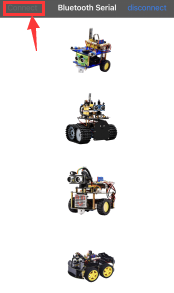

5.点击桌面小车的图片按钮，进入控制桌面小车的界面


代码说明：

Serial.available()
的意思是：返回串口缓冲区中当前剩余的字符个数。一般用这个函数来判断串口的缓冲区有无数据，当Serial.available()\>0时，说明串口接收到了数据，可以读取；

Serial.read()指从串口的缓冲区取出并读取一个Byte的数据，比如有设备通过串口向Arduino发送数据了，我们就可以用Serial.read()来读取发送的数据。

项目拓展：

上面的项目，我们讲解了蓝牙接收到手机发送的信号并且在开发板的串口显示出来，比如我们按下，然后我们就会接收到‘B’，当我们松开的时候又接收到‘S’。那接下来我们就要想一下了，我们可以利用接收到的信号去做一些事情吗，答案是肯定的，我们这里就利用手机发送的命令去打开或者关闭一个LED灯。看接线图，在D9脚接了一个LED。


/\*

小乌龟智能车

课程7.2

蓝牙控制LED

http://www.keyes-robot.com

\*/

int ledpin = 9;

void setup()

{

Serial.begin(9600);

pinMode(ledpin, OUTPUT);

}

void loop()

{

int i;

if (Serial.available())

{

i = Serial.read();

Serial.println("DATA RECEIVED:");

if (i == 'B')

{

digitalWrite(ledpin, HIGH);

Serial.println("led on");

}

if (i == 'S')

{

digitalWrite(ledpin, LOW);

Serial.println("led off");

}

}

}

//\*\*\*\*\*\*\*\*\*\*\*\*\*\*\*\*\*\*\*\*\*\*\*\*\*\*\*\*\*\*\*\*\*\*\*\*\*\*\*\*\*\*\*\*\*\*\*\*\*\*\*\*\*\*\*\*\*\*\*\*\*\*\*\*\*\*\*\*\*\*\*\*\*

上传代码完成后，点击手机APP
上以控制LED。当您按下发送\`\`B''时，LED将打开，而当您松开发送\`\`S''时，LED将关闭。


### 第8课 电机的驱动和调速 

项目介绍：

驱动电机的方法有很多，我们这个智能车用到的是最常用的L298P这个方案，
L298P是ST意法半导体公司出品的优秀大功率电机专用驱动芯片，可直接驱动直流电机、二相、四相步进电机，驱动电流达2A，电机输出端采用8只高速肖特基二极管作为保护。

我们根据L298P的电路设计了一款扩展板，叠层的设计可直接插接到开发板上使用，降低了用户使用和驱动电机的技术难度。我们来看一下这个板子的电路图和示意图：


为了调节小车上的4个电机，使得电机电机的驱动方向与后续的课程代码描述一致。驱动板上自带8个跳线帽，也可用于控制电机转向，例如当MA电机接口前方2个跳线帽由横向连接改为纵向连接时，MA电机的转动方向就和原来的转动方向相反。

规格参数：

逻辑部分输入电压：DC 5V

驱动部分输入电压：DC 7-12V

逻辑部分工作电流：\<36mA

驱动部分工作电流：\<2A

最大耗散功率：25W（T=75℃）

控制信号输入电平：高电平2.3V\<Vin\<5V  ，低电平-0.3V\<Vin\<1.5V  
工作温度：-25＋130℃

驱动小车运行原理：

根据上面电机驱动板的电路图和示意图，我们让A电机的方向引脚在D2,调速引脚在D6,B电机的方向引脚在D4，调速引脚在D5，按照以下表格的运动逻辑，我们就可以知道如何通过控制数字口，PWM口控制2个电机转动，从而实现智能小车的行走。其中PWM值范围为0-255，设置数字越大，电机转动越快。（左边A电机，右边B电机）

||D2|D6（PWM）|电机（A）|D4|D5（PWM）|电机（B）|
|-|-|-|-|-|-|-|
|前进|LOW|200|正转|LOW|200|正转|
|后退|HIGH|200|反转|HIGH|200|反转|
|右旋转|LOW|200|正转|HIGH|200|反转|
|左旋转|HIGH|200|反转|LOW|200|正转|
|停止|/|0|停止|/|0|停止|

项目组件：

|keyes UNO Plus 开发板*1|Keyes brick L298P 电机驱动扩展板 V1*1|Keyes quick connectors 12FN20电机连接板A*1|Keyes quick connectors 12FN20电机连接板B*1|
|-|-|-|-|
||||
|双头JST-PH2.0MM-2P*2|USB线|18650双节电池盒*1|18650电池*2 （电池自配）|
||||

接线图：


项目代码：

/\*

小乌龟智能车

课程8.1

电机驱动

http://www.keyes-robot.com

\*/

int MA = 2; //定义电机A方向控制引脚为D2

int PWMA = 6; //定义电机A速度控制引脚为D6

int MB = 4; //定义电机B方向控制引脚为D4

int PWMB = 5; //定义电机B速度控制引脚为D5

void setup() {

pinMode(MA, OUTPUT); //配置电机引脚为输出模式

pinMode(PWMA, OUTPUT);

pinMode(MB, OUTPUT);

pinMode(PWMB, OUTPUT);

}

void loop() {

//前进1秒

digitalWrite(MA, LOW); //电机A正转

analogWrite(PWMA, 200); //电机A速度为200

digitalWrite(MB, LOW); //电机B正转

analogWrite(PWMB, 200); //电机B速度为200

delay(1000);

//后退1秒

digitalWrite(MA, HIGH); //电机A反转

analogWrite(PWMA, 200); //电机A速度为200

digitalWrite(MB, HIGH); //电机B反转

analogWrite(PWMB, 200); //电机B速度为200

delay(1000);

//左转1秒

digitalWrite(MA, HIGH); //电机A反转

analogWrite(PWMA, 200); //电机A速度为200

digitalWrite(MB, LOW); //电机B正转

analogWrite(PWMB, 200); //电机B速度为200

delay(1000);

//右转1秒

digitalWrite(MA, LOW); //电机A正转

analogWrite(PWMA, 200); //电机A速度为200

digitalWrite(MB, HIGH); //电机B反转

analogWrite(PWMB, 200); //电机B速度为200

delay(1000);

//停止1秒

analogWrite(PWMA, 0);

analogWrite(PWMB, 0);

delay(1000);

}

//\*\*\*\*\*\*\*\*\*\*\*\*\*\*\*\*\*\*\*\*\*\*\*\*\*\*\*\*\*\*\*\*\*\*\*\*\*\*\*\*\*\*\*\*\*\*\*\*\*\*\*\*\*\*\*\*\*\*\*\*\*\*\*\*\*\*\*\*\*\*\*

项目结果：

上传代码成功，上电后，智能车前进1秒，后退1秒，左转1秒，右转1秒，停止1秒，循环。

代码说明：

digitalWrite(MB,LOW);
电机的正反转是靠高低电平的转换来实现的，控制电机正反转的脚位用一般的数字脚位就可以了。

analogWrite(PWMB,200);电机的速度调节是靠PWM来实现的，控制电机调速的脚位必须是Arduino
的PWM 脚位。

（9）项目拓展：

我们来通过调整PWM控制电机的速度，为后面我们控制车速做一个铺垫，接线不变

/\*

小乌龟智能车

课程8.2

电机驱动

http://www.keyes-robot.com

\*/

int MA = 2; //定义电机A方向控制引脚为D2

int PWMA = 6; //定义电机A速度控制引脚为D6

int MB = 4; //定义电机B方向控制引脚为D4

int PWMB = 5; //定义电机B速度控制引脚为D5

void setup() {

pinMode(MA, OUTPUT); //配置电机引脚为输出模式

pinMode(PWMA, OUTPUT);

pinMode(MB, OUTPUT);

pinMode(PWMB, OUTPUT);

}

void loop() {

//前进1秒

digitalWrite(MA, LOW); //电机A正转

analogWrite(PWMA, 100); //电机A速度为100

digitalWrite(MB, LOW); //电机B正转

analogWrite(PWMB, 100); //电机B速度为100

delay(1000);

//后退1秒

digitalWrite(MA, HIGH); //电机A反转

analogWrite(PWMA, 100); //电机A速度为100

digitalWrite(MB, HIGH); //电机B反转

analogWrite(PWMB, 100); //电机B速度为100

delay(1000);

//左转1秒

digitalWrite(MA, HIGH); //电机A反转

analogWrite(PWMA, 100); //电机A速度为100

digitalWrite(MB, LOW); //电机B正转

analogWrite(PWMB, 100); //电机B速度为100

delay(1000);

//右转1秒

digitalWrite(MA, LOW); //电机A正转

analogWrite(PWMA, 100); //电机A速度为100

digitalWrite(MB, HIGH); //电机B反转

analogWrite(PWMB, 100); //电机B速度为100

delay(1000);

//停止1秒

analogWrite(PWMA, 0);

analogWrite(PWMB, 0);

delay(1000);

}

//\*\*\*\*\*\*\*\*\*\*\*\*\*\*\*\*\*\*\*\*\*\*\*\*\*\*\*\*\*\*\*\*\*\*\*\*\*\*\*\*\*\*\*\*\*\*\*\*\*\*\*\*\*\*\*\*\*\*\*\*\*\*\*\*\*\*\*\*\*\*\*

上传代码成功，怎么样，电机转动的速度是不是慢了很多？

### 第9课 点亮8\*8点阵屏 

项目介绍：

制作小型显示器的一个有趣方法是使用8x8矩阵或4位7段显示器。像这样的矩阵是“多路复用的”——要控制64个LED，需要16个引脚。这需要很多引脚，还有像MAX7219这样的驱动芯片，可以为您控制矩阵，但是需要设置很多布线，它们占用了大量空间。毕竟，如果你能在没有大量布线的情况下控制一个矩阵，那不是很棒吗？这就是这些可爱的LED矩阵背包的用武之地。

在8X8点阵模块中，我们用HT16K33芯片来驱动点阵，有了它，我们只需要利用一个I2C通信接口（A4 SDA和A5 SCL）就可以控制一个8X8点阵了，不但方便了接线，而且节约可单片机资源。

项目组件：

|keyes UNO Plus 开发板*1|Keyes brick L298P 电机驱动扩展板 V1*1|Keyes brick 乌龟车用8X8点阵模块*1|
|-|-|-|
||||
|USB线*1|HX-2.54 4P 双头 26AWG*1|18650双节电池盒*1|18650电池*2 （电池自配）|
||||

8\*8点阵屏介绍 LED点阵屏由LED发光二极管组成，通过控制LED亮灭来显示文字、图片、动画、视频等，被广泛应用于公共场合做信息展示，如广告屏、公告牌等。

LED点阵屏按照LED发光颜色可分为单色、双色、三色灯等，可显示红、黄、绿甚至是真彩色。根据LED的数量又分为4×4、8×8、16×16等不同类型。这里我们通过单色8×8点阵屏来了解其原理。

不同点阵屏封装不同，8×8点阵屏由8行8列共64个LED灯组成，其内部结构如下图：


每个LED放置在行线和列线的交叉点上，当对应的某一行电平拉高，某一列电拉低，则对应交叉点的LED就会点亮。8×8点阵屏有16个管脚，将有丝印的一边朝下，逆时针编号为1.8，9.16。


其对应内部管脚定义如下如所示：


比如我们要点亮第一行第一列LED灯，则对应将点阵屏的第9脚拉高，第13脚拉低，其他LED控制以此类推即可。

HT16K33 8X8点阵驱动模块

上面介绍了8\*8点阵的原理，想控制8\*8点阵需要多达16个单片机的引脚。这样既浪费资源也浪费时间。我们这里用了一个驱动点阵屏的芯片：HT16K33。THT16K33是一款内存映射和多功能LED控制器驱动器。该设备的最大显示段数为128个模式（16个段和8个公共区），带有13\*3（最大）矩阵键扫描电路。HT16K33的软件配置功能使其适用于多个LED应用，包括LED模块和显示子系统。HT16K33与大多数微控制器兼容，并通过双线双向I2C总线进行通信。下图是HT16K33
芯片工作原理图。


我们基于以上原理设计了一个8X8点阵驱动模块，从上图我们可以看出，我们只要通过I2C
通讯利用单片机的2个引脚就可以很好的控制点阵显示。

8X8点阵模块的参数

工作电压: 5V    

额定输入频率: 400KHZ 

功率: 2.5W  

工作电流: 500mA  

取模工具的使用说明

点阵和驱动的原理都已经介绍完了，那点阵上显示的内容是怎么来的呢，有没有比较简便的方法？我们需要把一个图案转换成1组16个的16位数据，这里就需要用到一个取模软件,这个软件已放入资料文件夹中。使用时打开图标，显示如下图。


点击这个图标新建图案，根据显示屏规格，设置宽度为8，高度为8，如下图。


初始时发现格点不大，不方便设置，我们可以通过设置模拟动画，设置格点大小，点击如下图。


鼠标左键点击，就可以一直放大格点了。

放大后，我们就可以通过用鼠标点击白色区域，设置显示图案了。


设置时，鼠标点击（左右键都可以）白色格点，变为黑色；再点击黑色格点，变为白色。黑色代表该格点显示亮起，白色代表格点不显示。显示屏最多能设置8\*8个点显示。设置笑脸显示如下图。


设置参数设置，选择其他选项，设置如下图。设置完成点击。


设置取模方式，选择C51格式选择如下图。


设置成功后，在以下区域就可以看到对应的8个十六进制数据了，只需要将数据复制粘贴在数组中，就可以用直接调用了。（0x42,0xA5,0x00,0x00,0x18,0x42,0x3C,0x00）

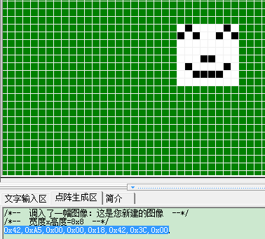

接线图：


接线注意：点阵屏模块的G、V、SDA、SCL引脚分别用导线连接到堆叠在keyes UNO Plus板上的电机驱动扩展板上的G、5V、A4、A5，电源接到BAT接口。

项目代码：

/\*

小乌龟智能车

课程9

8\*8点阵

http://www.keyes-robot.com

\*/

\#include \<Matrix.h\>

Matrix myMatrix(A4, A5);

uint8_t LedArray1\[8\] = {0x00,0x3c,0x42,0x00,0x00,0x00,0xa5,0x42};

uint8_t LEDArray\[8\];

void setup() {

myMatrix.begin(0x70);

myMatrix.clear();

myMatrix.setBrightness(5);//亮度5,范围0~15

}

void loop() {

for (int i = 0; i \< 8; i++)

{

LEDArray\[i\] = LedArray1\[i\];

for (int j = 7; j \>= 0; j--)

{

if ((LEDArray\[i\] & 0x01) \> 0)

myMatrix.drawPixel(j, i, 1);

LEDArray\[i\] = LEDArray\[i\] \>\> 1;

}

}

myMatrix.write();

}

（9）测试结果

上传代码成功，上电后，拨码开关拨打到“ON”端，8X8点阵显示笑脸图案。

项目拓展：

根据以上所学知识，我们来做个小题目。设置一个你喜欢的动态图案，在点阵屏显示（可参考实验）。

### 第10课 画地为牢小乌龟 

项目介绍：

前面我们详细的介绍了智能车上各个传感器、模块、扩展板的使用方法。在这里我们可以结合前面课程中知识制作一个循迹小乌龟智能车。实验中，我们通过循迹传感器检测智能车底部是否存在黑线，然后根据检测结果控制两个电机的转动，从而把智能车关在黑线圈中即画地为牢。

流程图：

画地为牢智能车具体逻辑如下表格。

|检测|中循迹传感器|检测到黑线：高电平|
|-|-|-|
|检测|中循迹传感器|检测到白线：低电平|
|检测|左循迹传感器|检测到黑线：高电平|
|检测|左循迹传感器|检测到白线：低电平|
|检测|右循迹传感器|检测到黑线：高电平|
|检测|右循迹传感器|检测到白线：低电平|
|条件|状态||
|左循迹传感器没检测到黑线且中循迹传感器没检测到黑线且右循迹传感器没检测到黑线|前进（PWM设为200）|
|左循迹传感器检测到黑线 或者中循迹传感器检测到黑线或者右循迹传感器检测到黑线|后退（PWM设为200） 然后左旋转（PWM设为200）|

按照前面思路设计好智能车后，我们就需要按照设计思路开始制作智能车。我们需要设计对应的接线，测试代码，然后接线上传代码，运行，确保智能车能够实现理想中的功能。

接线图：循迹模块+电机


接线注意：用导线把循迹模块连接到电机驱动扩展板上P1接口的G、V、D11、D7、D8；A、B两电机分别对应的连接到电机驱动扩展板上的接口A和接口B，电源接到BAT接口。

测试代码：

/\*

小乌龟智能车

课程10

画地为牢小乌龟

http://www.keyes-robot.com

\*/

int L_pin = 11; //定义左边传感器引脚为D11

int M_pin = 7; //定义中间传感器引脚为D7

int R_pin = 8; //定义右边传感器引脚为D8

int MA = 2; //定义电机A方向控制引脚为D2

int PWMA = 6; //定义电机A速度控制引脚为D6

int MB = 4; //定义电机A方向控制引脚为D4

int PWMB = 5; //定义电机A速度控制引脚为D5

int L_val, M_val, R_val;

void advance() { //小车前进

digitalWrite(MA, LOW); //电机A正转

analogWrite(PWMA, 200); //电机A速度为200

digitalWrite(MB, LOW); //电机B正转

analogWrite(PWMB, 200); //电机B速度为200

}

void back() { //小车后退

digitalWrite(MA, HIGH); //电机A反转

analogWrite(PWMA, 200); //电机A速度为200

digitalWrite(MB, HIGH); //电机B反转

analogWrite(PWMB, 200); //电机B速度为200

}

void turnL() { //小车左转

digitalWrite(MA, HIGH); //电机A反转

analogWrite(PWMA, 200); //电机A速度为200

digitalWrite(MB, LOW); //电机B正转

analogWrite(PWMB, 200); //电机B速度为200

}

void turnR() { //小车右转

digitalWrite(MA, LOW); //电机A正转

analogWrite(PWMA, 200); //电机A速度为200

digitalWrite(MB, HIGH); //电机B反转

analogWrite(PWMB, 200); //电机B速度为200

}

void stopp() { //小车停止

analogWrite(PWMA, 0); //电机A速度为0

analogWrite(PWMB, 0); //电机B速度为0

}

void setup() {

Serial.begin(9600); //设置波特率为9600

pinMode(L_pin, INPUT); //循迹传感器引脚都配置为输入模式

pinMode(M_pin, INPUT);

pinMode(R_pin, INPUT);

pinMode(MA, OUTPUT); //配置电机引脚为输出模式

pinMode(PWMA, OUTPUT);

pinMode(MB, OUTPUT);

pinMode(PWMB, OUTPUT);

}

void loop() {

L_val = digitalRead(L_pin); //读取左边传感器的值

M_val = digitalRead(M_pin); //读中间传感器的值

R_val = digitalRead(R_pin); //读取右边传感器的值

if ( L_val == 0 && M_val == 0 && R_val == 0 ) {
//当都没有检测到黑线时前进

advance();

}

else { //否则任一巡线传感器检测到黑线就后退再左转

back();

delay(500);

turnL();

delay(300);

}

}

测试结果：

当小车行驶过程中检测到黑线立即撤退，然后左转继续行驶。

### 第11课 循线小乌龟智能车 

项目介绍：

前面我们详细的介绍了画地为牢智能车的实现方法。在这里我们可以结合前面课程中知识制作一个循迹智能车。实验中，我们还是通过循迹传感器检测智能车底部是否存在黑线，然后根据检测结果控制两个电机的转动，从而控制智能车沿着黑线行走。

流程图：

循迹智能车具体逻辑如下表格。

|检测|中循迹传感器|检测到黑线：高电平|
|-|-|-|
|检测|中循迹传感器|检测到白线：低电平|
|检测|左循迹传感器|检测到黑线：高电平|
|检测|左循迹传感器|检测到白线：低电平|
|检测|右循迹传感器|检测到黑线：高电平|
|检测|右循迹传感器|检测到白线：低电平|
|条件|状态||
|中循迹传感器检测到黑线|左循迹传感器检测到黑线并且 右循迹传感器检测到白线|左旋转（PWM设为200）|
|中循迹传感器检测到黑线|左循迹传感器检测到白线并且 右循迹传感器检测到黑线|右旋转（PWM设为200）|
|中循迹传感器检测到黑线|左循迹传感器检测到白线并且 右循迹传感器检测到白线|前进|
|中循迹传感器检测到黑线|左循迹传感器检测到黑线并且右循迹传感器检测到黑线|前进|
|中循迹传感器检测到黑线|中循迹传感器检测到白线|左循迹传感器检测到黑线并且 右循迹传感器检测到白线|左旋转（PWM设为200）|
|中循迹传感器检测到黑线|左循迹传感器检测到白线并且 右循迹传感器检测到黑线|右旋转（PWM设为200）|
|中循迹传感器检测到黑线|左循迹传感器检测到白线并且 右循迹传感器检测到白线|停止|
|中循迹传感器检测到黑线|左循迹传感器检测到黑线并且右循迹传感器检测到黑线|停止|

按照前面思路设计好智能车后，我们就需要按照设计思路开始制作智能车。我们需要设计对应的接线，测试代码，然后接线上传代码，运行，确保智能车能够实现理想中的功能。

接线图：

巡线模块+电机


接线注意：用导线把循迹模块连接到电机驱动扩展板上P1接口的G、V、D11、D7、D8；A、B两电机分别对应的连接到电机驱动扩展板上的接口A和接口B，电源接到BAT接口。

测试代码：

/\*

小乌龟智能车

课程11

循迹小乌龟

http://www.keyes-robot.com

\*/

int L_pin = 11; //定义左边传感器引脚为D11

int M_pin = 7; //定义中间传感器引脚为D7

int R_pin = 8; //定义右边传感器引脚为D8

int MA = 2; //定义电机A方向控制引脚为D2

int PWMA = 6; //定义电机A速度控制引脚为D6

int MB = 4; //定义电机A方向控制引脚为D4

int PWMB = 5; //定义电机A速度控制引脚为D5

int L_val, M_val, R_val;

void advance() { //小车前进

digitalWrite(MA, LOW); //电机A正转

analogWrite(PWMA, 200); //电机A速度为200

digitalWrite(MB, LOW); //电机B正转

analogWrite(PWMB, 200); //电机B速度为200

}

void back() { //小车后退

digitalWrite(MA, HIGH); //电机A反转

analogWrite(PWMA, 200); //电机A速度为200

digitalWrite(MB, HIGH); //电机B反转

analogWrite(PWMB, 200); //电机B速度为200

}

void turnL() { //小车左转

digitalWrite(MA, HIGH); //电机A反转

analogWrite(PWMA, 200); //电机A速度为200

digitalWrite(MB, LOW); //电机B正转

analogWrite(PWMB, 200); //电机B速度为200

}

void turnR() { //小车右转

digitalWrite(MA, LOW); //电机A正转

analogWrite(PWMA, 200); //电机A速度为200

digitalWrite(MB, HIGH); //电机B反转

analogWrite(PWMB, 200); //电机B速度为200

}

void stopp() { //小车停止

analogWrite(PWMA, 0); //电机A速度为0

analogWrite(PWMB, 0); //电机B速度为0

}

void setup() {

Serial.begin(9600); //设置波特率为9600

pinMode(L_pin, INPUT); //循迹传感器引脚都配置为输入模式

pinMode(M_pin, INPUT);

pinMode(R_pin, INPUT);

pinMode(MA, OUTPUT); //配置电机引脚为输出模式

pinMode(PWMA, OUTPUT);

pinMode(MB, OUTPUT);

pinMode(PWMB, OUTPUT);

}

void loop() {

L_val = digitalRead(L_pin); //读取左边传感器的值

M_val = digitalRead(M_pin); //读中间传感器的值

R_val = digitalRead(R_pin); //读取右边传感器的值

if (M_val == 1) { //中间检测到黑线

if (L_val == 1 && R_val == 0) { //如果左边检测到黑线，右边没有，左转

turnL();

}

else if (L_val == 0 && R_val == 1) {
//否则如果右边检测到黑线，左边没有，右转

turnR();

}

else { //否则前进

advance();

}

}

else { //中间没检测到黑线

if (L_val == 1 && R_val == 0) { //如果左边检测到黑线，右边没有，左转

turnL();

}

else if (L_val == 0 && R_val == 1) {
//否则如果右边检测到黑线，左边没有，右转

turnR();

}

else { //否则停止

stopp();

}

}

}

测试结果：

将驱动扩展板堆叠在UNO Plus板上，上传好代码，按照接线图接线，将拨码开关拨至ON端后，智能车能够沿着黑线行走。

### 第12课 超声波跟随小乌龟 

项目介绍：

实验中，我们通过避障传感器检测智能车左右两方是否存在障碍物，检测智能车和前方障碍物的距离，然后根据这三个数据控制两个电机的转动，从而控制智能车的运动状态。

流程图：

跟随智能车具体逻辑如下表格。

|检测|超声波测试前方物体距离|distance（单位：cm）|
|-|-|-|
|条件|distance<8|
|状态|后退（PWM设为100）|
|条件|8＜distance≤13|
|状态|停止|
|条件|13≤distance≤35并且l_val=1并且r_val=1|
|状态|前进（PWM设为100）|
|条件|distance＞35|
|状态|停止|

按照前面思路设计好智能车后，我们就需要按照设计思路开始制作智能车。我们需要设计对应的接线，测试代码，然后接线上传代码，运行，确保智能车能够实现理想中的功能。

接线图：超声波模块+电机+点阵

接线注意：A、B两电机分别对应的连接电机驱动扩展板上的接口A和接口B；超声波传感器模块的V引脚至V，T（Trig）引脚至数字12(S)，E（Echo）引脚至数字13(S)，电源接到BAT接口。


测试代码：

/\*

小乌龟智能车

课程12

超声波跟随小乌龟智能车

http://www.keyes-robot.com

\*/

\#include \<Matrix.h\>

Matrix myMatrix(A4, A5);

uint8_t LedArray1\[8\] = {0x00,0x3c,0x42,0x00,0x00,0x00,0xa5,0x42};

uint8_t LEDArray\[8\];

int trigPin = 12; //定义TRIG引脚接D12

int echoPin = 13; //定义ECHO引脚接D13

int distance;

int MA = 2; //定义电机A方向控制引脚为D2

int PWMA = 6; //定义电机A速度控制引脚为D6

int MB = 4; //定义电机A方向控制引脚为D4

int PWMB = 5; //定义电机A速度控制引脚为D5

int get_distance() { //超声波测距函数

int distance;

digitalWrite(trigPin, LOW);

delayMicroseconds(2);

digitalWrite(trigPin, HIGH); //给TRIG引脚至少10us的时间触发

delayMicroseconds(10);

digitalWrite(trigPin, LOW);

distance = pulseIn(echoPin, HIGH) / 58; //检测脉冲宽度，并计算出距离

delay(10); //延时10ms

Serial.print("distance:"); //串口打印出距离

Serial.print(distance);

Serial.println("cm");

return distance;

}

void setup() {

Serial.begin(9600); //设置波特率为9600

pinMode(trigPin, OUTPUT); //定义TRIG为输出模式

pinMode(echoPin, INPUT); //定义ECHO为输入模式

pinMode(MA, OUTPUT); //配置电机引脚为输出模式

pinMode(PWMA, OUTPUT);

pinMode(MB, OUTPUT);

pinMode(PWMB, OUTPUT);

myMatrix.begin(0x70);

myMatrix.clear();

myMatrix.setBrightness(5);//亮度5,范围0~15

}

void loop() {

for (int i = 0; i \< 8; i++)

{

LEDArray\[i\] = LedArray1\[i\];

for (int j = 7; j \>= 0; j--)

{

if ((LEDArray\[i\] & 0x01) \> 0)

myMatrix.drawPixel(j, i, 1);

LEDArray\[i\] = LEDArray\[i\] \>\> 1;

}

}

myMatrix.write();

distance = get_distance(); //调用测距函数

if (distance \< 8 ) {//如果距离小于8

back();//后退

}

else if (distance \>= 8 && distance \< 13) { //如果距离大于等于8，小于13

stopp();//停止

}

else if (distance \>= 13 && distance \<= 35 ) {
//如果距离大于等于13，小于35

advance();//跟随

}

else {//如果以上都不是

stopp();//停止

}

}

void advance() { //小车前进

digitalWrite(MA, LOW); //电机A正转

analogWrite(PWMA, 200); //电机A速度为200

digitalWrite(MB, LOW); //电机B正转

analogWrite(PWMB, 200); //电机B速度为200

}

void back() { //小车后退

digitalWrite(MA, HIGH); //电机A反转

analogWrite(PWMA, 200); //电机A速度为200

digitalWrite(MB, HIGH); //电机B反转

analogWrite(PWMB, 200); //电机B速度为200

}

void turnL() { //小车左转

digitalWrite(MA, HIGH); //电机A反转

analogWrite(PWMA, 200); //电机A速度为200

digitalWrite(MB, LOW); //电机B正转

analogWrite(PWMB, 200); //电机B速度为200

}

void turnR() { //小车右转

digitalWrite(MA, LOW); //电机A正转

analogWrite(PWMA, 200); //电机A速度为200

digitalWrite(MB, HIGH); //电机B反转

analogWrite(PWMB, 200); //电机B速度为200

}

void stopp() { //小车停止

analogWrite(PWMA, 0); //电机A速度为0

analogWrite(PWMB, 0); //电机B速度为0

}

好了，
桌面迷你蓝牙智能车跟随功能效果的代码全部编写好了，上传程序，看看精彩的效果！（在上传程序代码前，需要把蓝牙模块取下，否则代码会上传失败。需要上传代码成功后，再连接蓝牙模块。）

测试结果：

将驱动扩展板堆叠在UNO Plus板上，上传好代码，按照接线图接线，将拨码开关拨至ON端后，智能车能够随着前方障碍物的移动而移动。

### 第13课 走迷宫智能车 

项目介绍：

在上课程中，我们制作了一个跟随智能车。实际上，利用同样的电子元件，同样的接线方法，我们只需要更改一个测试代码就可以将跟随智能车变为避障智能车。

流程图：

避障智能车具体逻辑如下表格。

|检测|左边障碍物距离|distance_l（单位：cm）|
|-|-|-|
|右边障碍物距离|distance_r（单位：cm）|
|中间障碍物距离|distance（单位：cm）|
|条件|状态|
|0<distance<10|distance_l > distance_r 如果左边大于右边|向左转|
|distance_l<=distance_r 如果左边不大于右边|向右转|
|distance>=20|前进|

使用的电子元件，接线方法和课程四一样，更换测试代码，运行，确保智能车能够实
现理想中的功能。

接线图：超声波模块+电机+舵机+点阵

接线注意：A、B两电机分别对应的连接电机驱动扩展板上的接口A和接口B；超声波传感器模块的V引脚至V，T（Trig）引脚至数字13(S)，E（Echo）引脚至数字12(S)，G引脚至G；舵机接D10；电源接到BAT接口。


测试代码

/\*

小乌龟智能车

课程13

超声波避障小乌龟智能车

http://www.keyes-robot.com

\*/

\#include \<Servo.h\>

Servo myservo; // create servo object to control a servo

\#include \<Matrix.h\>

Matrix myMatrix(A4, A5); //定义点阵的引脚在A4,A5

//数组，用于储存图案的数据，可以自己算也可以从取摸工具中得到

uint8_t matrix_heart\[8\] = {0x18,0x3c,0x7e,0xff,0xff,0xff,0xe7,0x42};

uint8_t matrix_smile\[8\] = {0x00,0x3c,0x42,0x00,0x00,0x00,0xa5,0x42};

uint8_t matrix_front2\[8\] = {0x00,0x00,0x81,0x42,0xa5,0x5a,0x24,0x18};

uint8_t matrix_back2\[8\] = {0x18,0x24,0x42,0x99,0x24,0x42,0x81,0x00};

uint8_t matrix_right2\[8\] = {0x10,0x30,0x60,0xff,0xff,0x60,0x30,0x10};

uint8_t matrix_left2\[8\] = {0x08,0x0c,0x06,0xff,0xff,0x06,0x0c,0x08};

uint8_t matrix_stop2\[8\] = {0x81,0x42,0x24,0x18,0x18,0x24,0x42,0x81};

uint8_t LEDArray\[8\];

int trigPin = 12; //定义TRIG引脚接D12

int echoPin = 13; //定义ECHO引脚接D13

int distance, distance_l, distance_r;

int MA = 2; //定义电机A方向控制引脚为D2

int PWMA = 6; //定义电机A速度控制引脚为D6

int MB = 4; //定义电机A方向控制引脚为D4

int PWMB = 5; //定义电机A速度控制引脚为D5

void setup ()

{

Serial.begin(9600); //测量结果将通过此串口输出至 PC 上的串口监视器

myservo.attach(10); // attaches the servo on pin 10 to the servo object

pinMode(echoPin, INPUT); //设置EchoPin 为输入模式

pinMode(trigPin, OUTPUT); //设置超声波数字IO脚模式，OUTPUT为输出

pinMode(MA, OUTPUT); //配置电机引脚为输出模式

pinMode(PWMA, OUTPUT);

pinMode(MB, OUTPUT);

pinMode(PWMB, OUTPUT);

myMatrix.begin(0x70);

myMatrix.setBrightness(5);//亮度5,范围0~15

myMatrix.clear();

myMatrix.write();

myservo.write(90); //舵机角度为90

delay(500);

}

void loop()

{

distance = get_distance(); //调用测距函数

if (distance \> 0 && distance \< 10) { //如果距离小于20且大于0

stopp();//停止

myMatrix.clear();

myMatrix.write();

matrix_display(matrix_stop2); //点阵显示停止图案

delay(100);

myservo.write(180); //舵机转到180度

delay(500);

distance_l = get_distance(); //获取左边的距离

delay(100);

myservo.write(0); //舵机转到0度

delay(500);

distance_r = get_distance(); //获取右边的距离

delay(100);

if (distance_l \> distance_r) { //比较距离，如果左边大于右边

turnL(); //向左转

myMatrix.clear();

myMatrix.write();

matrix_display(matrix_left2); //点阵显示向左图案

myservo.write(90);//舵机回到90度

delay(500);

myMatrix.clear();

myMatrix.write();

matrix_display(matrix_front2); //点阵显示前进图案

}

else { //否则如果右边大于左边

turnR();//向右转

myMatrix.clear();

myMatrix.write();

matrix_display(matrix_right2); //显示右转图案

myservo.write(90);//舵机回到90度

delay(500);

myMatrix.clear();

myMatrix.write();

matrix_display(matrix_front2); //点阵显示前进图案

}

}

else { //前方距离小于等于10cm时

advance();//前进

myMatrix.clear();

myMatrix.write();

matrix_display(matrix_front2); //点阵显示前进图案

}

}

int get_distance() {

int distance = 0;

digitalWrite(trigPin, LOW); // 通过Trig/Pin 发送脉冲，触发 HC-SR04
测距，使发出发出超声波信号接口低电平2μs

delayMicroseconds(2);

digitalWrite(trigPin, HIGH); //
使发出发出超声波信号接口高电平10μs，这里是至少10μs

delayMicroseconds(10);

digitalWrite(trigPin, LOW); // 保持发出超声波信号接口低电平

distance = pulseIn(echoPin, HIGH) / 58; //
读出脉冲时间,将脉冲时间转化为距离（单位：厘米）

Serial.println(distance); //输出距离值

delay(10);//延时10ms

return distance;

}

void advance() { //小车前进

digitalWrite(MA, LOW); //电机A正转

analogWrite(PWMA, 200); //电机A速度为200

digitalWrite(MB, LOW); //电机B正转

analogWrite(PWMB, 200); //电机B速度为200

}

void back() { //小车后退

digitalWrite(MA, HIGH); //电机A反转

analogWrite(PWMA, 200); //电机A速度为200

digitalWrite(MB, HIGH); //电机B反转

analogWrite(PWMB, 200); //电机B速度为200

}

void turnL() { //小车左转

digitalWrite(MA, HIGH); //电机A反转

analogWrite(PWMA, 200); //电机A速度为200

digitalWrite(MB, LOW); //电机B正转

analogWrite(PWMB, 200); //电机B速度为200

}

void turnR() { //小车右转

digitalWrite(MA, LOW); //电机A正转

analogWrite(PWMA, 200); //电机A速度为200

digitalWrite(MB, HIGH); //电机B反转

analogWrite(PWMB, 200); //电机B速度为200

}

void stopp() { //小车停止

analogWrite(PWMA, 0); //电机A速度为0

analogWrite(PWMB, 0); //电机B速度为0

}

//这个函数用于点阵屏显示

void matrix_display(unsigned char matrix_value\[\])

{

for (int i = 0; i \< 8; i++)

{

LEDArray\[i\] = matrix_value\[i\];

for (int j = 7; j \>= 0; j--)

{

if ((LEDArray\[i\] & 0x01) \> 0)

myMatrix.drawPixel(j, i, 1);

LEDArray\[i\] = LEDArray\[i\] \>\> 1;

}

}

myMatrix.write();

}

测试结果

将驱动扩展板堆叠在UNO Plus板上，上传好代码，按照课程三接线图接线，将拨码开关拨至ON端后，智能车能够自动避开障碍物行走。

### 第14课 红外遥控智能车 

项目介绍：

前面的学习中我们详细的介绍了智能车上各个传感器、模块、扩展板的使用方法。在这里我们可以再结合前面课程中知识制作一个红外控制智能车。在传感器项目第四课中，我们已经测试出红外遥控器各个按键对应的键值。实验中，我们可以通过代码设置（键值），让对应的按键控制智能车对应的运动状态。

流程图：

循迹智能车具体逻辑如下表格：

|按键：|键值：FF629D|状态：前进|
|-|-|-|
|按键：|键值：FFA857|状态：后退|
|按键：|键值：FF22DD|状态：左转|
|按键：|键值：FFC23D|状态：右转|
|按键：|键值：FF02FD|状态：停止|

按照前面思路设计好智能车后，我们就需要按照设计思路开始制作智能车。我们需要设计对应的接线，测试代码，然后接线上传代码，运行，确保智能车能够实现理想中的功能。

接线图：电机+红外接收模块+点阵

接线注意：由于红外接收传感器输入的数字信号，将红外接收传感器模块用导线连接到电机驱动扩展板上的G、V、A1，A、B两电机分别对应的连接到堆叠在UNO Plus板上的电机驱动扩展板上的接口A和接口B，点阵接IIC（A4、A5）接口，电源接到BAT接口。


测试代码：

/\*

小乌龟智能车

课程14

红外控制小乌龟智能车

http://www.keyes-robot.com

\*/

\#include \<Matrix.h\>

\#include \<IRremote.h\>

int RECV_PIN = A1; //定义IO口A1

IRrecv irrecv(RECV_PIN);

decode_results results;//声明一个IRremote库函数独有的变量类型

Matrix myMatrix(A4, A5); //定义点阵的引脚在A4,A5

//数组，用于储存图案的数据，可以自己算也可以从取摸工具中得到

uint8_t matrix_heart\[8\] = {0x18,0x3c,0x7e,0xff,0xff,0xff,0xe7,0x42};

uint8_t matrix_smile\[8\] = {0x00,0x3c,0x42,0x00,0x00,0x00,0xa5,0x42};

uint8_t matrix_front2\[8\] = {0x00,0x00,0x81,0x42,0xa5,0x5a,0x24,0x18};

uint8_t matrix_back2\[8\] = {0x18,0x24,0x42,0x99,0x24,0x42,0x81,0x00};

uint8_t matrix_right2\[8\] = {0x08,0x0c,0x06,0xff,0xff,0x06,0x0c,0x08};

uint8_t matrix_left2\[8\] = {0x08,0x0c,0x06,0xff,0xff,0x06,0x0c,0x08};

uint8_t matrix_stop2\[8\] = {0x81,0x42,0x24,0x18,0x18,0x24,0x42,0x81};

uint8_t LEDArray\[8\];

int IR_val;

int MA = 2; //定义电机A方向控制引脚为D2

int PWMA = 6; //定义电机A速度控制引脚为D6

int MB = 4; //定义电机A方向控制引脚为D4

int PWMB = 5; //定义电机A速度控制引脚为D5

void setup() {

Serial.begin(9600); //设置波特率为9600

pinMode(MA, OUTPUT); //配置电机引脚为输出模式

pinMode(PWMA, OUTPUT);

pinMode(MB, OUTPUT);

pinMode(PWMB, OUTPUT);

irrecv.enableIRIn();// 使能红外接收

myMatrix.begin(0x70);

myMatrix.setBrightness(5);//亮度5,范围0~15

myMatrix.clear();

myMatrix.write();

matrix_display(matrix_heart); //点阵显示心形图案

delay(500);

}

void loop() {

if (irrecv.decode(&results)) { //是否接收到红外遥控信号

IR_val = results.value;

Serial.println(IR_val, HEX); //串口打印数据

switch (IR_val) {

case 0xFF629D:

advance();

myMatrix.clear();

myMatrix.write();

matrix_display(matrix_front2); //点阵显示前进图案

break;

case 0xFFA857:

back();

myMatrix.clear();

myMatrix.write();

matrix_display(matrix_back2); //点阵显示后退图案

break;

case 0xFF22DD:

turnL();

myMatrix.clear();

myMatrix.write();

matrix_display(matrix_left2); //点阵显示向左图案

break;

case 0xFFC23D:

turnR();

myMatrix.clear();

myMatrix.write();

matrix_display(matrix_right2); //显示右转图案

break;

case 0xFF02FD:

stopp();

myMatrix.clear();

myMatrix.write();

matrix_display(matrix_stop2); //点阵显示停止图案

break;

default: break;

}

irrecv.resume();// 接收下个数据

}

}

void advance() { //小车前进

digitalWrite(MA, LOW); //电机A正转

analogWrite(PWMA, 200); //电机A速度为200

digitalWrite(MB, LOW); //电机B正转

analogWrite(PWMB, 200); //电机B速度为200

}

void back() { //小车后退

digitalWrite(MA, HIGH); //电机A反转

analogWrite(PWMA, 200); //电机A速度为200

digitalWrite(MB, HIGH); //电机B反转

analogWrite(PWMB, 200); //电机B速度为200

}

void turnL() { //小车左转

digitalWrite(MA, HIGH); //电机A反转

analogWrite(PWMA, 200); //电机A速度为200

digitalWrite(MB, LOW); //电机B正转

analogWrite(PWMB, 200); //电机B速度为200

}

void turnR() { //小车右转

digitalWrite(MA, LOW); //电机A正转

analogWrite(PWMA, 200); //电机A速度为200

digitalWrite(MB, HIGH); //电机B反转

analogWrite(PWMB, 200); //电机B速度为200

}

void stopp() { //小车停止

analogWrite(PWMA, 0); //电机A速度为0

analogWrite(PWMB, 0); //电机B速度为0

}

//这个函数用于点阵屏显示

void matrix_display(unsigned char matrix_value\[\])

{

for (int i = 0; i \< 8; i++)

{

LEDArray\[i\] = matrix_value\[i\];

for (int j = 7; j \>= 0; j--)

{

if ((LEDArray\[i\] & 0x01) \> 0)

myMatrix.drawPixel(j, i, 1);

LEDArray\[i\] = LEDArray\[i\] \>\> 1;

}

}

myMatrix.write();

}

好了，上传程序，红外遥控器对准红外接收器，按下红外遥控器对应按键，看看效果吧！（注意：在上传测试代码前，需要把蓝牙模块取下，否则测试代码会上传失败。需要上传代码成功后，再连接蓝牙模块。）

测试结果：

将驱动扩展板堆叠在UNO Plus板上，上传好代码，按照接线图接线，将拨码开关拨至ON端后，我们就能用红外遥控控制智能车运动了。

### 第15课 蓝牙遥控智能车 

项目介绍：

前面课程中，我们利用红外控制智能车运动，在这课程中我们可以做一个蓝牙控制智能车。既然是控制智能车，那就有一个控制端和被控制端。课程中我们把手机当做控制端（主机），BT-24蓝牙模块（从机）连接的智能车当做被控制端。使用时，我们需要在手机上安装一个APP，然后连接BT-24蓝牙模块，然后我们利用蓝牙APP上各个按钮，控制智能车实现各种运动状态。

流程图：

先取下蓝牙模块，程序代码上传后，再连接蓝牙模块和打开串口监视器，设置波特率为9600。对准蓝牙模块按下手机APP按钮，我们可以看到APP按钮对应的控制字符，如下图。


经过测试，我们得出了手机APP上各个按钮对应的控制字符和各个按钮对应的功能，这里我们整理了一个表格如下：

|按钮:|功能：配对连接BT-24蓝牙模块||
|-|-|-|
|按钮:|功能：进入蓝牙控制界面|
|按钮:|功能：断开蓝牙连接|
|按钮:|控制字符：按下：F；松开：S|功能：按下，小车前进；松开就停止|
|按钮:|控制字符：按下：B；松开：S|功能：按下，小车后退；松开就停止|
|按钮:|控制字符：按下：L；松开：S|功能：按下，小车左旋转；松开就停止|
|按钮:|控制字符：按下：R；松开：S|功能：按下，小车右旋转；松开就停止|
|按钮:|控制字符： 点击发送：S|功能：小车停止，停止所有功能|
|按钮:|控制字符：|功能：点击一下开启手机方向感应控制，再点击一下退出方向感应控制|
|按钮:|控制字符： 点击发送：U|功能：开启避障功能，点击退出|
|按钮:|控制字符： 点击发送：X|功能：开启循线功能，点击退出|
|按钮:|控制字符： 点击发送：Y|功能：开启超声波跟随功能，点击退出|

接线图：蓝牙+电机+点阵

接线注意：
蓝牙模块的RXD、TXD、GND、VCC分别对应的接到电机驱动扩展板上的TX、RX、-（GND）、+（VCC），而蓝牙模块的STATE和BRK两引脚不需要接，电源接到BAT接口。

1.  B两电机分别对应的连接到电机驱动扩展板上的接口A和接口B；蓝牙模块的RXD、TXD、GND、VCC分别对应的接到电机驱动扩展板上的TX、RX、-（GND）、+（VCC），而蓝牙模块的STATE和BRK两引脚不需要接，点阵接IIC（A4、A5）接口，电源接到BAT接口。


测试代码：

/\*

小乌龟智能车

课程15

蓝牙控制小乌龟智能车

http://www.keyes-robot.com

\*/

\#include \<Matrix.h\>

Matrix myMatrix(A4, A5); //定义点阵的引脚在A4,A5

//数组，用于储存图案的数据，可以自己算也可以从取摸工具中得到

uint8_t matrix_heart\[8\] = {0x18,0x3c,0x7e,0xff,0xff,0xff,0xe7,0x42};

uint8_t matrix_smile\[8\] = {0x00,0x3c,0x42,0x00,0x00,0x00,0xa5,0x42};

uint8_t matrix_front2\[8\] = {0x00,0x00,0x81,0x42,0xa5,0x5a,0x24,0x18};

uint8_t matrix_back2\[8\] = {0x18,0x24,0x42,0x99,0x24,0x42,0x81,0x00};

uint8_t matrix_right2\[8\] = {0x10,0x30,0x60,0xff,0xff,0x60,0x30,0x10};

uint8_t matrix_left2\[8\] = {0x08,0x0c,0x06,0xff,0xff,0x06,0x0c,0x08};

uint8_t matrix_stop2\[8\] = {0x81,0x42,0x24,0x18,0x18,0x24,0x42,0x81};

uint8_t LEDArray\[8\];

int MA = 2; //定义电机A方向控制引脚为D2

int PWMA = 6; //定义电机A速度控制引脚为D6

int MB = 4; //定义电机A方向控制引脚为D4

int PWMB = 5; //定义电机A速度控制引脚为D5

char blue_val;

void setup() {

Serial.begin(9600); //设置波特率为9600

pinMode(MA, OUTPUT); //配置电机引脚为输出模式

pinMode(PWMA, OUTPUT);

pinMode(MB, OUTPUT);

pinMode(PWMB, OUTPUT);

myMatrix.begin(0x70);

myMatrix.setBrightness(5);//亮度5,范围0~15

myMatrix.clear();

myMatrix.write();

matrix_display(matrix_heart); //点阵显示心形图案

delay(500);

}

void loop() {

if (Serial.available() \> 0) { //接收到蓝牙信号

blue_val = Serial.read(); //接收到的信号赋给blue_val

Serial.println(blue_val); //串口监视器显示蓝牙信号

switch (blue_val) {

case 'F': //接收到‘F’前进

advance();

myMatrix.clear();

myMatrix.write();

matrix_display(matrix_front2); //点阵显示前进图案

break;

case 'B':

back();

myMatrix.clear();

myMatrix.write();

matrix_display(matrix_back2); //点阵显示后退图案

break; //接收到‘B’后退

case 'L':

turnL();

myMatrix.clear();

myMatrix.write();

matrix_display(matrix_left2); //点阵显示向左图案

break; //接收到‘L’左旋转

case 'R':

turnR();

myMatrix.clear();

myMatrix.write();

matrix_display(matrix_right2); //显示右转图案

break; //接收到‘R’右旋转

case 'S':

stopp();

myMatrix.clear();

myMatrix.write();

matrix_display(matrix_stop2); //点阵显示停止图案

break; //接收到‘S’停止

}

}

}

void advance() { //小车前进

digitalWrite(MA, LOW); //电机A正转

analogWrite(PWMA, 200); //电机A速度为200

digitalWrite(MB, LOW); //电机B正转

analogWrite(PWMB, 200); //电机B速度为200

}

void back() { //小车后退

digitalWrite(MA, HIGH); //电机A反转

analogWrite(PWMA, 200); //电机A速度为200

digitalWrite(MB, HIGH); //电机B反转

analogWrite(PWMB, 200); //电机B速度为200

}

void turnL() { //小车左旋转

digitalWrite(MA, HIGH); //电机A反转

analogWrite(PWMA, 200); //电机A速度为200

digitalWrite(MB, LOW); //电机B正转

analogWrite(PWMB, 200); //电机B速度为200

}

void turnR() { //小车右旋转

digitalWrite(MA, LOW); //电机A正转

analogWrite(PWMA, 200); //电机A速度为200

digitalWrite(MB, HIGH); //电机B反转

analogWrite(PWMB, 200); //电机B速度为200

}

void stopp() { //小车停止

analogWrite(PWMA, 0); //电机A速度为0

analogWrite(PWMB, 0); //电机B速度为0

}

//这个函数用于点阵屏显示

void matrix_display(unsigned char matrix_value\[\])

{

for (int i = 0; i \< 8; i++)

{

LEDArray\[i\] = matrix_value\[i\];

for (int j = 7; j \>= 0; j--)

{

if ((LEDArray\[i\] & 0x01) \> 0)

myMatrix.drawPixel(j, i, 1);

LEDArray\[i\] = LEDArray\[i\] \>\> 1;

}

}

myMatrix.write();

}

好了，按住蓝牙APP的前进、后退、左转弯、右转弯、停止、左旋转、右旋转的按钮控制桌面迷你蓝牙智能车分别前进、后退、左转弯、右转弯、停止、左旋转、右旋转的程序代码全编写完了。上传程序，看看效果。（在上传测试代码前，需要把蓝牙模块取下，否则代码会上传失败。需要上传代码成功后，再连接蓝牙模块。）

测试结果：

将驱动扩展板堆叠在UNO Plus板上，上传好代码，按照接线图接线，将拨码开关拨至ON端后，手机APP连接蓝牙成功后，我们就能用手机APP控制智能车运动了。

按下按钮，小车前进；按下按钮，小车后退；按下按钮，小车左旋转；按下按钮，小车右旋转；点击按钮，小车停止；点击一下按钮，开启手机方向感应控制，再点击一下按钮，退出方向感应控制。

### 第16课 多功能乌龟小车 

项目介绍：

在前面课程中，我们只是让智能车实现单个功能，那我们能不能把所有功能合在一起呢？能，在这一课程中，我们利用一个代码测试智能车，智能车包含前面课程中讲到的所有功能，我们利用手机蓝牙APP上按钮自动切换各种功能,简单方便。

流程图：

按照前面思路设计好智能车后，我们就需要按照设计思路开始制作智能车。我们需要设计对应的接线，测试代码，然后接线上传代码，运行，确保智能车能够实现理想中的功能。

接线图：

接线注意：

循迹模块连接到电机驱动扩展板上P1接口的G、V、D11、D7、D8；

超声波传感器模块的VCC引脚连接至连接到电机驱动扩展板上，V引脚至V，T（Trig）引脚至数字12(S)，E（Echo）引脚至数字13(S)，G引脚至G；

舵机连接到电机驱动扩展板上的接口（G、V、D10），

红外接收传感器模块用导线连接到电机驱动扩展板上的G、V、A1；A、B两电机分别对应的连接到电机驱动扩展板上的接口A和接口B；

LED点阵模块G、V、CDA、SCL引脚分别对应的连接到电机驱动扩展板上的G（GND）、5V、A4、A5（S）；

蓝牙模块的RXD、TXD、GND、VCC分别对应的接到电机驱动扩展板上的TX、RX、-（GND）、+（VCC），而蓝牙模块的STATE和BRK两引脚不需要接，电源接到BAT接口。


测试代码：

/\*

小乌龟智能车

课程16

多功能蓝牙小乌龟智能车

http://www.keyes-robot.com

\*/

\#include \<Matrix.h\>

\#include \<IRremote.h\> //导入红外的库

int RECV_PIN = A1; //定义IO口A1

IRrecv irrecv(RECV_PIN);

decode_results results;//声明一个IRremote库函数独有的变量类型

\#include \<Servo.h\>

Servo myservo; // 创建舵机

Matrix myMatrix(A4, A5); //定义点阵的引脚在A4,A5

//数组，用于储存图案的数据，可以自己算也可以从取摸工具中得到

uint8_t matrix_heart\[8\] = {0x18,0x3c,0x7e,0xff,0xff,0xff,0xe7,0x42};

uint8_t matrix_smile\[8\] = {0x00,0x3c,0x42,0x00,0x00,0x00,0xa5,0x42};

uint8_t matrix_front2\[8\] = {0x00,0x00,0x81,0x42,0xa5,0x5a,0x24,0x18};

uint8_t matrix_back2\[8\] = {0x18,0x24,0x42,0x99,0x24,0x42,0x81,0x00};

uint8_t matrix_right2\[8\] = {0x10,0x30,0x60,0xff,0xff,0x60,0x30,0x10};

uint8_t matrix_left2\[8\] = {0x08,0x0c,0x06,0xff,0xff,0x06,0x0c,0x08};

uint8_t matrix_stop2\[8\] = {0x81,0x42,0x24,0x18,0x18,0x24,0x42,0x81};

uint8_t LEDArray\[8\];

int trigPin = 12; //定义TRIG引脚接D12

int echoPin = 13; //定义ECHO引脚接D13

int distance, distance_l, distance_r;

int MA = 2; //定义电机A方向控制引脚为D2

int PWMA = 6; //定义电机A速度控制引脚为D6

int MB = 4; //定义电机A方向控制引脚为D4

int PWMB = 5; //定义电机A速度控制引脚为D5

char blue_val;

int IR_val;

int speeds = 200; //初始化速度speeds为200

int L_pin = 11; //定义左边传感器引脚为D11

int M_pin = 7; //定义中间传感器引脚为D7

int R_pin = 8; //定义右边传感器引脚为D8

int L_val, M_val, R_val;

int get_distance() { //超声波测距函数

int distance;

digitalWrite(trigPin, LOW);

delayMicroseconds(2);

digitalWrite(trigPin, HIGH); //给TRIG引脚至少10us的时间触发

delayMicroseconds(10);

digitalWrite(trigPin, LOW);

distance = pulseIn(echoPin, HIGH) / 58; //检测脉冲宽度，并计算出距离

delay(20); //延时20ms

return distance;

}

void setup() {

Serial.begin(9600); //设置波特率为9600

myservo.attach(10); // attaches the servo on pin 10 to the servo object

pinMode(trigPin, OUTPUT); //定义TRIG为输出模式

pinMode(echoPin, INPUT); //定义ECHO为输入模式

pinMode(L_pin, INPUT); //循迹传感器引脚都配置为输入模式

pinMode(M_pin, INPUT);

pinMode(R_pin, INPUT);

pinMode(MA, OUTPUT); //配置电机引脚为输出模式

pinMode(PWMA, OUTPUT);

pinMode(MB, OUTPUT);

pinMode(PWMB, OUTPUT);

irrecv.enableIRIn();// 使能红外接收

myMatrix.begin(0x70);

myMatrix.setBrightness(5);//亮度5,范围0~15

myMatrix.clear();

myMatrix.write();

matrix_display(matrix_heart); //点阵显示心形图案

myservo.write(90); //舵机角度为90

delay(500);

}

void loop() {

if (Serial.available() \> 0) { //接收到蓝牙信号

blue_val = Serial.read(); //接收到的信号赋给blue_val

Serial.println(blue_val); //串口监视器显示蓝牙信号

switch (blue_val) {

case 'F': //接收到‘F’前进

advance();

myMatrix.clear();

myMatrix.write();

matrix_display(matrix_front2); //点阵显示前进图案

break;

case 'B':

back();

myMatrix.clear();

myMatrix.write();

matrix_display(matrix_back2); //点阵显示后退图案

break; //接收到‘B’后退

case 'L':

turnL();

myMatrix.clear();

myMatrix.write();

matrix_display(matrix_left2); //点阵显示向左图案

break; //接收到‘L’左旋转

case 'R':

turnR();

myMatrix.clear();

myMatrix.write();

matrix_display(matrix_right2); //显示右转图案

break; //接收到‘R’右旋转

case 'S':

stopp();

myMatrix.clear();

myMatrix.write();

matrix_display(matrix_stop2); //点阵显示停止图案

break; //接收到‘S’停止

case 'Y': follow(); break; //接收到‘Y’，进入跟随模式

case 'U': avoid(); break; //接收到‘U’，进入避障模式

case 'X': track(); break; //接收到‘X’，巡黑线模式

}

}

if (irrecv.decode(&results)) { //是否接收到红外遥控信号

IR_val = results.value;

Serial.println(IR_val, HEX); //串口打印数据

switch (IR_val) {

case 0xFF629D:

advance();

myMatrix.clear();

myMatrix.write();

matrix_display(matrix_front2); //点阵显示前进图案

break;

case 0xFFA857:

back();

myMatrix.clear();

myMatrix.write();

matrix_display(matrix_back2); //点阵显示后退图案

break;

case 0xFF22DD:

turnL();

myMatrix.clear();

myMatrix.write();

matrix_display(matrix_left2); //点阵显示向左图案

break;

case 0xFFC23D:

turnR();

myMatrix.clear();

myMatrix.write();

matrix_display(matrix_right2); //显示右转图案

break;

case 0xFF02FD:

stopp();

myMatrix.clear();

myMatrix.write();

matrix_display(matrix_stop2); //点阵显示停止图案

break;

default: break;

}

irrecv.resume();// 接收下个数据

}

}

void advance() { //小车前进

digitalWrite(MA, LOW); //电机A正转

analogWrite(PWMA, speeds); //电机A速度为speeds

digitalWrite(MB, LOW); //电机B正转

analogWrite(PWMB, speeds); //电机B速度为speeds

}

void back() { //小车后退

digitalWrite(MA, HIGH); //电机A反转

analogWrite(PWMA, speeds); //电机A速度为speeds

digitalWrite(MB, HIGH); //电机B反转

analogWrite(PWMB, speeds); //电机B速度为speeds

}

void turnL() { //小车左旋转

digitalWrite(MA, HIGH); //电机A反转

analogWrite(PWMA, speeds); //电机A速度为speeds

digitalWrite(MB, LOW); //电机B正转

analogWrite(PWMB, speeds); //电机B速度为speeds

}

void turnR() { //小车右旋转

digitalWrite(MA, LOW); //电机A正转

analogWrite(PWMA, speeds); //电机A速度为speeds

digitalWrite(MB, HIGH); //电机B反转

analogWrite(PWMB, speeds); //电机B速度为speeds

}

void stopp() { //小车停止

analogWrite(PWMA, 0); //电机A速度为0

analogWrite(PWMB, 0); //电机B速度为0

}

void speeds_a() { //增速函数

int a_flag = 1; //用于while循环

while (a_flag) {

Serial.println(speeds); //显示速度

if (speeds \< 255) { //最大增到255

speeds++;

delay(10); //调节增速的速度

}

blue_val = Serial.read();

if (blue_val == 'S')a_flag = 0; //接收到‘S’停止加速

}

}

void speeds_d() { //减速函数

int d_flag = 1; //用于while循环

while (d_flag) {

Serial.println(speeds); //显示速度

if (speeds \> 0) { //最小减到0

speeds--;

delay(10); //调节减速的速度

}

blue_val = Serial.read();

if (blue_val == 'S')d_flag = 0; //接收到‘S’停止减速

}

}

void follow() {

int follow_flag = 1;

while (follow_flag) {

distance = get_distance(); //调用测距函数

if (distance \< 8 ) {//如果距离小于8

back();//后退

}

else if (distance \>= 8 && distance \< 13) { //如果距离大于等于8，小于13

stopp();//停止

}

else if (distance \>= 13 && distance \<= 35 ) {
//如果距离大于等于13，小于35

advance();//跟随

}

else {//如果以上都不是

stopp();//停止

}

blue_val = Serial.read();

if (blue_val == 'S') { //接收到‘S’退出循环，小车停止

follow_flag = 0;

stopp();

}

}

}

void avoid() {

int avoid_flag = 1;

while (avoid_flag) {

distance = get_distance(); //调用测距函数

if (distance \> 0 && distance \< 10) { //如果距离小于20且大于0

stopp();//停止

myMatrix.clear();

myMatrix.write();

matrix_display(matrix_stop2); //点阵显示停止图案

delay(100);

myservo.write(180); //舵机转到180度

delay(500);

distance_l = get_distance(); //获取左边的距离

delay(100);

myservo.write(0); //舵机转到0度

delay(500);

distance_r = get_distance(); //获取右边的距离

delay(100);

if (distance_l \> distance_r) { //比较距离，如果左边大于右边

turnL(); //向左转

myMatrix.clear();

myMatrix.write();

matrix_display(matrix_left2); //点阵显示向左图案

myservo.write(90);//舵机回到90度

delay(500);

myMatrix.clear();

myMatrix.write();

matrix_display(matrix_front2); //点阵显示前进图案

}

else { //否则如果右边大于左边

turnR();//向右转

myMatrix.clear();

myMatrix.write();

matrix_display(matrix_right2); //显示右转图案

myservo.write(90);//舵机回到90度

delay(500);

myMatrix.clear();

myMatrix.write();

matrix_display(matrix_front2); //点阵显示前进图案

}

}

else { //前方距离小于等于10cm时

advance();//前进

myMatrix.clear();

myMatrix.write();

matrix_display(matrix_front2); //点阵显示前进图案

}

blue_val = Serial.read();

if (blue_val == 'S') { //接收到‘S’退出循环，小车停止

avoid_flag = 0;

stopp();

}

}

}

void track() {

int track_flag = 1;

while (track_flag) {

L_val = digitalRead(L_pin); //读取左边传感器的值

M_val = digitalRead(M_pin); //读中间传感器的值

R_val = digitalRead(R_pin); //读取右边传感器的值

if (M_val == 1) { //中间检测到黑线

if (L_val == 1 && R_val == 0) { //如果左边检测到黑线，右边没有，左转

turnL();

}

else if (L_val == 0 && R_val == 1) {
//否则如果右边检测到黑线，左边没有，右转

turnR();

}

else { //否则前进

advance();

}

}

else { //中间没检测到黑线

if (L_val == 1 && R_val == 0) { //如果左边检测到黑线，右边没有，左转

turnL();

}

else if (L_val == 0 && R_val == 1) {
//否则如果右边检测到黑线，左边没有，右转

turnR();

}

else { //否则停止

stopp();

}

}

blue_val = Serial.read();

if (blue_val == 'S') { //接收到‘S’退出循环，小车停止

track_flag = 0;

stopp();

}

}

}

//这个函数用于点阵屏显示

void matrix_display(unsigned char matrix_value\[\])

{

for (int i = 0; i \< 8; i++)

{

LEDArray\[i\] = matrix_value\[i\];

for (int j = 7; j \>= 0; j--)

{

if ((LEDArray\[i\] & 0x01) \> 0)

myMatrix.drawPixel(j, i, 1);

LEDArray\[i\] = LEDArray\[i\] \>\> 1;

}

}

myMatrix.write();

}

好了，蓝牙多功能控制智能车的程序都已经编写好了，上传程序，实际操作下看看效果。（在上传程序代码前，需要把蓝牙模块取下，否则代码会上传失败。需要上传代码成功后，再连接蓝牙模块。）

测试结果：

将驱动扩展板堆叠在UNO Plus板上，上传好代码，按照接线图接线，将拨码开关拨至ON端后，手机APP连接蓝牙成功后，我们就能用手机APP控制智能车运动了。我们可以通过按下对应按钮实现对应功能，通过停止钮来停止功能,点击会退出APP。

|按钮:|功能：配对连接BT-24蓝牙模块||
|-|-|-|
|按钮:|功能：进入蓝牙控制界面|
|按钮:|功能：断开蓝牙连接|
|按钮:|控制字符：按下：F；松开：S|功能：按下，小车前进；松开就停止|
|按钮:|控制字符：按下：B；松开：S|功能：按下，小车后退；松开就停止|
|按钮:|控制字符：按下：L；松开：S|功能：按下，小车左旋转；松开就停止|
|按钮:|控制字符：按下：R；松开：S|功能：按下，小车右旋转；松开就停止|
|按钮:|控制字符： 点击发送：S|功能：小车停止，停止所有功能|
|按钮:|控制字符：|功能：点击一下开启手机方向感应控制，再点击一下退出方向感应控制|
|按钮:|控制字符： 点击发送：U|功能：开启避障功能，点击退出|
|按钮:|控制字符： 点击发送：X|功能：开启循线功能，点击退出|
|按钮:|控制字符： 点击发送：Y|功能：开启超声波跟随功能，点击退出|
