Mixly 教程
==========

安装米思奇软件和开发板驱动
--------------------------

（1）米思奇（Mixly）软件下载和安装

打开米思奇软件的官方网站https://mixly.org/explore/software/mixly-arduino，在页面可以看到Mixly2.0最新版和Mixly
For的其它版本

|image1|\ 点击Mixly2.0版，再点击Mixly2.0 RC网盘文件下载\ |image2|

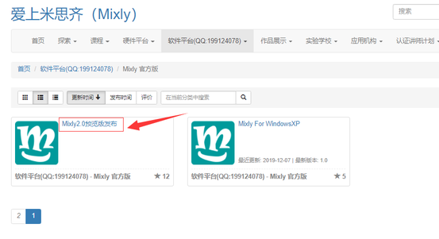

资料有四个系统版本的软件可以供选择，这里以WIN10-x64版本为例，现在的电脑大部分都是WIN10的系统，点击下载自己所需的软件版本

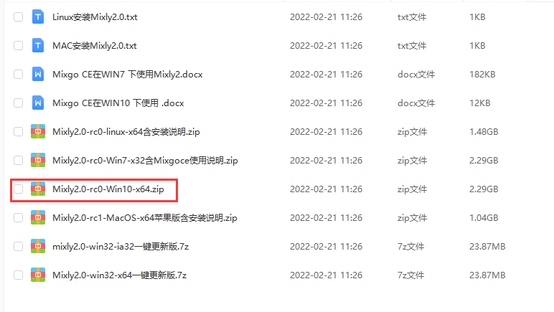

下载好的是米思奇软件的压缩包。压缩包下载好之后，解压到电脑的其中一个硬盘（建议不要放在系统盘），Mixly2.0版本不用安装，解压出来就可以用了

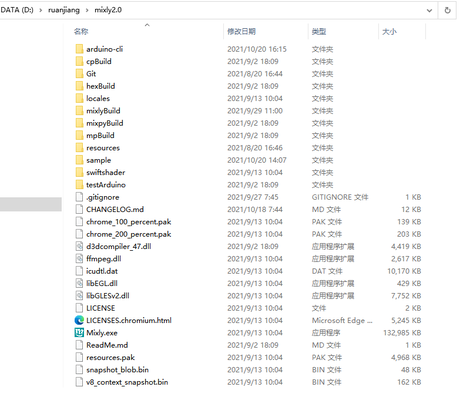

软件的更新
~~~~~~~~~~

点击软件目录下的一键更新

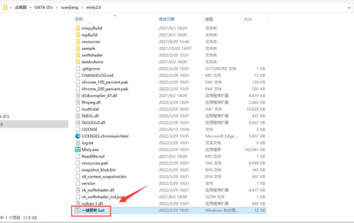

按提示输入“y”然后按下Enter键(回车键)即可自动安装，安装完成按下键盘的任意键即可退出

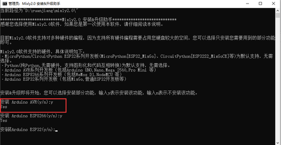

鼠标右键点击Mixly.exe 发送到电脑桌面，方便日后我们使用。

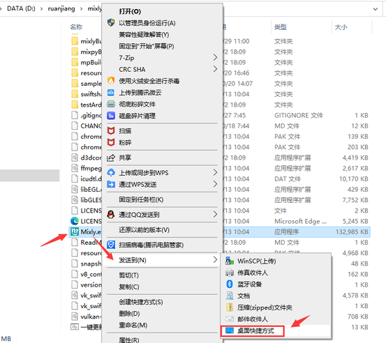

（3）米思奇软件介绍

米思奇（Mixly）是一个免费的开源图形Arduino编程软件，基于Google的图形化编程框架。它是创意电子开发的免费开源图形编程工具；是完整支持创意电子教育的生态系统；是创客教育者实现梦想的舞台。

安装好了软件，我们点击电脑桌面上的mixly图标来打开软件，选择Arduino AVR

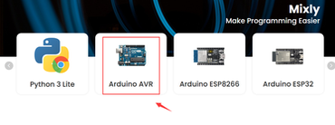

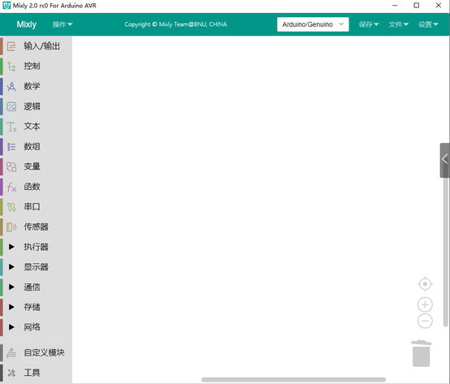

代码程序上传到Arduino开发板或者兼容板之前，必须先了解米思奇软件工具栏中出现的每个区和接口的功能。

界面布局

介绍面总的分为四大功能区域块。

1.基本功能块区

2.程序构建区

3.代码区

4.信息提示区

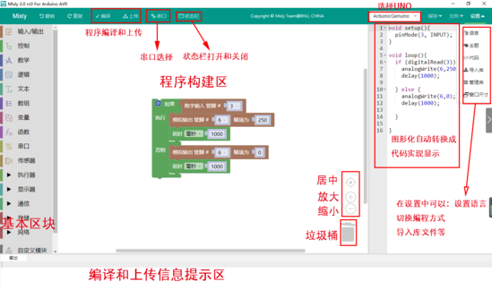

基本功能块区

输入输出: IO相关功能块

控制: 程序流程控制相关功能块

数学: 数学运算相关功能块

文本: 字符串操作相关功能块

数组: 数组相关功能块

逻辑: 逻辑关系的相关功能块

串口: 串口通信相关功能块

通信: 以太网,红外遥控等通讯功能块

储存: 数据储存相关功能块 (高级视图)

传感器: 通用传感器相关功能块

执行器: 通用执行器相关功能块

显示器: 显示相关功能块

以太网:以太网通讯功能块(高级视图)

变量: 变量操作相关功能块

函数: 函数相关功能块

自定义模块: 自定义代码功能块(高级视图)

程序建构区

该区域为程序功能拼接区域。将功能块从左侧块区拖入程序建构区进行拼接。该区域的右下角有个垃圾桶，可以将不用的代码拖进去删除，也可以将不用的代码直接往最左方拖拽（模块选择区），同样可以删除代码。当然，点击不用的代码后点击键盘
Delete也可将代码删除，还可以右键点击块选择删除块.

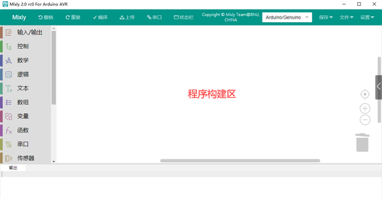

视图缩放

在垃圾桶的上方有两个图形，一个是
⊕一个是Θ。该图形可放大或缩小程序构建区模块

的大小。在⊕的上方有一个按钮，这个按钮的功能是将模块的大小恢复至标准大小，并居中.

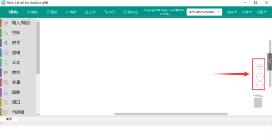

功能切换

语言切换:在该区域的右上角的设置中，还可以切换语言显示的种类。

主题切换:在设置中主题可以进行普通视图和高级视图来进行视图之间的切换。

编程方式切换：在设置中的代码可以切换编程方式。

撤消/重做:撤销功能是当编写代码时误删模块后，便可以点击左箭头或者直接按Ctrl+Z
来恢复误删代码；而重做则是和 Ctrl+Z 相反。

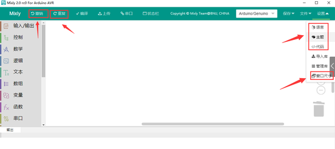

文件操作区

新建:新建项目文件

打开:打开项目文件

保存:保存项目文件

另存为:另存项目文件

导出库:导出当前项目为库文件

导入库:导入第三库文件

管理库:库的删除和重命名等操作

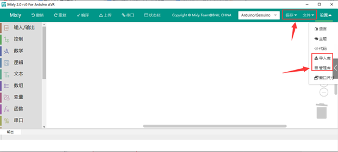

库文件是为了方便代码分享.将一个功能集成在个函数中。之后导出库文件.就可以分享给他人使用.

代码区

点击代码可以对当前模块自动生成的代码进行修改，修改后如不切换回图形区,进行编译和下载,将按照修改的代码进行编译或者下载.但如果切换回图形区.代码会恢复为图形区的代码.

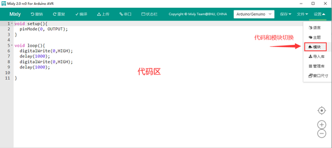

程序下载及串口监视

编译: 将程序编译为机器执行码.编译过程和结果会在信息显示区显示

上传: 编译程序并上传至主板,上传信息会在信息显示区显示.

主板选择: 选择主板类型及连接的端口

串口监视:
用于监视主板从串口发来的信息或者给主板发送信息.需编程.主要用于调试程序或者显示信息用.

|image3|\ 需要注意的是在上传程序时请关闭串口监视窗口.否则会导致程序上传失败

（4）安装PLUS开发板驱动

第1小节 简单介绍keyes PLUS开发板

Keyes Plus 开发板是一款完全兼容Arduino
IDE开发环境的控制板。它包含官网的UNO开发板的所有功能，并且在UNO开发板的基础上，我们做了一些改进，使它的功能更加强大。具体改进如下图。为了方便接线，我们还配了1根长度为1米的type-c接口的USB线。

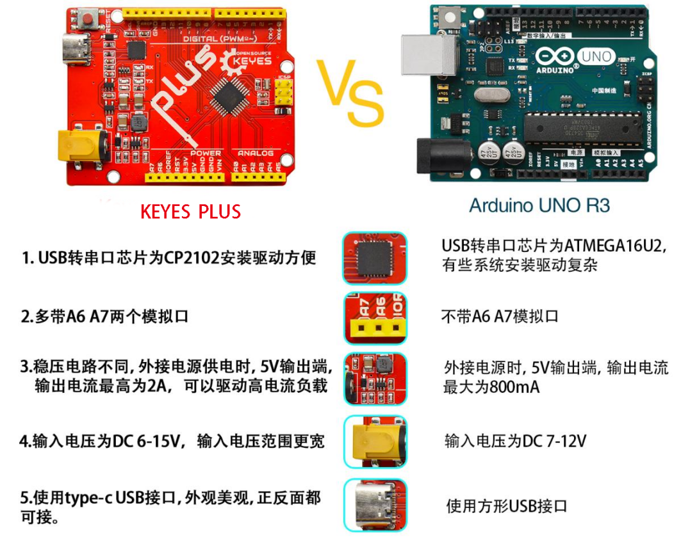

规格参数

微控制器：ATMEGA328P-AU

USB转串口芯片：CP2102

工作电压：DC 5V

外接电源: DC 6-15V（建议9V）

数字I/O引脚: 14 (D0-D13)

PWM通道：6 (D3 D5 D6 D9 D10 D11)

模拟输入通道（ADC）: 8(A0-A7)

每个I/O直流输出能力: 20 mA

3.3V端口输出能力: 50 mA

Flash Memory: 32 KB（其中引导程序使用0.5 KB）

SRAM:2 KB (ATMEGA328P-AU)

EEPROM: 1 KB (ATMEGA328P-AU)

时钟速度:16MHz

板载LED引脚:D13

各个接口和主要元件说明

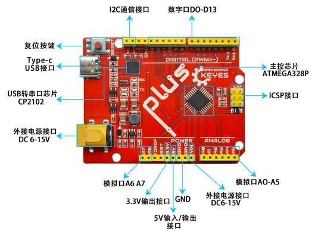

特殊功能接口说明

串口通信接口：D0为RX、D1为TX

PWM接口（脉宽调制）：D3 D5 D6 D9 D10 D11

外部中断接口：D2(中断0)和D3 (中断1)

SPI通信接口：D10为SS、D11为MOSI、D12为MISO、D13为SCK

IIC通信端口：A4为SDA、A5为SCL

软件下载完毕，我们开始为Keyes Plus 开发板安装驱动。Keyes
Plus开发板的USB转串口芯片用的是著名的CP2102芯片，米思奇1.0以上的版本里就已经包含了这个芯片的驱动程序，这样我们使用起来会非常方便。一般插上USB，电脑就会识别到硬件，WINDOWS就会自动安装CP2102的驱动。\ |image4|

如果驱动安装不成功，或者你想手动安装驱动，请打开电脑的设备管理器\ |image5|

显示CP2102的驱动没有安装成功，有一个黄色的感叹号。我们双击硬件更新驱动

.. image:: media/8f29e945c3a63db61914cdfba237fd48.png

浏览计算机查找驱动程序

.. image:: media/b10707b543aebd3e72a8fff4d7e1f818.png

打开我们提供的资料，找到drivers文件夹

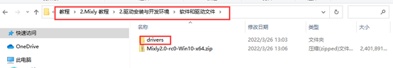

我们选择这个文件夹，然后点击确定，驱动安装成功。

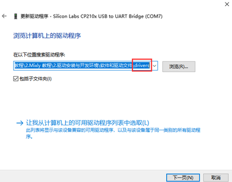

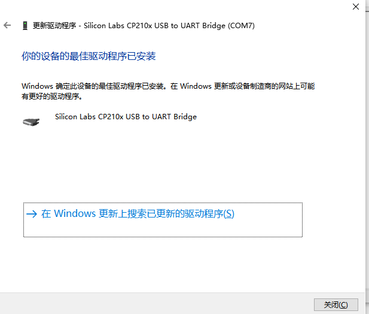

这个时候再打开设备管理器，我就可以看到CP2102的驱动程序已经安装成功了，刚刚的那个黄色的感叹号不见了。

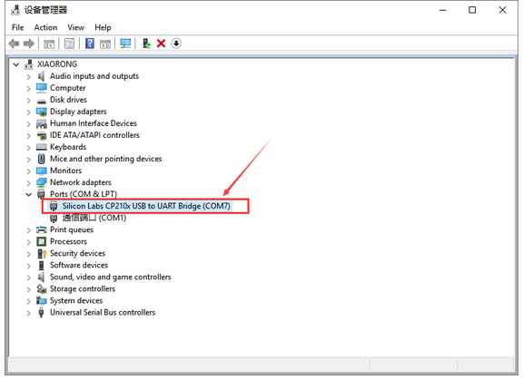

（5）导入KEYES智能小车 mixly库文件

打开米思奇软件，点击设置—->导入库

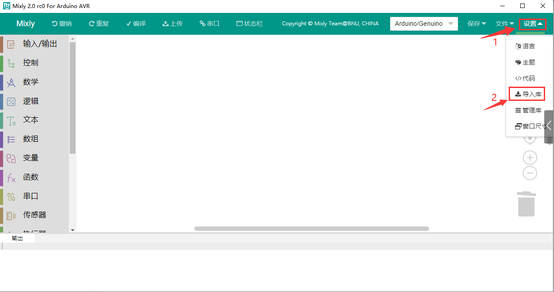

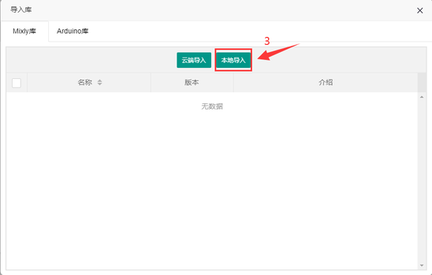

点击本地导入

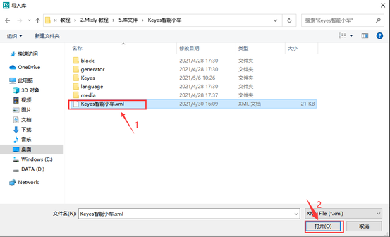

选择我们文件里提供的keyes智能小车文件，这样米思奇库文件就导入完成了。

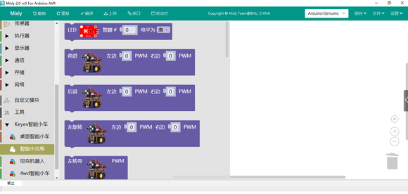

多功能小乌龟智能车安装
----------------------

安装1

安装所需零件

.. image:: media/6cdf0feaf829943a106dc1c26fac7c5e.jpg

安装（丝印A,B字母朝上）

.. image:: media/df1613a5bab38d92c2584492bb3a4224.jpg

完成

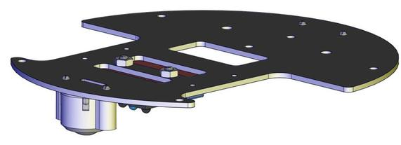

安装2

安装所需零件

.. image:: media/72f5b7396795a4ff94d435768412a237.jpeg

安装（注意电机对应位置）

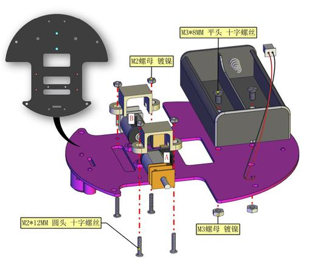

完成 |image6| 安装3

安装所需零件 |image7|

安装 |image8|

完成

.. image:: media/f3d54f1cd80a305f1010a36764105de8.jpg

安装完后需先给A，B电机插线

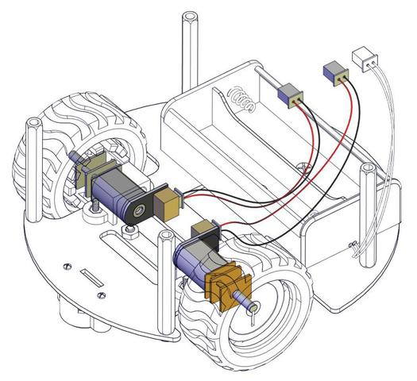

循迹传感器插线

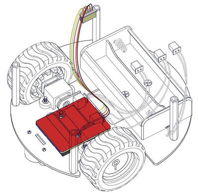

安装4

安装所需零件

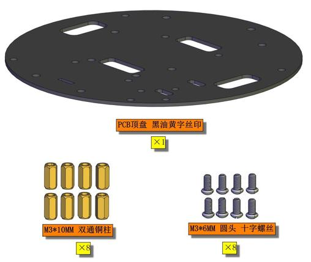

安装 |image9|

完成

.. image:: media/93e358f44aff9c09c9a24b4d352e26d2.jpg

安装5

安装所需零件

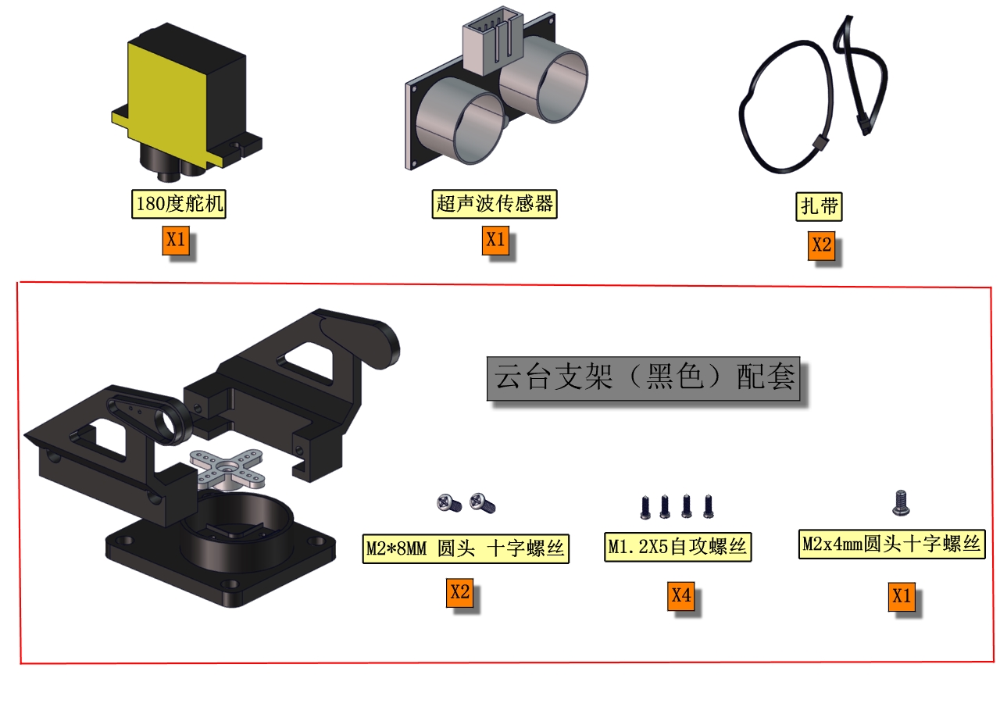

分步安装1

.. image:: media/e4303f5b91584761f5879ae1d795e503.jpg

分步安装2（安装时需要安图所示90°朝前安装）

.. image:: media/0e74f16130164078ea115ab8ac48dc51.jpg

完成

.. image:: media/d8bf2dd41c971035e3dfb0fe0942849a.png

安装6

安装所需零件

.. image:: media/8679948f52652683d86f75fa8566f212.jpg

安装

.. image:: media/e3b4ec0644ffcfbf31398e8d18352bd9.jpg

完成

.. image:: media/43e31a41f4c4363945cdeaf57cf68dec.jpg

安装7

安装所需零件

.. image:: media/0bfd287d38eaffdcf2b5c21653cb756f.png

安装

.. image:: media/7c89237c4f519ba63c6192c4624b2f2a.png

完成

.. image:: media/d7e09ef6302b75721ff3320fc0316705.png

安装8

安装所需零件

.. image:: media/8aa301881d10f967aaaf7a5271692c3b.png

安装（安装前先按图穿线）

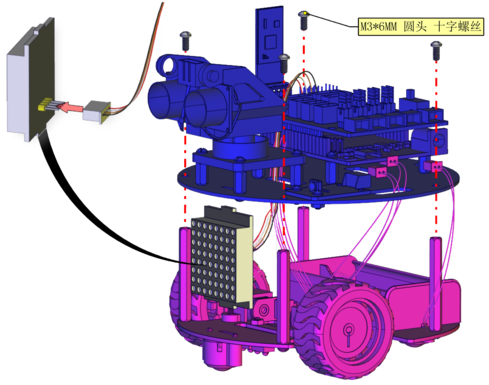

完成

.. image:: media/85f4d8f582947868a3926e2f05789210.png

安装部分完成后进行接线

电机A接线图

.. image:: media/e2ab96e31db14190f57220216323f484.png

电机B接线图

.. image:: media/3fb0388025b2a879d58a23467c1da5ac.png

循迹传感器接线图

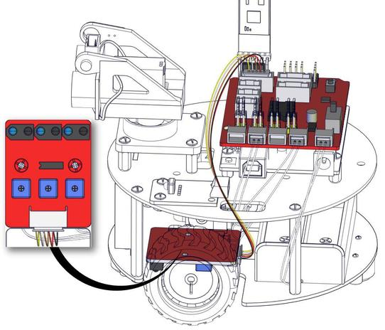

超声波接线图

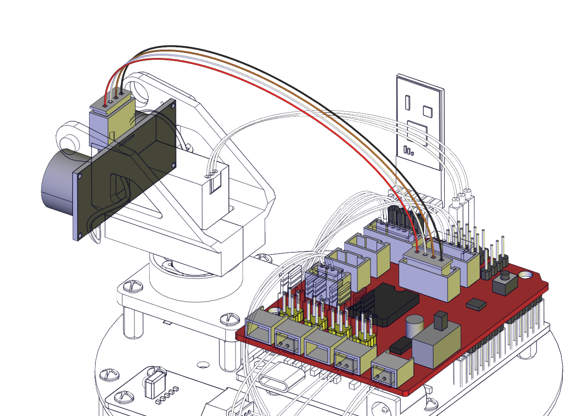

点阵接线图

.. image:: media/7d205fab4ba8170a382eeda43d93f738.png

舵机接线图

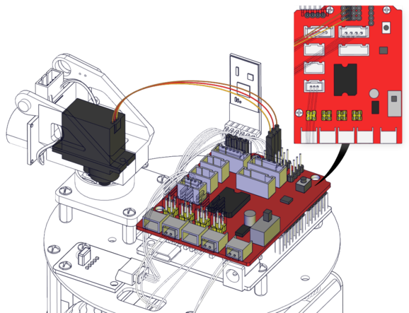

红外接收传感器接线图

.. image:: media/40dfb501b6cbecb3b661eb103a3ca45c.png

电池盒接线图

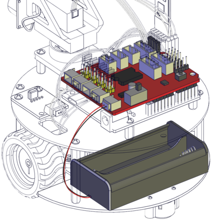

完成渲染效果图

.. image:: media/789da81dd59554f8e3fab3c3480f8d18.png

接线
~~~~

把舵机接到驱动板的10号引脚后叠加到PULS控制板上如下图

.. image:: media/ac4131d8e8f6b1e87d34cce8d3571cb3.png

上传程序
~~~~~~~~

(1)找到并拖出智能小乌龟栏里的舵机，设置舵机90

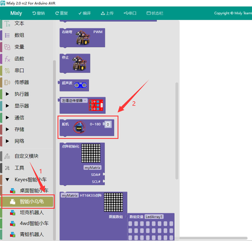

(2)把控制板连接好电脑，选择好开发板(Arduino
uno)和串口，点击上传，程序上传成功后舵机自动转到90度的位置

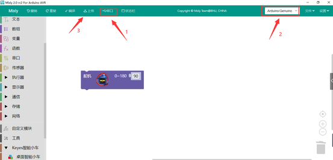

实验课程
--------

第1课 LED灯项目
~~~~~~~~~~~~~~~

前面所有的东西都已经准备完毕，我们正式开始桌面小车的编程项目。前面我们从简单的传感器和模块开始，循序渐进完成模块传感器的测试项目，现在再来完成几个不同类型的机器人，最后我们把所有学到的知识结合到一起，完成一个综合的项目：多功能桌面小车。

注意：本项目中的各传感器/模块上标有（G）表示负极，是连接到控制板或传感器扩展板上的G或-或GND；标有（V）表示正极，是连接到控制板或扩展板上的V或VCC或+或5V。

项目介绍：

|image10|\ 前面我们安装了keyes UNO
Plus开发板的驱动。接下来的项目我们就要由简单到复杂，一步一步探索Arduino的世界了。首先我们要来完成经典的“Arduino点亮LED”，也就是Blink项目。Blink对于学习Arduino的爱好者而言，是最基础的项目是新手必须经历的一个练习。

LED
，发光二极管的简称。由含镓（Ga）、砷（As）、磷（P）、氮（N）等的化合物制成。当电子与空穴复合时能辐射出可见光，因而可以用来制成发光二极管。在电路及仪器中作为指示灯，或者组成文字或数字显示。

为了实验的方便，我们将LED发光二极管做成了一个模块，在第一个项目中，我们用一个最基本的测试代码来控制LED，亮一秒钟，灭一秒钟，来实现闪烁的效果。你可以改变代码中LED灯亮灭的时间，实现不同的闪烁效果。LED模块信号端S为高电平时LED亮起，S为低电平时LED熄灭。

|image11| |image12|

LED模块参数：

控制接口: 数字口

工作电压: DC 3.3-5V

排针间距: 2.54mm

LED显示颜色：红色

项目组件：

+-----------------------+-----------------------+-----------------------+
| keyes UNO             | Keyes brick L298P     | keyes                 |
| Plus开发板*1          | 电机驱动扩展板 V1*1   | 草帽LED白发红模块*1   |
+=======================+=======================+=======================+
| |image13|             | |image14|             | |image15|             |
+-----------------------+-----------------------+-----------------------+
| USB线*1               | 3Pin 双母头杜邦线*1   | 18650双节电池盒*1     |
+-----------------------+-----------------------+-----------------------+
| |image16|             | |image17|             | |image18|             |
+-----------------------+-----------------------+-----------------------+

接线图：

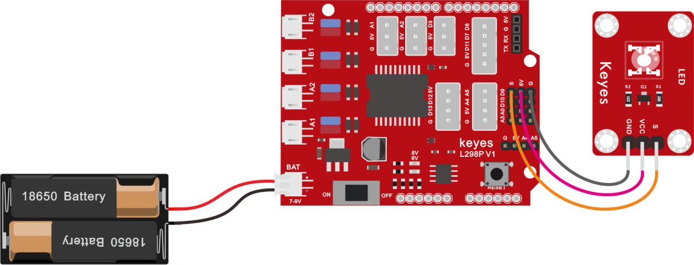

由上图我们可以看到，扩展板是堆叠在开发板上的，LED模块的-接到了扩展板的G,LED模块的+接到了扩展板的5V，LED模块的S已经接到了扩展板上的D9接口，接好线之后我们开始编写代码：

项目代码：

可以直接打开我们编写好的程序：点击文件下的打开然后找到Mixly教程的第一课程序

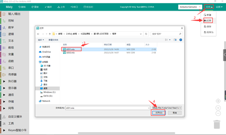

也可以自己通过拖动代码块来编写代码程序，操作步骤如下：

①点击左侧基本块区，在控制栏目里面拖出初始化图标\ |image19|

②点击keyes智能小车库下面的智能小乌龟车，拖出LED灯栏目图标，放入初始化里面，设置管脚为9，电平为低，关闭LED。

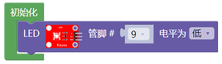

③再单独复制一个LED栏目，设置管脚为9，电平为高，点亮LED

④在控制栏目里拖出延时模块，设置为1000毫秒

.. image:: media/6efb3930432bad527c184cf24563b3f3.png

⑤再复制一个LED灯栏目，设置管脚为9，电平为低，熄灭LED

⑥再来一个延时1000毫秒

.. image:: media/6efb3930432bad527c184cf24563b3f3.png

\********************************完整的代码如下*******************************\*

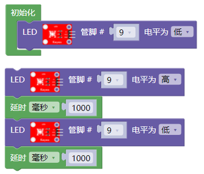

上传程序：选择正确串口，波特率是：9600；控制板选择Arduino
uno板；然后点击上传程序，程序上传成功会提示上传成功。

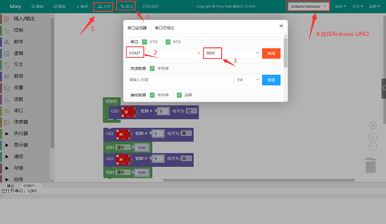

项目结果：

点击上传程序到开发板，成功之后，D9脚接着的LED打开和关闭，而且间隔的时间是一秒钟。

项目拓展：

+----------------------------------------------------------+----------+
| 文件路径                                                 | 文件名   |
+==========================================================+==========+
| Mixly 教程\4.实验课程:raw-latex:`\第`1课                 | LED2.mix |
| LED灯项目:raw-latex:`\程序`                              |          |
+----------------------------------------------------------+----------+

前面我们控制了LED 的闪烁，我们来拓展一下思路，我们要改变LED
灯闪烁的频率。代码如下：

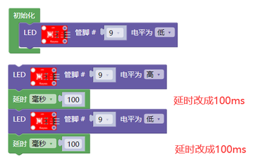

怎么样是不是很好理解，就是通过改变这个代码的延时时间，来改变9脚LED亮和灭的频率，不多说，我们上传代码。看看这个LED灯闪烁的频率是不是比之前快了？

第2课 LED 亮度的调节
~~~~~~~~~~~~~~~~~~~~

项目介绍：

前面课程中，我们详细的介绍了通过代码控制LED亮灭，实现闪烁的效果。这节课我们使用PWM来控制LED亮度不断地变化，模拟我们呼吸的效果。

PWM是使用数字手段来控制模拟输出的一种手段。使用数字控制产生占空比不同的方波（一个不停在高电平与低电平之间切换的信号)来控制模拟输出。一般来说端口的输入电压只有两个0V与5V。如果想要改变灯的亮度怎么办呢个？有同学说串联电阻，对，这个方法是正确的。但是，如果想要得到不同的亮度，且在不同亮度之间来回变动怎么办呢？不可能不停地切换电阻吧。这种情况下就需要使用PWM了，那它是怎么控制的呢？

|image20|\ 对于Arduino的数字端口电压输出只有LOW与HIGH两个，对应的就是0V与5V的电压输出，可以把LOW定义为0，HIGH定义为1，1秒内让Arduino输出500个0或者1的信号。如果这500个全部为1，那就是完整的5V，如果全部为0，那就是0V。如果010101010101这样输出，刚好一半，端口输出的平均电压就为2.5V了。这个和放映电影是一个道理，咱们所看的电影并不是完全连续的，它其实是每秒输出25张图片。在这种情况下，人的肉眼是分辨不出来的，看上去就是连续的了。PWM也是同样的道理，如果想要不同的电压，就控制0与1的输出比例控制就可以了。当然这和真实的连续输出还是有差别的，单位时间内输出的0,1信号越多，控制的就越精确。

项目组件：

+-----------------------+-----------------------+-----------------------+
| keyes UNO Plus        | Keyes brick L298P     | keyes                 |
| 开发板*1              | 电机驱动扩展板 V1*1   | 草帽LED白发红模块*1   |
+=======================+=======================+=======================+
| |image21|             | |image22|             | |image23|             |
+-----------------------+-----------------------+-----------------------+
| USB线*1               | 3Pin 双母头杜邦线*1   | 18650双节电池盒*1     |
+-----------------------+-----------------------+-----------------------+
| |image24|             | |image25|             | |image26|             |
+-----------------------+-----------------------+-----------------------+

接线图：

Arduino的PWM引脚在3，5，6，9，10，11,上一小节的接线刚刚好在9脚，所以我们这个接线不用变

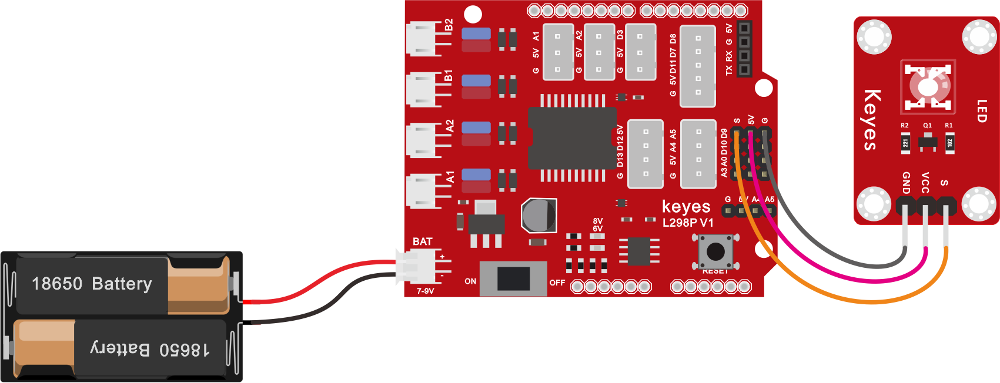

项目程序

可以直接打开我们编写好的程序：

+------------------------------------------------------+--------------+
| 文件路径                                             | 文件名       |
+======================================================+==============+
| Mixly 教程\4.实验课程:raw-latex:`\第`2课 LED         | 第2课2.1.mix |
| 亮度的调节:raw-latex:`\程序`                         |              |
+------------------------------------------------------+--------------+

也可以自己通过拖动代码块来编写代码程序，操作步骤如下：

①初始化D9引脚上的LED为低电平

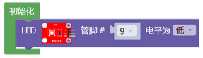

③从控制栏目里面拖出以下模块，设置i从0到255，步长为1，就执行方块中的命令（代码）

④从输入/输出栏目里面拖出模拟输出管脚,设置为9，赋值为变量i

.. image:: media/be14b0919cf0ee61ab4ca571e8aef11d.png

⑤拖出一个延时模块，时间设置为5毫秒

.. image:: media/6cedaac7c913194fdb77ab2f44f36b68.png

⑥从控制栏目里面拖出以下模块，设置i从255到0，步长为-1，就执行方块中的命令（代码）

⑦再拖出一个模拟输出管脚模块，设置为9，并且赋值为变量i

.. image:: media/be14b0919cf0ee61ab4ca571e8aef11d.png

⑧再拖出一个延时模块，时间设置为5毫秒

.. image:: media/6cedaac7c913194fdb77ab2f44f36b68.png

\********************************完整的代码如下*******************************\*

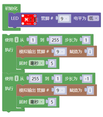

项目结果：

上传代码到开发板代，完成后，我们可以看到LED会有个逐渐由亮到灭的一个缓慢过程，而不是直接的亮灭，如同呼吸一般，均匀变化。

项目拓展：

+-----------------------------------------------------+---------------+
| 文件路径                                            | 文件名        |
+=====================================================+===============+
| Mixly 教程\4.实验课程:raw-latex:`\第`2课 LED        | 第2课 2.2.mix |
| 亮度的调节:raw-latex:`\程序`                        |               |
+-----------------------------------------------------+---------------+

我们不改变灯的脚位，只是改变程序里面延时ms的值为30ms，看看它如何改变渐变效果。

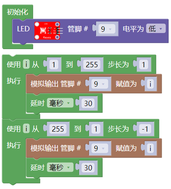

上传代码到开发板，看LED渐变的效果是不是慢了一些。

第3课 循迹传感器项目
~~~~~~~~~~~~~~~~~~~~

项目介绍：

.. image:: media/6780dd9ed614a63a3862f503e39b3b7e.png

这个3路循迹传感器模块上自带有三个电位器，用于调节循迹传感器敏感度。循迹传感器其实也是红外传感器，这里的循迹传感器模块用到的元件是TCRT5000红外对管，TCRT5000红外对管具有一个高发射功率红外发射二极管和一个高灵敏度红外接收管。当发射管的红外信号经反射被接收管接收后，接收管的电阻会发生变化，在电路上一般以电压的变化体现出来。电阻的变化取决于接收管所接收的红外信号强度，常表现在反射面的颜色和反射面接收管的距离。在检测的时候，黑色高电平有效，白色是为低电平有效。

红外对管寻迹：

当乌龟车在白色底面行驶时，装在车下的红外发射管发射红外信号，经白色发射后，被接收管接收，一旦接收管接收到信号，输出端将输出低电平（0）；当乌龟车行驶到黑线时，红外线信号被黑色吸收后，将输出高电平，从而实现了通过红外线检测信号的功能。将检测到的信号送到单片机的I/O口，当I/O口检测到的信号为高电平时，表明乌龟车处于黑色的引线上；同理，当I/O口检测到的信号为低电平（0）时，表明乌龟车处于白色地面上。

参数：

工作电压：DC 3.3-5V

接口：5PIN接口（PH2.0mm-5P 卧贴插座 ）

输出信号：数字信号

检测高度：0—3cm

尺寸：40*32*9mm

重量：6.8g

定位孔大小：直径3mm

.. image:: media/07f91c262808ec0b48146173080d227e.png

项目组件：

+-----------------+-----------------+-----------------+-----------------+
| keyes UNO Plus  | Keyes brick     | keyes           | Keyes           |
| 开发板*1        | L298P           | 草帽            | connectors      |
|                 | 电机驱动扩展板  | LED白发红模块*1 | 循迹传感器*1    |
|                 | V1*1            |                 |                 |
+=================+=================+=================+=================+
| |image27|       | |image28|       | |image29|       | |image30|       |
+-----------------+-----------------+-----------------+-----------------+
| XH2.54转PH2.0   | 3Pin            | USB线*1         | 18              |
| 5P 连接线*1     | 双母头杜邦线*1  |                 | 650双节电池盒*1 |
+-----------------+-----------------+-----------------+-----------------+
| |image31|       | |image32|       | |image33|       | |image34|       |
+-----------------+-----------------+-----------------+-----------------+

接线图:

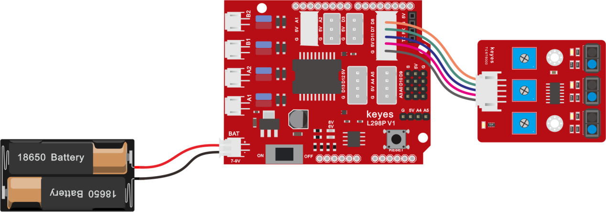

循迹传感器接扩展板的D11、D7、D8引脚（左11，中7，右8）。

项目代码：

可以直接打开我们编辑好的程序：

======================================================= =============
文件路径                                                文件名
======================================================= =============
Mixly 教程\4.实验课程:raw-latex:`\第`3课 循迹传感器项目 第3课 3.1.mix
======================================================= =============

也可以自己通过拖动代码块来编写代码程序，操作步骤如下：

1. 点击“变量”模块，找到并拖出方块\ |image35|\ ，再点击“数学”模块，拖出\ |image36|

然后将item变量名修改为L_val、M_val、R_val，变量类型下拉选择“整数”：\ |image37|

2. 点击“串口”模块，找到并拖出指令方块\ |image38|\ 放入方块\ |image39|\ 中。

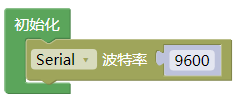

3. 点击“变量”模块，找到并拖出指令方块\ |image40|\ 、\ |image41|\ 和\ |image42|\ ，在点击“Keyes智能小车”里面的“智能小乌龟”选择\ |image43|\ ，复制两次，再分别点击下拉三角形按钮选择“中循迹传感器”和“右循迹传感器”，然后放入对应的变量中：

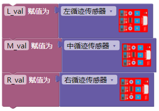

再点击“串口”模块，找到并拖出指令方块\ |image44|\ ，再复制出个4指令方块.最后面是用的\ |image45|\ 换行打印。

4. 点击“变量”模块，找到并拖出指令方块\ |image46|\ 、\ |image47|\ 和\ |image48|\ 放入指令方块\ |image49|\ 中，再在“文本”模块中找到\ |image50|\ ，将“hello”改为“
   ”（两个空格）

点击“控制”模块，找到并拖出方块\ |image51|\ ，延时时间1000毫秒改成100毫秒。

\*****************************************完整程序***********************************\*

项目结果：

上传代码带开发板，打开串口监视，可以看到左中右三个循迹传感器的状态，如果我们用白纸去遮挡传感器，传感器的状态都是0。在没有接收到信号的时候，三个传感器都是高电平状态，显示的数值是1。

项目拓展：

======================================================= =============
文件路径                                                文件名
======================================================= =============
Mixly 教程\4.实验课程:raw-latex:`\第`3课 循迹传感器项目 第3课 3.2.mix
======================================================= =============

上面我们了解了循迹传感器的工作原理，接下来我们在第9脚接上一个LED
灯，然后通过读取循迹传感器的状态，来控制LED的亮和灭。如下图接线：

我们开始来编写代码：

上传代码到开发板，用我们的手去一个个的靠近传感器，我们看看LED灯的状态发生了改变没有？当我们用手去遮挡循迹传感器的时候，我们可以看到LED灯亮起来了。

第4课 舵机控制项目
~~~~~~~~~~~~~~~~~~

|image52|\ 项目介绍：

舵机是一种位置伺服的驱动器，主要是由外壳、电路板、无核心马达、齿轮与位置检测器所构成。其工作原理是由接收机或者单片机发出信号给舵机，其内部有一个基准电路，产生周期为20ms，宽度为1.5ms
的基准信号，将获得的直流偏置电压与电位器的电压比较，获得电压差输出。

|image53|\ 舵机有很多规格，但所有的舵机都有外接三根线，分别用棕、红、橙三种颜色进行区分，由于舵机品牌不同，颜色也会有所差异，棕色为接地线，红色为电源正极线，橙色为信号线。

舵机的转动的角度是通过调节PWM（脉冲宽度调制）信号的占空比来实现的，标准PWM（脉冲宽度调制）信号的周期固定为20ms（50Hz），理论上脉宽分布应在1ms到2ms
之间，但是，事实上脉宽可由0.5ms 到2.5ms
之间，脉宽和舵机的转角0°～180°相对应。

对应的舵机角度值如下:

.. image:: media/ebadad234cf7e43ee799e66bb6c67b27.png

舵机参数：

工作电压：DC 4.8V〜6V

可操作角度范围：大约 About 180°(在 500→2500 μsec)

脉波宽度范围：500→2500 μsec

空载转速：0.12±0.01 sec/60（DC 4.8V） 0.1±0.01 sec/60（DC 6V）

空载电流：200±20mA（DC 4.8V） 220±20mA（DC 6V）

停止扭力：1.3±0.01kg·cm（DC 4.8V） 1.5±0.1kg·cm（DC 6V）

停止电流：≦850mA（DC 4.8V） ≦1000mA（DC 6V）

待机电流：3±1mA（DC 4.8V） 4±1mA（DC 6V）

项目组件：

+-----------------------+-----------------------+-----------------------+
| keyes UNO Plus        | Keyes brick L298P     | Keyes SG90 9G 舵机    |
| 开发板*1              | 电机驱动扩展板 V1*1   |                       |
+=======================+=======================+=======================+
| |image54|             | |image55|             | |image56|             |
+-----------------------+-----------------------+-----------------------+
| USB线*1               | 18650双节电池盒*1     | 18650电池*2           |
|                       |                       | （电池自配）          |
+-----------------------+-----------------------+-----------------------+
| |image57|             | |image58|             |                       |
+-----------------------+-----------------------+-----------------------+

接线图：

接线注意：舵机连接到G（GND）、V（VCC）、10，舵机的棕色线是与Gnd(G)相连，红色线与5v(V)相连，橙色线是与数字10相连的。接舵机的时候必须要外接供电，因为驱动舵机的电流要求比较大，一般峰值的情况下接近1A，开发板的电流远远不够。如果不接外接电源，很有可能烧坏开发板。

.. image:: media/ac4131d8e8f6b1e87d34cce8d3571cb3.png

项目代码1：

可以直接打开我们编写好的程序：

+---------------------------------------------------------+-----------+
| 文件路径                                                | 文件名    |
+=========================================================+===========+
| Mixly 教程\4.实验课程:raw-latex:`\第`4课                | 第4课 4.1 |
| 舵机控制项目:raw-latex:`\程序`                          |           |
+---------------------------------------------------------+-----------+

也可以自己通过拖动代码块来编写代码程序，操作步骤如下：

+-----------------------------------+-----------------------------------+
| ①在控制栏找到并拖出初始化模块     | |image59|                         |
| ②在智能小                         |                                   |
| 乌龟栏里拖出舵机模块，，初始角度  |                                   |
| 为90°，在加上延时模块延时500毫秒  |                                   |
+===================================+===================================+
| ③设置舵机角度为0°，延时为500ms    | |image60|                         |
+-----------------------------------+-----------------------------------+
| ④设置舵机角度为180°，延时为500ms  | |image61|                         |
+-----------------------------------+-----------------------------------+
| ⑤设置舵机角度为0°，延时为500ms    | |image62|                         |
+-----------------------------------+-----------------------------------+

\********************************完整的代码如下*******************************\*

实验结果

在上传代码成功，我们可以看到舵机在0°到180°角度范围来回摆动。

第5课 超声波模块项目
~~~~~~~~~~~~~~~~~~~~

项目介绍：

|image63|\ 超声波传感器，它可以检测前方是否存在障碍物，并且检测出传感器与障碍物的详细距离。它的原理和蝙蝠飞行的原理一样，就是超声波模块发送出一种频率很高，人体无法听到的超声波信号。这些超声波的信号若是碰到障碍物，就会立刻反射回来，在接收到返回的信息之后，通过判断发射信号和接收信号的时间差，计算出传感器和障碍物的距离。

超声波参数：

工作电压：DC 5V

工作电流：15mA

工作频率：40khz

最大探测距离：3-4m

最小探测距离：2cm

感应角度：不大于15度

高精度：可达3mm

项目组件：

+-----------------+-----------------+-----------------+-----------------+
| keyes UNO Plus  | Keyes brick     | keyes           | HC-SR0          |
| 开发板*1        | L298P           | 草帽            | 4超声波传感器*1 |
|                 | 电机驱动扩展板  | LED白发红模块*1 |                 |
|                 | V1*1            |                 |                 |
+=================+=================+=================+=================+
| |image64|       | |image65|       | |image66|       | |image67|       |
+-----------------+-----------------+-----------------+-----------------+
| HX-2.54 4P 双头 | 3Pin            | USB线*1         | 18              |
| 连接线*1        | 双母头杜邦线*1  |                 | 650双节电池盒*1 |
+-----------------+-----------------+-----------------+-----------------+
| |image68|       | |image69|       | |image70|       | |image71|       |
+-----------------+-----------------+-----------------+-----------------+

超声波模块知识：

原理：看超声波的图可知，像是有两个眼睛，其一边是发射超声的，一边是接收超声波的，然后检测从发射遇到障碍物返回被接收到所需的时间t，再根据声音在空气中的传播速度大概是343m/s,
距离 = 速度 \* 时间 ，
由于超声波发射返回是两段路程了，所以需要除以2，故超声波测到的 距离
=（速度 \* 时间）/2

超声波模块的使用方法及时序图：

1、使用GPIO引脚给SR04的Trig引脚至少10μs的高电平信号，触发SR04模块测距功能；

2、触发后，模块会自动发送8个40KHz的超声波脉冲，并自动检测是否有信号返回。这步会由模块内部自动完成。

3、如有信号返回，Echo引脚会输出高电平，高电平持续的时间就是超声波从发射到返回的时间。

超声波模块的电路图

接线图：

接线注意：超声波传感器模块的VCC引脚连接至keyes V5
传感器扩展板的5v(V)，Trig引脚至数字12(S)，Echo引脚至数字13(S)，Gnd引脚至Gnd(G)。

项目代码：

可以直接打开我们编写好的程序：

+-----------------------------------------------------+---------------+
| 文件路径                                            | 文件名        |
+=====================================================+===============+
| Mixly 教程\4.实验课程:raw-latex:`\第`5课            | 第5课 5.1.mix |
| 超声波模块项目 :raw-latex:`\实验程序`               |               |
+-----------------------------------------------------+---------------+

也可以自己通过拖动代码块来编写代码程序，操作步骤如下：

+-----------------------------------+-----------------------------------+
| ①初始化                           | |image72|                         |
+===================================+===================================+
| ②设置串口波特率为9600             | |image73|                         |
+-----------------------------------+-----------------------------------+
| ③在变量栏目下拖出声明变量模块     | |image74|                         |
| ，设置变量distance1为整数并赋值0  |                                   |
+-----------------------------------+-----------------------------------+
| ④在变量栏目下拖出声明变量模块     | |image75|                         |
| ，设置变量distance2为整数并赋值0  |                                   |
+-----------------------------------+-----------------------------------+
| ⑤在智能小乌龟                     | |image76|                         |
| 栏拖超声波模块，将超声波传感器测  |                                   |
| 量的距离（cm）赋给于变量distance1 |                                   |
+-----------------------------------+-----------------------------------+
| ⑥变量di                           | |image77|                         |
| stance2赋值为变量distance1×0.3937 |                                   |
+-----------------------------------+-----------------------------------+
| ⑦串口打印变量distance2的值        | |image78|                         |
+-----------------------------------+-----------------------------------+
| ⑧串口打印字符in                   | |image79|                         |
+-----------------------------------+-----------------------------------+
| ⑨串口打印变量distance1的值        | |image80|                         |
+-----------------------------------+-----------------------------------+
| ⑩串口打印字符cm                   | |image81|                         |
+-----------------------------------+-----------------------------------+
| ⑪延时时间为250毫秒                | |image82|                         |
+-----------------------------------+-----------------------------------+

\**********************************完整程序如下*********************\*

项目结果：

上传好测试代码到开发板，打开串口监视器，设置波特率为9600，我们可以看到超声波模块显示的距离，单位是厘米和英寸。用手阻挡超声波模块，我们看到显示距离的数值变小了。

(注意：上传好程序，采用电池供电，把驱动板上的拨码开关拨到ON的位置，因为USB供电过低，超声波传感器无法正常工作)

项目拓展：

我们刚刚测出了超声波显示的距离，那我们动动脑筋，能不能用测出的距离来做一些控制呢，如果控制一个LED灯的亮和灭。我们来试一下，在D9脚接上一个LED灯模块。

可以直接打开我们编写好的程序：

+-----------------------------------------------------+---------------+
| 文件路径                                            | 文件名        |
+=====================================================+===============+
| Mixly 教程\4.实验课程:raw-latex:`\第`5课            | 第5课 5.2.mix |
| 超声波模块项目 :raw-latex:`\实验程序`               |               |
+-----------------------------------------------------+---------------+

也可以自己通过拖动代码块来编写代码程序，操作步骤如下：

+-----------------------------------+-----------------------------------+
| ①初始化                           | |image83|                         |
+===================================+===================================+
| ②设置串口波特率为9600             | |image84|                         |
+-----------------------------------+-----------------------------------+
| ③在变量栏目下拖出声明变量模块     | |image85|                         |
| ，设置变量distance1为整数并赋值0  |                                   |
+-----------------------------------+-----------------------------------+
| ④在变量栏目下拖出声明变量模块     | |image86|                         |
| ，设置变量distance2为整数并赋值0  |                                   |
+-----------------------------------+-----------------------------------+
| ⑤将超声波传感器测                 | |image87|                         |
| 量的距离（cm）赋给于变量distance1 |                                   |
+-----------------------------------+-----------------------------------+
| ⑥变量di                           | |image88|                         |
| stance2赋值为变量distance1×0.3937 |                                   |
+-----------------------------------+-----------------------------------+
| ⑦串口打印变量distance2的值        | |image89|                         |
+-----------------------------------+-----------------------------------+
| ⑧串口打印字符in,                  | |image90|                         |
+-----------------------------------+-----------------------------------+
| ⑨串口打印变量distance1的值        | |image91|                         |
+-----------------------------------+-----------------------------------+
| ⑩串口打印字符cm                   | |image92|                         |
+-----------------------------------+-----------------------------------+
| ⑪延时时间为250毫秒                | |image93|                         |
+-----------------------------------+-----------------------------------+
| ⑫在控制栏目里面找                 | |image95|\ |image96|              |
| 到如果–执行这个模块，点击这个按钮 |                                   |
| \ |image94|\ 把否则拖到如果下面。 |                                   |
| ⑬在逻辑栏目里面找到且这个模块，   |                                   |
| 如果条件distance1≥2且distance1≤1  |                                   |
| 0成立时，就执行里面的命令（代码） |                                   |
+-----------------------------------+-----------------------------------+
| ⑭点亮D9引脚上的红色LED            | |image97|                         |
| ⑮延时时间1000毫秒                 |                                   |
| ⑯熄灭D9引脚上的红色LED            |                                   |
| ⑰延时时间1000毫秒                 |                                   |
+-----------------------------------+-----------------------------------+

\**************************************完整程序如下**********************************\*

上传好测试代码到开发板，我们用手去靠近超声波传感器，看LED
灯亮起来了没有。

第6课 红外接收原理及应用
~~~~~~~~~~~~~~~~~~~~~~~~

项目介绍

|image98|\ 红外遥控在日常生活中随处可见，它被用来控制各种家电，如电视、音响、录影机和卫星信号接收器。红外遥控是由红外发射和红外接收系统组成的，也就是一个红外遥控器和红外接收模块和一个能解码的单片机组成的。 

|image99|\ 红外发射的遥控器发射的38K红外载波信号是由遥控器里的编码芯片对其进行编码。它是以一段引导码，用户码，数据码，数据反码组成，利用脉冲的时间间隔来区别是0还是1信号(高电平低电平之比约为1:1时被认为是信号0)，而编码就是由这些0
、1信号组成。同一个遥控器的用户码是不变的，用数据吗不同来分辨遥控器按的键不同。当按下遥控器按键时，遥控器发送出红外载波信号，红外接收器接收到信号时程序对载波信号进行解码，通过数据码的不同来判断按下的是哪个键。单片机由接收到的01信号进行解码，由此判断遥控器按下的是什么键。

红外接收我们用的是一个红外接收模块，主要由红外接收头组成，它是集接收、放大、解调一体的器件，它内部IC就已经完成了解调，能够完成从红外线接收到输出与TTL电平信号兼容的所有工作，输出的就是数字信号。他适用于红外线遥控和红外线数据传输。接收器做成的红外接收模块只有三个引脚，信号线，VCC，GND。与arduino和其他单片机连接通信非常方便。

红外接收的参数：

|image100|\ |image101|\ 工作电压：3.3-5V（DC）

接口：3PIN接口

输出信号：数字信号

接收角度：90度

| 频率：38khz
| 接收距离：10米

右图为红外接收模块的实物图和电路图

项目组件：

+-------------+-------------+-------------+-------------+-------------+
| keyes UNO   | Keyes brick | keyes       | keyes brick | JMP-1       |
| Plus        | L298P       | 草帽LED白   | 红外接      | 17键        |
| 开发板*1    | 电机        | 发红模块*1  | 收传感器*1  | 红外遥控*1  |
|             | 驱动扩展板  |             |             |             |
|             | V1*1        |             |             |             |
+=============+=============+=============+=============+=============+
| |image102|  | |image103|  | |image104|  | |image105|  | |image106|  |
+-------------+-------------+-------------+-------------+-------------+
| USB线*1     | 3Pin        | XH2.54-3Pin | 18650双     | 18650电池*2 |
|             | 双母        | +杜邦母双*1 | 节电池盒*1  | （          |
|             | 头杜邦线*1  |             |             | 电池自配）  |
+-------------+-------------+-------------+-------------+-------------+
| |image107|  | |image108|  | |image109|  | |image110|  |             |
+-------------+-------------+-------------+-------------+-------------+

接线图：

接线注意：由于红外接收传感器输入的数字信号，将红外接收传感器模块的“-”、“+”和S引脚分别用导线连接到keyes传感器扩展板G（GND）、V（VCC）、A1，模拟口在数字口不够的情况下，模拟口也可以当数字口使用，模拟口A0相当于数字口14，A1相当于数字口15，以此类推。

项目代码：

可以直接打开我们编写好的程序：

+----------------------------------------------------+----------------+
| 文件路径                                           | 文件名         |
+====================================================+================+
| Mixly 教程\4.实验课程:raw-latex:`\第`6课           | 第六课 6.1.mix |
| 红外接收原理及应用:raw-latex:`\实验程序`           |                |
+----------------------------------------------------+----------------+

也可以自己通过拖动代码块来编写代码程序，操作步骤如下：

+-----------------------------------+-----------------------------------+
| ①初始化                           | |image111|                        |
+===================================+===================================+
| ②设置串口波特率为9600             |                                   |
+-----------------------------------+-----------------------------------+
| ③拖出智能小乌龟里面的             | |image112|                        |
| 红外接收模块，红外接收器在A1引脚  |                                   |
+-----------------------------------+-----------------------------------+
| ④当接收到信号，在串口中           | |image113|                        |
| 以十六进制数的格式打印指定的数字  |                                   |
+-----------------------------------+-----------------------------------+

\********************************完整程序如下***********************\*

项目结果：

上传好测试代码，打开串口监视器，设置波特率为9600，拿出遥控器，对准红外接收传感器发送信号，即可看相应按键的键值，如果按键时间过长，容易出现乱码。

我们通过测试得出的数值，做了一个遥控器按键值表，方便以后使用。

项目拓展：

我们刚刚解码了红外遥控器的按键值，那我们能不能用测出的按键值来做一些控制呢，如果控制一个LED灯的亮和灭。我们来试一下，在9脚接上一个LED灯模块。红外接收器的脚位不变,当有遥控器的按键按下时,接在数字引脚9上的发光LED就会点亮，再按一下按键，led熄灭，接线图如下：

上传代码带开发板,当遥控器按下OK按键时,LED就会亮，再按一下LED就会灭,同时电脑的串口会出现按键的命令编码.

可以直接打开我们编写好的程序：

+----------------------------------------------------+----------------+
| 文件路径                                           | 文件名         |
+====================================================+================+
| Mixly 教程\4.实验课程:raw-latex:`\第`6课           | 第六课 6.2.mix |
| 红外接收原理及应用:raw-latex:`\实验程序`           |                |
+----------------------------------------------------+----------------+

上传代码带开发板,当遥控器按下OK按键时,LED就会亮，再按一下LED就会灭,同时电脑的串口会出现按键的命令编码.

第7课 蓝牙遥控的原理及应用
~~~~~~~~~~~~~~~~~~~~~~~~~~

|image114|\ 项目介绍：

蓝牙是一种无线数据传输方法。蓝牙技术是一种无线标准技术，可实现固定设备、移动设备和楼宇个人域网之间的短距离数据交换，DX-
-BT24 5. 1蓝牙模块采用英国 DAILOG公司14531芯片，配置256Kb 空间，遵循V5.1
BLE蓝牙规范。支持AT指令，用户可根据需要更改串口波特率、设备名称等参数，使用灵活。.本模块支持UART接口,并支持蓝牙串口透传，具有成本低、体积小、功耗低、收发灵敏性高等优点，只需配备少许的外围元件就能实现其强大功能。

蓝牙参数：

蓝牙协议：Bluetooth Specification V5.1 BLE

工作距离：在开放环境中，实现40m超远距离通讯

工作频率：2.4GHz ISM频段

通信接口：UART

蓝牙认证：符合FCC CE ROHS REACH认证标准

串口参数：9600、8数据位、1停止位、无效位、无流控

电源：5V DC

工作温度：–10至+65摄氏度

项目组件：

+-----------------+-----------------+-----------------+-----------------+
| keyes UNO Plus  | Keyes brick     | keyes           | DX-BT24 V5. 1   |
| 开发板*1        | L298P           | 草帽            | BLE蓝牙模块     |
|                 | 电机驱动扩展板  | LED白发红模块*1 |                 |
|                 | V1*1            |                 |                 |
+=================+=================+=================+=================+
| |image115|      | |image116|      | |image117|      | |image118|      |
+-----------------+-----------------+-----------------+-----------------+
| 3Pin            | USB线*1         | 18              | 18650电池*2     |
| 双母头杜邦线*1  |                 | 650双节电池盒*1 | （电池自配）    |
+-----------------+-----------------+-----------------+-----------------+
| |image119|      | |image120|      | |image121|      |                 |
+-----------------+-----------------+-----------------+-----------------+

接线图：

1.STATE：状态测试引脚，连接到内部LED，通常保持其未连接。

2.RXD：串行接口，接收终端。

3.TXD：串行接口，传输终端。

4.GND：接地。

5.VCC：电源的正极。

6.EN/BRK：断开连接，表示断开蓝牙连接，一般情况下，保持断开连接。\ |image122|

蓝牙是直接插在电机驱动扩展板上的，注意一下方向，而且在上传代码之前不要插上蓝牙。

实验程序：

可以直接打开我们编写好的程序：

+-----------------------------------+-----------------------------------+
| 文件路径                          | 文件名                            |
+===================================+===================================+
| Mixly                             | 第7课 7.1.mix                     |
| 教                                |                                   |
| 程\4.实验课程:raw-latex:`\第`7课  |                                   |
| 蓝牙遥控的                        |                                   |
| 原理及应用:raw-latex:`\实验程序`  |                                   |
+-----------------------------------+-----------------------------------+

也可以自己通过拖动代码块来编写代码程序，操作步骤如下：

+-----------------------------------+-----------------------------------+
| ①初始化 ②设置串口波特率为9600     | |image123|                        |
+===================================+===================================+
| ③在智能小乌龟栏目里面找到蓝牙模块 | |image124|                        |
+-----------------------------------+-----------------------------------+
| ④串口换行打印指定的变量           | |image125|                        |
+-----------------------------------+-----------------------------------+

（上传代码之前不要连接蓝牙模块，因为代码的上传也是用的串口通信，跟蓝牙的串口通信会有冲突，导致代码上传不成功）

上传代码到开发板，然后再插上蓝牙模块，等待手机发出的指令。

下载蓝牙测试APP：

安卓系统手机APP

1. 扫码下载\ |image126|\ 或者进入APP下载链接：http://8.210.52.206/Turtle_Car.apk

注意：当我们扫码下载的时候需要使用浏览器打开，使用微信扫可能无效。

2. 下载后安装，安装成功，显示图标如下。

3.点击上图图标，进入APP，显示如下图。

4.REV4板上传代码成功后，连接蓝牙，上电后，蓝牙模块上LED闪烁。点击APP\ |image127|\ 图标，搜索到蓝牙，显示如下图。

5.点击连接，蓝牙连接成功，显示如下图，蓝牙模块上LED变为常亮。

苹果系统手机APP

1.打开App Store。

.. image:: media/af6836387c7ddd16faa20396439cf0dd.png

2.点击搜索，搜索keyes，下载搜索到的keyes BT car。

3.打开keyes BT car。

4.开启手机蓝牙，点击左上角的connect按钮，进行蓝牙搜索和连接。

5.点击桌面小车的\ |image128|\ 图片按钮，进入控制桌面小车的界面

项目拓展：

上面的项目，我们讲解了蓝牙接收到手机发送的信号并且在开发板的串口显示出来，比如我们按下\ |image129|\ ，然后我们就会接收到‘B’，当我们松开的时候又接收到‘S’。那接下来我们就要想一下了，我们可以利用接收到的信号去做一些事情吗，答案是肯定的，我们这里就利用手机发送的命令去打开或者关闭一个LED灯。看接线图，在D9脚接了一个LED。

+-----------------------------------+-----------------------------------+
| ①初始化                           | |image130|                        |
+===================================+===================================+
| ②设置串口波特率为9600             |                                   |
+-----------------------------------+-----------------------------------+
| ③设置变量bluetooth_val为整数      | |image131|                        |
+-----------------------------------+-----------------------------------+
| ④赋值为0                          |                                   |
+-----------------------------------+-----------------------------------+
| ⑤在智能小乌龟栏目里面找到蓝牙模块 | |image132|                        |
+-----------------------------------+-----------------------------------+
| ⑥串口换行打印指定的字符串DATA     | |image133|                        |
| RECEIVED：                        |                                   |
+-----------------------------------+-----------------------------------+
| ⑦如果变量bluetooth_val=’B         | |image134|                        |
| ’成立时，则执行下面的命令（代码） |                                   |
+-----------------------------------+-----------------------------------+
| ⑧点亮D9脚的LED                    | |image135|                        |
| ⑨串口换行打印指定的字符串led on   |                                   |
+-----------------------------------+-----------------------------------+
| ⑩如果变量bluetooth_val=’S         | |image136|                        |
| ’成立时，则执行下面的命令（代码） |                                   |
+-----------------------------------+-----------------------------------+
| ⑪熄灭D9脚的LED                    | |image137|                        |
| ⑫串口换行打印指定的字符串led off  |                                   |
+-----------------------------------+-----------------------------------+

\****************************************完整程序如下*******************************\*

上传代码完成后，点击手机APP
上\ |image138|\ 以控制LED。当您按下发送``B’‘时，LED将打开，而当您松开发送``S’’时，LED将关闭。

第8课 电机的驱动和调速
~~~~~~~~~~~~~~~~~~~~~~

项目介绍：

驱动电机的方法有很多，我们这个智能车用到的是最常用的L298P这个方案，
L298P是ST意法半导体公司出品的优秀大功率电机专用驱动芯片，可直接驱动直流电机、二相、四相步进电机，驱动电流达2A，电机输出端采用8只高速肖特基二极管作为保护。

我们根据L298P的电路设计了一款扩展板，叠层的设计可直接插接到开发板上使用，降低了用户使用和驱动电机的技术难度。我们来看一下这个板子的电路图和示意图：

.. image:: media/991bfe4ef7264a6b83455ac668ecc10b.png

|image139|\ |image140|
为了调节小车上的4个电机，使得电机电机的驱动方向与后续的课程代码描述一致。驱动板上自带8个跳线帽，也可用于控制电机转向，例如当MA电机接口前方2个跳线帽由横向连接改为纵向连接时，MA电机的转动方向就和原来的转动方向相反。

规格参数：

逻辑部分输入电压：DC 5V

驱动部分输入电压：DC 7-12V

逻辑部分工作电流：<36mA

驱动部分工作电流：<2A

最大耗散功率：25W（T=75℃）

| 控制信号输入电平：高电平2.3V<Vin<5V  ，低电平-0.3V<Vin<1.5V
| 工作温度：-25＋130℃

驱动小车运行原理：

根据上面电机驱动板的电路图和示意图，我们让A电机的方向引脚在D2,调速引脚在D6,B电机的方向引脚在D4，调速引脚在D5，按照以下表格的运动逻辑，我们就可以知道如何通过控制数字口，PWM口控制2个电机转动，从而实现智能小车的行走。其中PWM值范围为0-255，设置数字越大，电机转动越快。（左边A电机，右边B电机）

====== ==== ========= ========= ==== ========= =========
\      D2   D6（PWM） 电机（A） D4   D5（PWM） 电机（B）
====== ==== ========= ========= ==== ========= =========
前进   LOW  200       正转      LOW  200       正转
后退   HIGH 200       反转      HIGH 200       反转
右旋转 LOW  200       正转      HIGH 200       反转
左旋转 HIGH 200       反转      LOW  200       正转
停止   /    0         停止      /    0         停止
====== ==== ========= ========= ==== ========= =========

项目组件：

+-----------------+-----------------+-----------------+-----------------+
| keyes UNO Plus  | Keyes brick     | Keyes quick     | Keyes quick     |
| 开发板*1        | L298P           | connectors      | connectors      |
|                 | 电机驱动扩展板  | 12FN            | 12FN            |
|                 | V1*1            | 20电机连接板A*1 | 20电机连接板B*1 |
+=================+=================+=================+=================+
| |image141|      | |image142|      | |image1         |                 |
|                 |                 | 43|\ |image144| |                 |
+-----------------+-----------------+-----------------+-----------------+
| 双头J           | USB线           | 18              | 18650电池*2     |
| ST-PH2.0MM-2P*2 |                 | 650双节电池盒*1 | （电池自配）    |
+-----------------+-----------------+-----------------+-----------------+
| |image1         | |image147|      | |image148|      |                 |
| 45|\ |image146| |                 |                 |                 |
+-----------------+-----------------+-----------------+-----------------+

接线图：

项目代码：

可以直接打开我们编写好的程序：

+-----------------------------------------------------+---------------+
| 文件路径                                            | 文件名        |
+=====================================================+===============+
| Mixly 教程\4.实验课程:raw-latex:`\第`8课            | 第8课 8.1.mix |
| 电机的驱动和调速:raw-latex:`\实验程序`              |               |
+-----------------------------------------------------+---------------+

也可以自己通过拖动代码块来编写代码程序，操作步骤如下：

+-----------------------------------+-----------------------------------+
| ①从智能                           | |image149|                        |
| 小乌龟栏目里拖出前进模块，左边速  |                                   |
| 度设置为200，右边速度设置为200。  |                                   |
+===================================+===================================+
| ②延时2秒。                        | |image150|                        |
+-----------------------------------+-----------------------------------+
| ③从智能                           | |image151|                        |
| 小乌龟栏目里拖出后退模块，左边速  |                                   |
| 度设置为200，右边速度设置为200。  |                                   |
+-----------------------------------+-----------------------------------+
| ④延时2秒。                        | |image152|                        |
+-----------------------------------+-----------------------------------+
| ⑤从智能小                         | |image153|                        |
| 乌龟栏目里拖出左旋转模块，左边速  |                                   |
| 度设置为200，右边速度设置为200。  |                                   |
+-----------------------------------+-----------------------------------+
| ⑥延时2秒。                        | |image154|                        |
+-----------------------------------+-----------------------------------+
| ⑦从智能小                         | |image155|                        |
| 乌龟栏目里拖出右旋转模块，左边速  |                                   |
| 度设置为200，右边速度设置为200。  |                                   |
+-----------------------------------+-----------------------------------+
| ⑧延时2秒。                        | |image156|                        |
+-----------------------------------+-----------------------------------+
| ⑨从智能小乌龟栏目里拖出停止模块。 | |image157|                        |
+-----------------------------------+-----------------------------------+
| ⑩延时2秒。                        | |image158|                        |
+-----------------------------------+-----------------------------------+

项目结果：

上传代码成功，上电后，智能车前进1秒，后退1秒，左转1秒，右转1秒，停止1秒，循环。

（注意：程序上传成功后请使用电池供电，USB供电过低电机无法正常工作）

（8）项目拓展：

我们来通过调整PWM控制电机的速度，PWM调节100，接线不变

上传代码成功，怎么样，电机转动的速度是不是慢了很多？

第9课 点亮8*8点阵屏
~~~~~~~~~~~~~~~~~~~

项目介绍：

|image159|\ 制作小型显示器的一个有趣方法是使用8x8矩阵或4位7段显示器。像这样的矩阵是“多路复用的”——要控制64个LED，需要16个引脚。这需要很多引脚，还有像MAX7219这样的驱动芯片，可以为您控制矩阵，但是需要设置很多布线，它们占用了大量空间。毕竟，如果你能在没有大量布线的情况下控制一个矩阵，那不是很棒吗？这就是这些可爱的LED矩阵背包的用武之地。

在8X8点阵模块中，我们用HT16K33芯片来驱动点阵，有了它，我们只需要利用一个I2C通信接口（A4
SDA和A5
SCL）就可以控制一个8X8点阵了，不但方便了接线，而且节约可单片机资源。

项目组件：

+-----------------------+-----------------------+-----------------------+
| keyes UNO Plus        | Keyes brick L298P     | Keyes brick           |
| 开发板*1              | 电机驱动扩展板 V1*1   | 乌龟车用8X8点阵模块*1 |
+=======================+=======================+=======================+
| |image160|            | |image161|            | |image162|            |
+-----------------------+-----------------------+-----------------------+
| USB线*1               | HX-2.54 4P 双头       | 18650双节电池盒*1     |
|                       | 26AWG*1               |                       |
+-----------------------+-----------------------+-----------------------+
| |image163|            | |image164|            | |image165|            |
+-----------------------+-----------------------+-----------------------+

8*8点阵屏介绍
LED点阵屏由LED发光二极管组成，通过控制LED亮灭来显示文字、图片、动画、视频等，被广泛应用于公共场合做信息展示，如广告屏、公告牌等。\ |image166|

LED点阵屏按照LED发光颜色可分为单色、双色、三色灯等，可显示红、黄、绿甚至是真彩色。根据LED的数量又分为4×4、8×8、16×16等不同类型。这里我们通过单色8×8点阵屏来了解其原理。

不同点阵屏封装不同，8×8点阵屏由8行8列共64个LED灯组成，其内部结构如下图：

每个LED放置在行线和列线的交叉点上，当对应的某一行电平拉高，某一列电拉低，则对应交叉点的LED就会点亮。8×8点阵屏有16个管脚，将有丝印的一边朝下，逆时针编号为1.8，9.16。

其对应内部管脚定义如下如所示：

比如我们要点亮第一行第一列LED灯，则对应将点阵屏的第9脚拉高，第13脚拉低，其他LED控制以此类推即可。

HT16K33 8X8点阵驱动模块

上面介绍了8*8点阵的原理，想控制8*8点阵需要多达16个单片机的引脚。这样既浪费资源也浪费时间。我们这里用了一个驱动点阵屏的芯片：HT16K33。THT16K33是一款内存映射和多功能LED控制器驱动器。该设备的最大显示段数为128个模式（16个段和8个公共区），带有13*3（最大）矩阵键扫描电路。HT16K33的软件配置功能使其适用于多个LED应用，包括LED模块和显示子系统。HT16K33与大多数微控制器兼容，并通过双线双向I2C总线进行通信。下图是HT16K33
芯片工作原理图。

我们基于以上原理设计了一个8X8点阵驱动模块，从上图我们可以看出，我们只要通过I2C
通讯利用单片机的2个引脚就可以很好的控制点阵显示。

8X8点阵模块的参数

工作电压: 5V    

额定输入频率: 400KHZ 

功率: 2.5W  

工作电流: 500mA  

接线图：

接线注意：点阵屏模块的G、V、SDA、SCL引脚分别用导线连接到堆叠在keyes UNO
Plus板上的电机驱动扩展板上的G、5V、A4、A5，电源接到BAT接口。

实验程序：

可以直接打开我们编写好的程序：

=================================================== =============
文件路径                                            文件名
=================================================== =============
Mixly 教程\4.实验课程:raw-latex:`\第`9课 使用点阵屏 第9课 9.1.mix
=================================================== =============

也可以自己通过拖动代码块来编写代码程序，操作步骤如下：

+-----------------------------------+-----------------------------------+
| ①初始化                           | |image167|                        |
+===================================+===================================+
| ②从显示器栏中的点阵屏找到并拖出H  | |image168|                        |
| T16K33点阵初始化模块设置SCL相对应 |                                   |
| 主板上的A5，SDA相对应主板上的A4。 |                                   |
+-----------------------------------+-----------------------------------+
| ③从显示器栏中的                   | |image169|                        |
| 点阵屏找到并拖出点阵类型MAX7219点 |                                   |
| 击三角形选择HT16K33模块设置为全灭 |                                   |
+-----------------------------------+-----------------------------------+
| ④点阵8x8显示\ |image170|\ 图案    | |image171|                        |
+-----------------------------------+-----------------------------------+

\**********************************完整程序如下********************\*

（8）测试结果

上传代码成功，上电后，拨码开关拨打到“ON”端，8X8点阵显示笑脸图案。

项目拓展：

根据以上所学知识，我们来做个小题目。设置一个你喜欢的动态图案，在点阵屏显示（可参考实验）。

第10课 画地为牢小乌龟
~~~~~~~~~~~~~~~~~~~~~

项目介绍：

前面我们详细的介绍了智能车上各个传感器、模块、扩展板的使用方法。在这里我们可以结合前面课程中知识制作一个循迹小乌龟智能车。实验中，我们通过循迹传感器检测智能车底部是否存在黑线，然后根据检测结果控制两个电机的转动，从而把智能车关在黑线圈中即画地为牢。

流程图：

画地为牢智能车具体逻辑如下表格。

+-----------------------+-----------------------+-----------------------+
| 检测                  | 中循迹传感器          | 检测到黑线：高电平    |
+=======================+=======================+=======================+
| 检测                  | 中循迹传感器          | 检测到白线：低电平    |
+-----------------------+-----------------------+-----------------------+
| 检测                  | 左循迹传感器          | 检测到黑线：高电平    |
+-----------------------+-----------------------+-----------------------+
| 检测                  | 左循迹传感器          | 检测到白线：低电平    |
+-----------------------+-----------------------+-----------------------+
| 检测                  | 右循迹传感器          | 检测到黑线：高电平    |
+-----------------------+-----------------------+-----------------------+
| 检测                  | 右循迹传感器          | 检测到白线：低电平    |
+-----------------------+-----------------------+-----------------------+
| 条件                  | 状态                  |                       |
+-----------------------+-----------------------+-----------------------+
| 左循                  | 前进（PWM设为200）    |                       |
| 迹传感器没检测到黑线  |                       |                       |
| 且中循迹传感          |                       |                       |
| 器没检测到黑线且右循  |                       |                       |
| 迹传感器没检测到黑线  |                       |                       |
+-----------------------+-----------------------+-----------------------+
| 左                    | 后退（PWM设为200）    |                       |
| 循迹传感器检测到黑线  | 然后                  |                       |
| 或者中循迹传          | 左旋转（PWM设为200）  |                       |
| 感器检测到黑线或者右  |                       |                       |
| 循迹传感器检测到黑线  |                       |                       |
+-----------------------+-----------------------+-----------------------+

按照前面思路设计好智能车后，我们就需要按照设计思路开始制作智能车。我们需要设计对应的接线，测试代码，然后接线上传代码，运行，确保智能车能够实现理想中的功能。

接线图：循迹模块+电机

接线注意：用导线把循迹模块连接到电机驱动扩展板上P1接口的G、V、D11、D7、D8；A、B两电机分别对应的连接到电机驱动扩展板上的接口A和接口B，电源接到BAT接口。

测试代码：

+---------------------------------------------------+-----------------+
| 文件路径                                          | 文件名          |
+===================================================+=================+
| Mixly 教程\4.实验课程:raw-latex:`\第`10课         | 第10课 10.1.mix |
| 画地为牢小乌龟:raw-latex:`\实验程序`              |                 |
+---------------------------------------------------+-----------------+

（前面我们已经对如何通过拖动代吗块来编写程序进行说明，后面的不再重复，开始对程序功能进行详细说明）

程序说明

+-----------------------------------+-----------------------------------+
| ①初始化                           | |image172|                        |
+===================================+===================================+
| ②设置变量L                        |                                   |
| _pin、M_pin、R_pin为整数并赋值为0 |                                   |
+-----------------------------------+-----------------------------------+
| ③将三个循迹传感器的值赋值         | |image173|                        |
| 给对应的变量L_pin、M_pin、R_pin中 |                                   |
+-----------------------------------+-----------------------------------+
| ④判断                             | |image174|                        |
| L_pin、M_pin、R_pin的值是否等于0  |                                   |
+-----------------------------------+-----------------------------------+
| ⑤小乌龟车以PWM200的速度前进       | |image175|                        |
+-----------------------------------+-----------------------------------+
| ⑥当不满足前面的条件则执行下列代码 | |image176|                        |
+-----------------------------------+-----------------------------------+
| ⑦                                 |                                   |
| 小乌龟车以PWM200的速度后退500毫秒 |                                   |
+-----------------------------------+-----------------------------------+
| ⑧                                 |                                   |
| 小乌龟车以PWM200的速度左转800毫秒 |                                   |
+-----------------------------------+-----------------------------------+

测试结果：

当小车行驶过程中检测到黑线立即撤退，然后左转继续行驶。

第11课 循线小乌龟智能车
~~~~~~~~~~~~~~~~~~~~~~~

项目介绍：

前面我们详细的介绍了画地为牢智能车的实现方法。在这里我们可以结合前面课程中知识制作一个循迹智能车。实验中，我们还是通过循迹传感器检测智能车底部是否存在黑线，然后根据检测结果控制两个电机的转动，从而控制智能车沿着黑线行走。

流程图：

循迹智能车具体逻辑如下表格。

+-----------------------+-----------------------+-----------------------+
| 检测                  | 中循迹传感器          | 检测到黑线：高电平    |
+=======================+=======================+=======================+
| 检测                  | 中循迹传感器          | 检测到白线：低电平    |
+-----------------------+-----------------------+-----------------------+
| 检测                  | 左循迹传感器          | 检测到黑线：高电平    |
+-----------------------+-----------------------+-----------------------+
| 检测                  | 左循迹传感器          | 检测到白线：低电平    |
+-----------------------+-----------------------+-----------------------+
| 检测                  | 右循迹传感器          | 检测到黑线：高电平    |
+-----------------------+-----------------------+-----------------------+
| 检测                  | 右循迹传感器          | 检测到白线：低电平    |
+-----------------------+-----------------------+-----------------------+
| 条件                  | 状态                  |                       |
+-----------------------+-----------------------+-----------------------+
| 中                    | 左循迹                | 左旋转（PWM设为200）  |
| 循迹传感器检测到黑线  | 传感器检测到黑线并且  |                       |
|                       | 右                    |                       |
|                       | 循迹传感器检测到白线  |                       |
+-----------------------+-----------------------+-----------------------+
| 中                    | 左循迹                | 右旋转（PWM设为200）  |
| 循迹传感器检测到黑线  | 传感器检测到白线并且  |                       |
|                       | 右                    |                       |
|                       | 循迹传感器检测到黑线  |                       |
+-----------------------+-----------------------+-----------------------+
| 中                    | 左循迹                | 前进                  |
| 循迹传感器检测到黑线  | 传感器检测到白线并且  |                       |
|                       | 右                    |                       |
|                       | 循迹传感器检测到白线  |                       |
+-----------------------+-----------------------+-----------------------+
| 中                    | 左循迹传              | 前进                  |
| 循迹传感器检测到黑线  | 感器检测到黑线并且右  |                       |
|                       | 循迹传感器检测到黑线  |                       |
+-----------------------+-----------------------+-----------------------+
| 中                    | 左循迹                | 左旋转（PWM设为200）  |
| 循迹传感器检测到白线  | 传感器检测到黑线并且  |                       |
|                       | 右                    |                       |
|                       | 循迹传感器检测到白线  |                       |
+-----------------------+-----------------------+-----------------------+
| 中                    | 左循迹                | 右旋转（PWM设为200）  |
| 循迹传感器检测到黑线  | 传感器检测到白线并且  |                       |
|                       | 右                    |                       |
|                       | 循迹传感器检测到黑线  |                       |
+-----------------------+-----------------------+-----------------------+
| 中                    | 左循迹                | 停止                  |
| 循迹传感器检测到黑线  | 传感器检测到白线并且  |                       |
|                       | 右                    |                       |
|                       | 循迹传感器检测到白线  |                       |
+-----------------------+-----------------------+-----------------------+
| 中                    | 左循迹传              | 停止                  |
| 循迹传感器检测到黑线  | 感器检测到黑线并且右  |                       |
|                       | 循迹传感器检测到黑线  |                       |
+-----------------------+-----------------------+-----------------------+

按照前面思路设计好智能车后，我们就需要按照设计思路开始制作智能车。我们需要设计对应的接线，测试代码，然后接线上传代码，运行，确保智能车能够实现理想中的功能。

接线图：

巡线模块+电机

接线注意：用导线把循迹模块连接到电机驱动扩展板上P1接口的G、V、D11、D7、D8；A、B两电机分别对应的连接到电机驱动扩展板上的接口A和接口B，电源接到BAT接口。

测试代码：

+--------------------------------------------------------+------------+
| 文件路径                                               | 文件名     |
+========================================================+============+
| Mixly 教程\4.实验课程:raw-latex:`\第`11课              | 第11课.mix |
| 循线小乌龟智能车 改:raw-latex:`\实验程序`              |            |
+--------------------------------------------------------+------------+

程序说明

+-----------------------------------+-----------------------------------+
| ①初始化                           | |image177|                        |
+===================================+===================================+
| ②设置变量L                        |                                   |
| _pin、M_pin、R_pin为整数并赋值为0 |                                   |
+-----------------------------------+-----------------------------------+
| ③将三个循迹传感器的值赋值         | |image178|                        |
| 给对应的变量L_pin、M_pin、R_pin中 |                                   |
+-----------------------------------+-----------------------------------+
| ④判                               | |image179|                        |
| 断中间的循迹传感器是否感应到黑线  |                                   |
+-----------------------------------+-----------------------------------+
| ⑤判断左边循迹传感                 | |image180|                        |
| 器感应到黑线，右边没有感应到黑线  |                                   |
+-----------------------------------+-----------------------------------+
| ⑥小乌龟车以PWM150的速度左转       | |image181|                        |
+-----------------------------------+-----------------------------------+
| ⑦判断右边循迹传感                 | |image182|                        |
| 器感应到黑线，左边没有感应到黑线  |                                   |
+-----------------------------------+-----------------------------------+
| ⑧小乌龟车以PWM150的速度右转       | |image183|                        |
+-----------------------------------+-----------------------------------+
| ⑨小乌龟车以PWM150的速度前进       | |image184|                        |
+-----------------------------------+-----------------------------------+
| ⑩当中间的循迹传感器没             | |image185|                        |
| 有感应到黑线时，判断左边循迹传感  |                                   |
| 器感应到黑线，右边没有感应到黑线  |                                   |
+-----------------------------------+-----------------------------------+
| ⑪小乌龟车以PWM150的速度左转       | |image186|                        |
+-----------------------------------+-----------------------------------+
| ⑫判断右边循迹传感                 | |image187|                        |
| 器感应到黑线，左边没有感应到黑线  |                                   |
+-----------------------------------+-----------------------------------+
| ⑬小乌龟车以PWM150的速度右转       | |image188|                        |
+-----------------------------------+-----------------------------------+
| ⑭上面条件都不满足时小乌龟车停止   | |image189|                        |
+-----------------------------------+-----------------------------------+

测试结果：

将驱动扩展板堆叠在UNO
Plus板上，上传好代码，按照接线图接线，将拨码开关拨至ON端后，智能车能够沿着黑线行走。

第12课 超声波跟随小乌龟
~~~~~~~~~~~~~~~~~~~~~~~

（1）项目介绍：

实验中，我们通过避障传感器检测智能车左右两方是否存在障碍物，检测智能车和前方障碍物的距离，然后根据这三个数据控制两个电机的转动，从而控制智能车的运动状态。

（2）流程图：

跟随智能车具体逻辑如下表格。

==== ==================================== ====================
检测 超声波测试前方物体距离               distance（单位：cm）
==== ==================================== ====================
条件 distance<8                           
状态 后退（PWM设为100）                   
条件 8＜distance≤13                       
状态 停止                                 
条件 13≤distance≤35并且l_val=1并且r_val=1 
状态 前进（PWM设为100）                   
条件 distance＞35                         
状态 停止                                 
==== ==================================== ====================

按照前面思路设计好智能车后，我们就需要按照设计思路开始制作智能车。我们需要设计对应的接线，测试代码，然后接线上传代码，运行，确保智能车能够实现理想中的功能。

（3）接线图：超声波模块+电机+点阵+舵机

接线注意：A、B两电机分别对应的连接电机驱动扩展板上的接口A和接口B；超声波传感器模块的V引脚至V，T（Trig）引脚至数字12(S)，E（Echo）引脚至数字13(S)，舵机接D10，电源接到BAT接口。

（4）测试代码：

+--------------------------------------------------------+------------+
| 文件路径                                               | 文件名     |
+========================================================+============+
| Mixly 教程\4.实验课程:raw-latex:`\第`12课              | 第12课.mix |
| 超声波跟随小乌龟 :raw-latex:`\实验程序`                |            |
+--------------------------------------------------------+------------+

程序说明

+-------------------------------------------------------+-------------+
| 文件路径                                              | 文件名      |
+=======================================================+=============+
| Mixly 教程\4.实验课程:raw-latex:`\第`12课             | 第12课 .mix |
| 超声波跟随小乌龟:raw-latex:`\实验程序`                |             |
+-------------------------------------------------------+-------------+

+-----------------------------------+-----------------------------------+
| ①初始化                           | |image190|                        |
+===================================+===================================+
| ②设置串口波特率为9600             |                                   |
+-----------------------------------+-----------------------------------+
| ③设置变量distance为整数并赋值为0  |                                   |
| ④舵机设置的角度为90               |                                   |
+-----------------------------------+-----------------------------------+
| ⑤初始化8\ *8点阵                  |                                   |
| ⑥设置8*\ 8点阵显示笑脸            |                                   |
+-----------------------------------+-----------------------------------+
| ⑦将超声                           | |image191|                        |
| 波传感器测到的距离赋给变distance  |                                   |
+-----------------------------------+-----------------------------------+
| ⑧当距离≥13cm且距离≤35c            | |image192|                        |
| m成立时，就执行do中的命令（代码） |                                   |
+-----------------------------------+-----------------------------------+
| ⑨小乌龟车以PWM200的速度前进       | |image193|                        |
+-----------------------------------+-----------------------------------+
| ⑩当距离≥8cm且距离<13c             | |image194|                        |
| m成立时，就执行do中的命令（代码） |                                   |
+-----------------------------------+-----------------------------------+
| ⑪小车停止                         | |image195|                        |
+-----------------------------------+-----------------------------------+
| ⑫当距离<8c                        | |image196|                        |
| m成立时，就执行do中的命令（代码） |                                   |
+-----------------------------------+-----------------------------------+
| ⑬小车以PWM150的速度后退           | |image197|                        |
+-----------------------------------+-----------------------------------+
| ⑭当上述条件都未成立时，就执       | |image198|                        |
| 行else中的命令（代码），小车停止  |                                   |
+-----------------------------------+-----------------------------------+

好了，
桌面迷你蓝牙智能车跟随功能效果的代码全部编写好了，上传程序，看看精彩的效果！（在上传程序前，需要把蓝牙模块取下，否则代码会上传失败。需要上传程序成功后，再连接蓝牙模块。）

（6）测试结果：

将驱动扩展板堆叠在UNO
Plus板上，上传好代码，按照接线图接线，将拨码开关拨至ON端后，智能车能够随着前方障碍物的移动而移动，同时点阵模块显示笑脸。

第13课 走迷宫智能车
~~~~~~~~~~~~~~~~~~~

项目介绍：

在上课程中，我们制作了一个跟随智能车。实际上，利用同样的电子元件，同样的接线方法，我们只需要更改一个测试代码就可以将跟随智能车变为避障智能车。

流程图：

避障智能车具体逻辑如下表格。

+----------------------+----------------------+----------------------+
| 检测                 | 左边障碍物距离       | di                   |
|                      |                      | stance_l（单位：cm） |
+======================+======================+======================+
| 右边障碍物距离       | di                   |                      |
|                      | stance_r（单位：cm） |                      |
+----------------------+----------------------+----------------------+
| 中间障碍物距离       | distance（单位：cm） |                      |
+----------------------+----------------------+----------------------+
| 条件                 | 状态                 |                      |
+----------------------+----------------------+----------------------+
| 0<distance<10        | distance_l >         | 向左转               |
|                      | distance_r           |                      |
|                      | 如果左边大于右边     |                      |
+----------------------+----------------------+----------------------+
| di                   | 向右转               |                      |
| stance_l<=distance_r |                      |                      |
| 如果左边不大于右边   |                      |                      |
+----------------------+----------------------+----------------------+
| distance>=20         | 前进                 |                      |
+----------------------+----------------------+----------------------+

使用的电子元件，接线方法和课程四一样，更换测试代码，运行，确保智能车能够实
现理想中的功能。

接线图：超声波模块+电机+舵机+点阵

接线注意：A、B两电机分别对应的连接电机驱动扩展板上的接口A和接口B；超声波传感器模块的V引脚至V，T（Trig）引脚至数字13(S)，E（Echo）引脚至数字12(S)，G引脚至G；舵机接D10；电源接到BAT接口。

测试程序

+--------------------------------------------------------+------------+
| 文件路径                                               | 文件名     |
+========================================================+============+
| Mixly 教程\4.实验课程:raw-latex:`\第`13课              | 第13课.mix |
| 自动避障智能车 :raw-latex:`\实验程序`                  |            |
+--------------------------------------------------------+------------+

程序说明

+-----------------------------------+-----------------------------------+
| ①初始化                           | |image199|                        |
+===================================+===================================+
| ②设置变量distance为整数并赋值为0  |                                   |
+-----------------------------------+-----------------------------------+
| ③                                 |                                   |
| 设置变量distance_L为整数并赋值为0 |                                   |
| ④                                 |                                   |
| 设置变量distance_R为整数并赋值为0 |                                   |
| ⑥舵机的角度设置为90               |                                   |
| 设置点阵8x8的SDA，SCL 点阵清屏    |                                   |
+-----------------------------------+-----------------------------------+
| ⑦给distance赋值距离               | |image200|                        |
+-----------------------------------+-----------------------------------+
| ⑧判断距                           | |image201|                        |
| 离是否大于0小于10，然后再执行语句 |                                   |
+-----------------------------------+-----------------------------------+
| ⑨停止小车，点阵显示X并延时100毫秒 | |image202|                        |
+-----------------------------------+-----------------------------------+
| ⑩舵机旋转到1                      | |image203|                        |
| 80度延时500毫秒，然后将读取到的距 |                                   |
| 离赋值给distance_L，在延时100毫秒 |                                   |
+-----------------------------------+-----------------------------------+
| ⑪舵机旋转到0                      | |image204|                        |
| 度，延时500毫秒，然后将读取到的距 |                                   |
| 离赋值给distance_R，在延时100毫秒 |                                   |
+-----------------------------------+-----------------------------------+
| ⑫判断d                            | |image205|                        |
| istance_L的距离是否比distance_R远 |                                   |
| 如果                              |                                   |
| 是：就执行小车左转，点阵显示左箭  |                                   |
| 头（由于左右箭头的代码块是按照点  |                                   |
| 阵面向自己的方向做的，所以左右箭  |                                   |
| 头在指示小车状态的时候刚好相反）  |                                   |
| 舵机旋转到90度，                  |                                   |
| 延时1000毫秒后，点阵显示向前箭头  |                                   |
+-----------------------------------+-----------------------------------+
| ⑬如果                             | |image206|                        |
| 不是：小车就右转，点阵显示右转箭  |                                   |
| 头（由于左右箭头的代码块是按照点  |                                   |
| 阵面向自己的方向做的，所以左右箭  |                                   |
| 头在指示小车状态的时候刚好相反）  |                                   |
| 舵机转到90度，                    |                                   |
| 延时1000毫秒后，点阵显示向前箭头  |                                   |
+-----------------------------------+-----------------------------------+
| ⑮如果上面的条件都不满足           | |image207|                        |
| ，那小车就前进，点阵显示前进箭头  |                                   |
+-----------------------------------+-----------------------------------+

测试结果

将驱动扩展板堆叠在UNO
Plus板上，上传好代码，按照课程接线图接线，将拨码开关拨至ON端后，智能车能够自动避开障碍物行走。

第14课 红外遥控智能车
~~~~~~~~~~~~~~~~~~~~~

项目介绍：

前面的学习中我们详细的介绍了智能车上各个传感器、模块、扩展板的使用方法。在这里我们可以再结合前面课程中知识制作一个红外控制智能车。在传感器项目第四课中，我们已经测试出红外遥控器各个按键对应的键值。实验中，我们可以通过代码设置（键值），让对应的按键控制智能车对应的运动状态。

流程图：

循迹智能车具体逻辑如下表格：

+-----------------------+-----------------------+-----------------------+
| 按键：\ |image208|    | 键值：FF629D          | 状态：前进            |
+=======================+=======================+=======================+
| 按键：\ |image209|    | 键值：FFA857          | 状态：后退            |
+-----------------------+-----------------------+-----------------------+
| 按键：\ |image210|    | 键值：FF22DD          | 状态：左转            |
+-----------------------+-----------------------+-----------------------+
| 按键：\ |image211|    | 键值：FFC23D          | 状态：右转            |
+-----------------------+-----------------------+-----------------------+
| 按键：\ |image212|    | 键值：FF02FD          | 状态：停止            |
+-----------------------+-----------------------+-----------------------+

按照前面思路设计好智能车后，我们就需要按照设计思路开始制作智能车。我们需要设计对应的接线，测试代码，然后接线上传代码，运行，确保智能车能够实现理想中的功能。

接线图：电机+红外接收模块+点阵

接线注意：由于红外接收传感器输入的数字信号，将红外接收传感器模块用导线连接到电机驱动扩展板上的G、V、A1，A、B两电机分别对应的连接到堆叠在UNO
Plus板上的电机驱动扩展板上的接口A和接口B，点阵接IIC（A4、A5）接口，电源接到BAT接口。

实验程序：

+--------------------------------------------------------+------------+
| 文件路径                                               | 文件名     |
+========================================================+============+
| Mixly 教程\4.实验课程:raw-latex:`\第`14课              | 第14课.mix |
| 红外遥控智能车:raw-latex:`\实验程序`                   |            |
+--------------------------------------------------------+------------+

程序说明

+-----------------------------------+-----------------------------------+
| ①初始化                           | |image213|                        |
+===================================+===================================+
| ②设置串口波特率为9600             |                                   |
| ③舵机设置的角度为90               |                                   |
+-----------------------------------+-----------------------------------+
| ④设                               |                                   |
| 置8\ *8点阵的时钟（SCL）引脚为SCL |                                   |
| ，数据（SDA）引脚为SDA；SCL相对应 |                                   |
| 主板上的A5，SDA相对应主板上的A4。 |                                   |
| ⑤                                 |                                   |
| 8*\ 8点阵显示“\ |image214|\ ”图案 |                                   |
+-----------------------------------+-----------------------------------+
| ⑥红外接收                         | |image215|                        |
| 模块信号端接收红外遥控信号并在串  |                                   |
| 口监视器中以十六进制数字打印出来  |                                   |
+-----------------------------------+-----------------------------------+
| ⑦当红外遥控信号=0xFF629           | |image216|                        |
| D成立时，就执行do中的命令（代码） |                                   |
+-----------------------------------+-----------------------------------+
| ⑧小车以PWM                        | |image217|                        |
| 200的速度前进，8*8点阵显示“↑”图案 |                                   |
+-----------------------------------+-----------------------------------+
| ⑦当红外遥控信号=0xFFA85           | |image218|                        |
| 7成立时，就执行do中的命令（代码） |                                   |
+-----------------------------------+-----------------------------------+
| ⑧小车以PWM                        | |image219|                        |
| 200的速度后退，8*8点阵显示“↓”图案 |                                   |
+-----------------------------------+-----------------------------------+
| ⑩当红外遥控信号=0xFF22D           | |image220|                        |
| D成立时，就执行do中的命令（代码） |                                   |
+-----------------------------------+-----------------------------------+
| ⑪小车左转弯，8*8点阵显示“←”图     | |image221|                        |
| 案（由于左右箭头的代码块是按照点  |                                   |
| 阵面向自己的方向做的，所以左右箭  |                                   |
| 头在指示小车状态的时候刚好相反）  |                                   |
+-----------------------------------+-----------------------------------+
| ⑬当红外遥控信号=0xFFC23           | |image222|                        |
| D成立时，就执行do中的命令（代码） |                                   |
+-----------------------------------+-----------------------------------+
| ⑭小车右转弯，8*8点阵显示“→”图     | |image223|                        |
| 案（由于左右箭头的代码块是按照点  |                                   |
| 阵面向自己的方向做的，所以左右箭  |                                   |
| 头在指示小车状态的时候刚好相反）  |                                   |
+-----------------------------------+-----------------------------------+
| ⑯当红外遥控信号=0xFF02F           | |image224|                        |
| D成立时，就执行do中的命令（代码） |                                   |
+-----------------------------------+-----------------------------------+
| ⑰小车停止，8*8点阵显示“STOP”图案  | |image225|                        |
+-----------------------------------+-----------------------------------+

好了，上传程序，红外遥控器对准红外接收器，按下红外遥控器对应按键，看看效果吧！（注意：在上传测试代码前，需要把蓝牙模块取下，否则测试代码会上传失败。需要上传代码成功后，再连接蓝牙模块。）

测试结果：

将驱动扩展板堆叠在UNO
Plus板上，上传好代码，按照接线图接线，将拨码开关拨至ON端后，我们就能用红外遥控控制智能车运动了。

第15课 蓝牙遥控智能车
~~~~~~~~~~~~~~~~~~~~~

项目介绍：

前面课程中，我们利用红外控制智能车运动，在这课程中我们可以做一个蓝牙控制智能车。既然是控制智能车，那就有一个控制端和被控制端。课程中我们把手机当做控制端（主机），BT24
蓝牙模块（从机）连接的智能车当做被控制端。使用时，我们需要在手机上安装一个APP，然后连接BT24
蓝牙模块，然后我们利用蓝牙APP上各个按钮，控制智能车实现各种运动状态。

流程图：

先取下蓝牙模块，程序代码上传后，再连接蓝牙模块和打开串口监视器，设置波特率为9600。对准蓝牙模块按下手机APP按钮，我们可以看到APP按钮对应的控制字符，如下图。

经过测试，我们得出了手机APP上各个按钮对应的控制字符和各个按钮对应的功能，这里我们整理了一个表格如下：

+-----------------------+-----------------------+-----------------------+
| 按钮:|image226|       | 功能：配对连接BT24    |                       |
|                       | 蓝牙模块              |                       |
+=======================+=======================+=======================+
| 按钮:|image227|       | 功                    |                       |
|                       | 能：进入蓝牙控制界面  |                       |
+-----------------------+-----------------------+-----------------------+
| 按钮:|image228|       | 功能：断开蓝牙连接    |                       |
+-----------------------+-----------------------+-----------------------+
| 按钮:|image229|       | 控制字                | 功能：按下，          |
|                       | 符：按下：F；松开：S  | 小车前进；松开就停止  |
+-----------------------+-----------------------+-----------------------+
| 按钮:|image230|       | 控制字                | 功能：按下，          |
|                       | 符：按下：B；松开：S  | 小车后退；松开就停止  |
+-----------------------+-----------------------+-----------------------+
| 按钮:|image231|       | 控制字                | 功能：按下，小        |
|                       | 符：按下：L；松开：S  | 车左旋转；松开就停止  |
+-----------------------+-----------------------+-----------------------+
| 按钮:|image232|       | 控制字                | 功能：按下，小        |
|                       | 符：按下：R；松开：S  | 车右旋转；松开就停止  |
+-----------------------+-----------------------+-----------------------+
| 按钮:|image233|       | 控制字符：            | 功能：小              |
|                       | 点击发送：S           | 车停止，停止所有功能  |
+-----------------------+-----------------------+-----------------------+
| 按钮:|image234|       | 控制字符：            | 功                    |
|                       |                       | 能：点击一下开启手机  |
|                       |                       | 方向感应控制，再点击  |
|                       |                       | 一下退出方向感应控制  |
+-----------------------+-----------------------+-----------------------+
| 按钮:|image235|       | 控制字符：            | 功                    |
|                       | 点击发送：U           | 能：开启避障功能，点  |
|                       |                       | 击\ |image236|\ 退出  |
+-----------------------+-----------------------+-----------------------+
| 按钮:|image237|       | 控制字符：            | 功                    |
|                       | 点击发送：X           | 能：开启循线功能，点  |
|                       |                       | 击\ |image238|\ 退出  |
+-----------------------+-----------------------+-----------------------+
| 按钮:|image239|       | 控制字符：            | 功能：开              |
|                       | 点击发送：Y           | 启超声波跟随功能，点  |
|                       |                       | 击\ |image240|\ 退出  |
+-----------------------+-----------------------+-----------------------+

接线图：蓝牙+电机+点阵

接线注意：
蓝牙模块的RXD、TXD、GND、VCC分别对应的接到电机驱动扩展板上的TX、RX、-（GND）、+（VCC），而蓝牙模块的STATE和BRK两引脚不需要接，电源接到BAT接口。

1. B两电机分别对应的连接到电机驱动扩展板上的接口A和接口B；蓝牙模块的RXD、TXD、GND、VCC分别对应的接到电机驱动扩展板上的TX、RX、-（GND）、+（VCC），而蓝牙模块的STATE和BRK两引脚不需要接，点阵接IIC（A4、A5）接口，电源接到BAT接口。

实验代码：

+--------------------------------------------------------+------------+
| 文件路径                                               | 文件名     |
+========================================================+============+
| Mixly 教程\4.实验课程:raw-latex:`\第`15课              | 第15课.mix |
| 蓝牙遥控智能车:raw-latex:`\实验程序`                   |            |
+--------------------------------------------------------+------------+

程序说明

+-----------------------------------+-----------------------------------+
| ①初始化                           | |image241|                        |
+===================================+===================================+
| ②设置串口波特率为9600             |                                   |
| ③设置舵机转到90度                 |                                   |
+-----------------------------------+-----------------------------------+
| ④                                 |                                   |
| 设置8*8点阵的时钟（SCL）引脚为SCL |                                   |
| ，数据（SDA）引脚为SDA；SCL相对应 |                                   |
| 主板上的A5，SDA相对应主板上的A4。 |                                   |
+-----------------------------------+-----------------------------------+
| ⑤8*8点阵显示“\ |image242|\ ”图案  |                                   |
+-----------------------------------+-----------------------------------+
| ⑥蓝牙BLE模块接收蓝牙              | |image243|                        |
| 数据并在串口监视器中读取打印出来  |                                   |
+-----------------------------------+-----------------------------------+
| ⑦变量blueto                       | |image244|                        |
| oth_val的值与各个case逐个进行比较 |                                   |
+-----------------------------------+-----------------------------------+
| ⑧当变量blue                       |                                   |
| tooth_val的值是F时,执行case下的命 |                                   |
| 令（代码）并退出switch-case语句体 |                                   |
+-----------------------------------+-----------------------------------+
| ⑨小车以PWM200的速度前进           | |image245|                        |
+-----------------------------------+-----------------------------------+
| ⑩8*8点阵显示“↑”图案               |                                   |
+-----------------------------------+-----------------------------------+
| ⑪当变量blue                       | |image246|                        |
| tooth_val的值是B时,执行case下的命 |                                   |
| 令（代码）并退出switch-case语句体 |                                   |
+-----------------------------------+-----------------------------------+
| ⑫小车以PWM200的速度后退           | |image247|                        |
+-----------------------------------+-----------------------------------+
| ⑬8*8点阵显示“↓”图案               |                                   |
+-----------------------------------+-----------------------------------+
| ⑭当变量blue                       | |image248|                        |
| tooth_val的值是L时,执行case下的命 |                                   |
| 令（代码）并退出switch-case语句体 |                                   |
+-----------------------------------+-----------------------------------+
| ⑮小车以PWM250的速度左旋转         | |image249|                        |
+-----------------------------------+-----------------------------------+
| ⑯8*8点阵显示“←”图                 |                                   |
| 案（由于左右箭头的代码块是按照点  |                                   |
| 阵面向自己的方向做的，所以左右箭  |                                   |
| 头在指示小车状态的时候刚好相反）  |                                   |
+-----------------------------------+-----------------------------------+
| ⑰当变量blue                       | |image250|                        |
| tooth_val的值是R时,执行case下的命 |                                   |
| 令（代码）并退出switch-case语句体 |                                   |
+-----------------------------------+-----------------------------------+
| ⑱小车以PWM200的速度右旋转         | |image251|                        |
| ⑲8*8点阵显示“→”图                 |                                   |
| 案（由于左右箭头的代码块是按照点  |                                   |
| 阵面向自己的方向做的，所以左右箭  |                                   |
| 头在指示小车状态的时候刚好相反）  |                                   |
+-----------------------------------+-----------------------------------+
| ⑳当变量blue                       | |image252|                        |
| tooth_val的值是S时,执行case下的命 |                                   |
| 令（代码）并退出switch-case语句体 |                                   |
+-----------------------------------+-----------------------------------+
| ㉑小车停止                        | |image253|                        |
+-----------------------------------+-----------------------------------+
| ㉒8*8点阵显示“STOP”图案           |                                   |
+-----------------------------------+-----------------------------------+

好了，按住蓝牙APP的前进、后退、左转弯、右转弯、停止、左旋转、右旋转的按钮控制桌面迷你蓝牙智能车分别前进、后退、左转弯、右转弯、停止、左旋转、右旋转的程序代码全编写完了。上传程序，看看效果。（在上传测试代码前，需要把蓝牙模块取下，否则代码会上传失败。需要上传代码成功后，再连接蓝牙模块。）

测试结果：

将驱动扩展板堆叠在UNO
Plus板上，上传好代码，按照接线图接线，将拨码开关拨至ON端后，手机APP连接蓝牙成功后，我们就能用手机APP控制智能车运动了。

按下\ |image254|\ 按钮，小车前进；按下\ |image255|\ 按钮，小车后退；按下\ |image256|\ 按钮，小车左旋转；按下\ |image257|\ 按钮，小车右旋转；点击\ |image258|\ 按钮，小车停止；点击一下\ |image259|\ 按钮，开启手机方向感应控制，再点击一下\ |image260|\ 按钮，退出方向感应控制。

第16课 多功能乌龟小车
~~~~~~~~~~~~~~~~~~~~~

项目介绍：

在前面课程中，我们只是让智能车实现单个功能，那我们能不能把所有功能合在一起呢？能，在这一课程中，我们利用一个代码测试智能车，智能车包含前面课程中讲到的所有功能，我们利用手机蓝牙APP上按钮自动切换各种功能,简单方便。

流程图：

按照前面思路设计好智能车后，我们就需要按照设计思路开始制作智能车。我们需要设计对应的接线，测试代码，然后接线上传代码，运行，确保智能车能够实现理想中的功能。

接线图：

接线注意：

循迹模块连接到电机驱动扩展板上P1接口的G、V、D11、D7、D8；

超声波传感器模块的VCC引脚连接至连接到电机驱动扩展板上，V引脚至V，T（Trig）引脚至数字12(S)，E（Echo）引脚至数字13(S)，G引脚至G；

舵机连接到电机驱动扩展板上的接口（G、V、D10），

红外接收传感器模块用导线连接到电机驱动扩展板上的G、V、A1；A、B两电机分别对应的连接到电机驱动扩展板上的接口A和接口B；

LED点阵模块G、V、CDA、SCL引脚分别对应的连接到电机驱动扩展板上的G（GND）、5V、A4、A5（S）；

蓝牙模块的RXD、TXD、GND、VCC分别对应的接到电机驱动扩展板上的TX、RX、-（GND）、+（VCC），而蓝牙模块的STATE和BRK两引脚不需要接，电源接到BAT接口。

实验程序：

实验程序较长这里就不做说明了，可以直接打开我们的编写好的程序，文件目录如下：

+--------------------------------------------------------+------------+
| 文件路径                                               | 文件名     |
+========================================================+============+
| Mixly 教程\4.实验课程:raw-latex:`\第`16课              | 第16课.mix |
| 多功能乌龟小车:raw-latex:`\实验程序`                   |            |
+--------------------------------------------------------+------------+

好了，蓝牙多功能控制智能车的程序都已经编写好了，上传程序，实际操作下看看效果。（在上传程序代码前，需要把蓝牙模块取下，否则代码会上传失败。需要上传代码成功后，再连接蓝牙模块。）

测试结果：

将驱动扩展板堆叠在UNO
Plus板上，上传好代码，按照接线图接线，将拨码开关拨至ON端后，手机APP连接蓝牙成功后，我们就能用手机APP控制智能车运动了。我们可以通过按下对应按钮实现对应功能，通过停止钮来停止功能,点击\ |image261|\ 会退出APP。

+-----------------------+-----------------------+-----------------------+
| 按钮:|image262|       | 功能：                |                       |
|                       | 配对连接BT-24蓝牙模块 |                       |
+=======================+=======================+=======================+
| 按钮:|image263|       | 功                    |                       |
|                       | 能：进入蓝牙控制界面  |                       |
+-----------------------+-----------------------+-----------------------+
| 按钮:|image264|       | 功能：断开蓝牙连接    |                       |
+-----------------------+-----------------------+-----------------------+
| 按钮:|image265|       | 控制字                | 功能：按下，          |
|                       | 符：按下：F；松开：S  | 小车前进；松开就停止  |
+-----------------------+-----------------------+-----------------------+
| 按钮:|image266|       | 控制字                | 功能：按下，          |
|                       | 符：按下：B；松开：S  | 小车后退；松开就停止  |
+-----------------------+-----------------------+-----------------------+
| 按钮:|image267|       | 控制字                | 功能：按下，小        |
|                       | 符：按下：L；松开：S  | 车左旋转；松开就停止  |
+-----------------------+-----------------------+-----------------------+
| 按钮:|image268|       | 控制字                | 功能：按下，小        |
|                       | 符：按下：R；松开：S  | 车右旋转；松开就停止  |
+-----------------------+-----------------------+-----------------------+
| 按钮:|image269|       | 控制字符：            | 功能：小              |
|                       | 点击发送：S           | 车停止，停止所有功能  |
+-----------------------+-----------------------+-----------------------+
| 按钮:|image270|       | 控制字符：            | 功                    |
|                       |                       | 能：点击一下开启手机  |
|                       |                       | 方向感应控制，再点击  |
|                       |                       | 一下退出方向感应控制  |
+-----------------------+-----------------------+-----------------------+
| 按钮:|image271|       | 控制字符：            | 功                    |
|                       | 点击发送：U           | 能：开启避障功能，点  |
|                       |                       | 击\ |image272|\ 退出  |
+-----------------------+-----------------------+-----------------------+
| 按钮:|image273|       | 控制字符：            | 功                    |
|                       | 点击发送：X           | 能：开启循线功能，点  |
|                       |                       | 击\ |image274|\ 退出  |
+-----------------------+-----------------------+-----------------------+
| 按钮:|image275|       | 控制字符：            | 功能：开              |
|                       | 点击发送：Y           | 启超声波跟随功能，点  |
|                       |                       | 击\ |image276|\ 退出  |
+-----------------------+-----------------------+-----------------------+

.. |image6| image:: media/3a700958dffe6de929e0b87637d47531.jpg
.. |image7| image:: media/69cd5129a96f7b0b0d45252ec01476d7.jpg

.. |image9| image:: media/44ead708d099ad9391790d3ede3dd46e.jpg
.. |image10| image:: media/ae80c4ac2d601bf0e96ccb25ed872dcb.jpg
.. |image11| image:: media/85b2076096371fd9ca03671602b1e5ce.png
.. |image12| image:: media/31734302247e9a18efc688056a9c1019.png

.. |image15| image:: media/31fb938502d3d519813c391569d6a3f3.png

.. |image19| image:: media/4cef0682c1367faa4403c0ee6bf3493a.png
.. |image20| image:: media/a6dbf9a1d18d8849437f013dcaf2d4a6.png

.. |image23| image:: media/31fb938502d3d519813c391569d6a3f3.png

.. |image29| image:: media/31fb938502d3d519813c391569d6a3f3.png
.. |image30| image:: media/4f3f0b0638fcb1a64af48afdc3740309.png
.. |image31| image:: media/f5dc1ad0f10e043c326aefa252a82575.png

.. |image36| image:: media/3be2c3159f1535aa7f5bb08c71329a4a.png

.. |image38| image:: media/87067dd12cc3e0ad2c37212e0df86c7a.png

.. |image45| image:: media/2c4f706746a4d0a54e20be7644b65270.png
.. |image46| image:: media/5628113c80db25e5be6c29b75f00bc5f.png
.. |image47| image:: media/7c3c1540bf44483e534a77ab109c3d50.png
.. |image48| image:: media/663d8d9b6086c48e7a1cf59aa105a0ec.png

.. |image50| image:: media/da9b38eb014eefa355cb169316536d4a.png

.. |image52| image:: media/ebfc39b179ba70727ddf81ce6817deb5.png
.. |image53| image:: media/69be958142b773acdae33eeef12afed7.png

.. |image66| image:: media/31fb938502d3d519813c391569d6a3f3.png

.. |image68| image:: media/146f0fc8a39a7d767675ff130236d967.png

.. |image73| image:: media/bb4ee6efc125fb0d8993715f93f4ad97.png

.. |image75| image:: media/79234c28bb6612e618a8eceb29ebcf2c.png

.. |image77| image:: media/54ce440c257e081628f0b77693d51d5a.png

.. |image84| image:: media/bb4ee6efc125fb0d8993715f93f4ad97.png

.. |image86| image:: media/79234c28bb6612e618a8eceb29ebcf2c.png

.. |image88| image:: media/54ce440c257e081628f0b77693d51d5a.png

.. |image90| image:: media/40aa519d25d36742a25e55b3159b0e10.png

.. |image104| image:: media/31fb938502d3d519813c391569d6a3f3.png

.. |image109| image:: media/0815facc4222dbf87ca7e1d087d6e4ce.png

.. |image114| image:: media/3920253c86188ac64cf9b82c0df6c941.png

.. |image117| image:: media/31fb938502d3d519813c391569d6a3f3.png

.. |image123| image:: media/6b209d1080e4e584c4e026514950895c.png

.. |image125| image:: media/5190b9331df3c5a469cc47d6679a8787.png

.. |image131| image:: media/a77fee9ad2fb04b16fe1414c5ce13ae6.png

.. |image133| image:: media/5190b9331df3c5a469cc47d6679a8787.png

.. |image136| image:: media/d03cd48b81fa3aa0e3117ad612b65a7d.png

.. |image150| image:: media/cbd43a158ac97fd41233b7b7e1fb026a.png

.. |image156| image:: media/39888157541806cb7323eae225e61b48.png

.. |image158| image:: media/4702e7bc0148fc539cfaaf24c18e724e.png

.. |image167| image:: media/c65409e6e320197c46122fab9fe3555e.png

.. |image182| image:: media/9430c25d56740a95537a83e0cdec87ed.png

.. |image192| image:: media/6cac34a0a99b6cdde54852645f2b0694.png

.. |image196| image:: media/75771d22688d9fde6ca41f5b1b566200.png

.. |image208| image:: media/b11dc5ffa6cccebc6088e5d557d76daf.png
.. |image209| image:: media/ae8110034aacb083151cfd882ee599ba.png
.. |image210| image:: media/bce9cba2c6d2465fbcce570ad4210eba.png
.. |image211| image:: media/ad907a618af86f30d52986bbbd57ba76.png

.. |image216| image:: media/9f0148aa5d2b7fc2f086a7732cd76d80.png

.. |image224| image:: media/0ac3fd3059794ff85b7ca25c8b21cc79.png

.. |image252| image:: media/39d46b05f784cb03b117dc5365b54471.png

