# Scartch 教程

## 驱动安装与开发环境

### 1.KidsBlock软件安装方法 

注意：这里是以Windows系统为例，macOS 系统可以以此作为参考。

1.  双击“KidsBlock Desktop 1.1.4 Setup.exe”。

2.  先选中“为使用这台电脑的任何人安装”，再点击“下一步”。

3.  先点击“浏览（B）...”,选择安装的位置（我这里选择安装在C盘，你也可以选择安装在电脑的其他盘），再点击“安装”。这样，软件就在安装过程中。

4.  几秒种后，安装完成。点击“完成”就可以打开安装好的软件。

5.  如果出现电脑安全警报窗口，点击“允许访问”。这样就可以打开了软件页面。

有更新软件时一般打开会自动提醒，为了软件能正常使用我们选择升级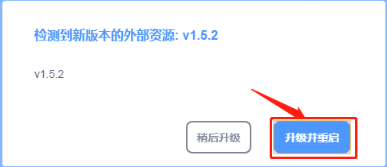

我们也可在设置中手动更新软件

如果已经是最新版本则显示

### 2.KidsBlock软件的使用方法

（以下是以Windows系统为例，MacOS系统可以参考）

1. 软件中各按钮的功能：

2. 点击可以选择语言“English”和“简体中文”。

3. 点击，选择点击“安装驱动”。（注意：如果电脑已经安装了驱动程序，则不需要再安装驱动；如果没有，则需要进行以下操作）

A.在“设备驱动程序安装向导”页面选择点击“下一页”。

2.  过一会儿，选择点击“完成”。

3.  选择点击“下一页”。

4.  选择点击“完成”。

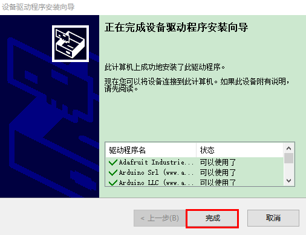

5.  如果出现安全页面，选择点击“允许”即可，然后选择点击“Install”。

E.选择点击“安装”。

6.  过一会儿，点击“Finish”。

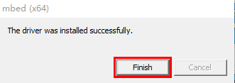

7.  选择点击“Extract”。

8.  选择点击“下一页”。

9.  选择点击“我接受这个协议”后，点击“下一页”。

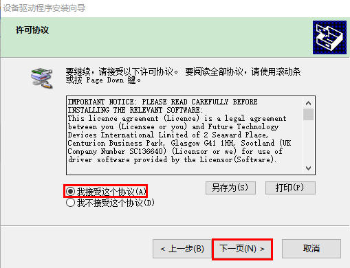

10. 选择点击“完成”。

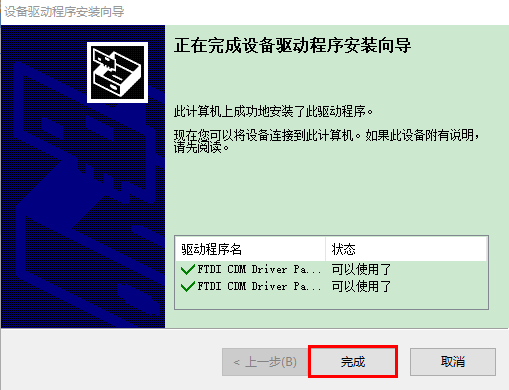

11. 选择“安装”。

15. 过几秒钟后，驱动安装完成，点击“确定”即可。

4.  驱动安装完后，点击进入主控板页面，可以选择需要添加的设备（控制板），本项目需要选择Uno     Plus主控板。先点击Uno Plus主控板所处区域，后点击“连接”。这样Uno     Plus主控板已连接上，点击“返回编辑器”回到编码编辑器。这样，我们会发现变成，同时变成，说明Uno     Plus主控板和端口（COM） 都已经连接上了。

5.  假如Uno Plus主控板已经连接上后，但是没有变成，则需要手动点击来连接端口（COM）。先点击，在出现的对话页面中点击，连接成功后，会出现“已连接”页面，说明端口已连接上了。

如果需要断开端口，先点击，在出现的对话页面中点击“断开连接”。这样，端口就断开了。

6.  Uno Plus主控板和端口（COM）都已经连接上，接着点击切换模式，这样就可以将切换成。

7.  是添加传感器/模块和元件的扩展包，点击可以进入传感器/模块扩展库界面，点击传感器/模块所处区域，就可以添加对应的传感器/模块。例如需要添加超声波传感器模块，点击“超声波传感器”所处区域，“未加载”变成“已加载”，说明“超声波传感器”模块添加成功。

点击，可以回到代码编辑器界面，在模块区可以看到添加的“超声波传感器”模块。

如果需要删除“超声波传感器”模块，只需要点击再次进入传感器/模块扩展库界面，点击“超声波传感器”所处区域，“已加载”变成“未加载”，则说明“超声波传感器”模块删除成功。

其他的传感器/模块和元器件的添加和删除，方法是一样的。

8.  打开已有的SB3类型文件的方法：推荐使用方法2，方法1打开时有时可能会丢失代码数据！

方法1：鼠标左键双击SB3类型文件，这样就可以打开SB3类型文件。例如：需要打开文件，则只需要左键双击文件就可以直接打开。

方法2：打开Kidsblock软件，点击“文件”，选择点击“从电脑中上传”，在电脑上选中需要打开的SB3类型文件（例如：文件）

## 多功能小乌龟智能车安装

安装1

安装所需零件

安装（丝印A,B字母朝上）

完成

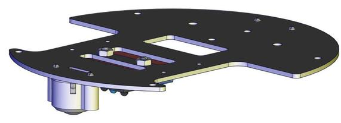

安装2

安装所需零件

安装（注意电机对应位置）

完成 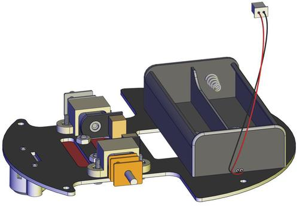
安装3

安装所需零件 

安装 

完成

安装完后需先给A，B电机插线

循迹传感器插线

安装4

安装所需零件

安装 

完成

安装5

安装所需零件

分步安装1

分步安装2（安装时需要安图所示90°朝前安装）

完成

安装6

安装所需零件

安装

完成

安装7

安装所需零件

安装

完成

安装8

安装所需零件

安装（安装前先按图穿线）

完成

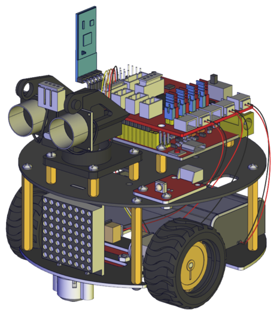

安装部分完成后进行接线

电机A接线图

电机B接线图

循迹传感器接线图

超声波接线图

点阵接线图

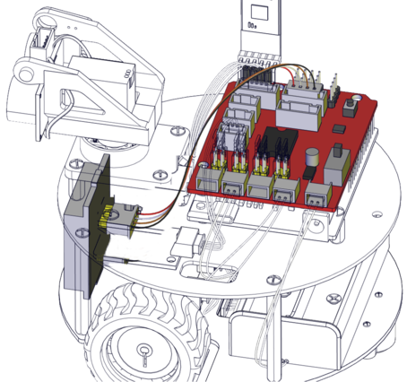

舵机接线图

红外接收传感器接线图

电池盒接线图

完成渲染效果图

### 接线

把舵机接到驱动板的10号引脚后叠加到PULS控制板上如下图

### 上传程序

1)  打开资料下的舵机复位程序

(2)开发板连接好电脑，选择好开发板和串口，点击上传程序，程序上传成功后舵机自动转到90度的位置

## 实验课程

### 第1课 LED灯项目

前面所有的东西都已经准备完毕，我们正式开始桌面小车的编程项目。前面我们从简单的传感器和模块开始，循序渐进完成模块传感器的测试项目，现在再来完成几个不同类型的机器人，最后我们把所有学到的知识结合到一起，完成一个综合的项目：多功能桌面小车。

注意：本项目中的各传感器/模块上标有（G）表示负极，是连接到控制板或传感器扩展板上的G或-或GND；标有（V）表示正极，是连接到控制板或扩展板上的V或VCC或+或5V。

（1）项目介绍： 

前面我们安装了keyes UNO Plus开发板的驱动。接下来的项目我们就要由简单到复杂，一步一步探索Arduino的世界了。首先我们要来完成经典的“Arduino点亮LED”，也就是Blink项目。Blink对于学习Arduino的爱好者而言，是最基础的项目是新手必须经历的一个练习。

LED
，发光二极管的简称。由含镓（Ga）、砷（As）、磷（P）、氮（N）等的化合物制成。当电子与空穴复合时能辐射出可见光，因而可以用来制成发光二极管。在电路及仪器中作为指示灯，或者组成文字或数字显示。

为了实验的方便，我们将LED发光二极管做成了一个模块，在第一个项目中，我们用一个最基本的测试代码来控制LED，亮一秒钟，灭一秒钟，来实现闪烁的效果。你可以改变代码中LED灯亮灭的时间，实现不同的闪烁效果。LED模块信号端S为高电平时LED亮起，S为低电平时LED熄灭。

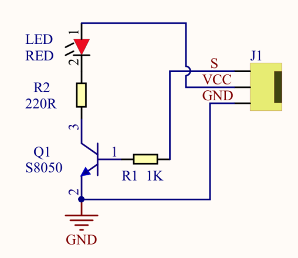

（2）LED模块参数： 

控制接口: 数字口

工作电压: DC 3.3-5V

排针间距: 2.54mm

LED显示颜色：红色

（3）项目组件： 

|keyes UNO Plus开发板*1|Keyes brick L298P 电机驱动扩展板 V1*1|keyes 草帽LED白发红模块*1|
|-|-|-|
||||
|USB线*1|3Pin 双母头杜邦线*1|18650双节电池盒*1|18650电池*2 （电池自配）|
||||

（4）接线图： 

由上图我们可以看到，扩展板是堆叠在开发板上的，LED模块的-接到了扩展板的G,LED模块的+接到了扩展板的5V，LED模块的S已经接到了扩展板上的D9接口，接好线之后我们开始编写代码：

（5）项目代码： 

可以直接打开我们编写好的程序：点击文件下的打开然后找到Scartch教程的第一课程序

也可以自己通过拖动代码块来编写代码程序，操作步骤如下：

①在事件栏里拉出“Arduino启动”模块。

②在引脚栏拖出设置引脚输入/输出模块

③在控制栏拖出无限循环模块

④在引脚栏拖出设置引脚高低电平模块，设置管脚为2，电平为高，点亮LED。

⑤在控制栏目里拖出延时模块，设置为1秒

⑥在引脚栏拖出设置引脚高低电平模块，设置管脚为2，电平为低，熄灭LED。

⑦再来一个延时1秒

\*\*\*\*\*\*\*\*\*\*\*\*\*\*\*\*\*\*\*\*\*\*\*\*\*\*\*\*\*\*\*\*完整的代码如下\*\*\*\*\*\*\*\*\*\*\*\*\*\*\*\*\*\*\*\*\*\*\*\*\*\*\*\*\*\*\*\*

上传程序：选择正确串口，波特率是：9600；控制板选择uno plus开发板；然后点击上传程序，程序上传成功会提示上传成功。

（6）项目结果： 

点击上传程序到开发板，成功之后，D9脚接着的LED打开和关闭，而且间隔的时间是一秒钟。

（7）项目拓展： 

|文件路径|文件名|
|-|-|
|Scartch 教程\4.实验课程\第1课 LED灯项目\程序|1-2.sb3|

前面我们控制了LED 的闪烁，我们来拓展一下思路，我们要改变LED
灯闪烁的频率,把延时改成0.2秒。代码如下：

怎么样是不是很好理解，就是通过改变这个代码的延时时间，来改变9脚LED亮和灭的频率，不多说，我们上传代码。看看这个LED灯闪烁的频率是不是比之前快了？

### 第2课 LED 亮度的调节 

（1）项目介绍： 

前面课程中，我们详细的介绍了通过代码控制LED亮灭，实现闪烁的效果。这节课我们使用PWM来控制LED亮度不断地变化，模拟我们呼吸的效果。

PWM是使用数字手段来控制模拟输出的一种手段。使用数字控制产生占空比不同的方波（一个不停在高电平与低电平之间切换的信号)来控制模拟输出。一般来说端口的输入电压只有两个0V与5V。如果想要改变灯的亮度怎么办呢个？有同学说串联电阻，对，这个方法是正确的。但是，如果想要得到不同的亮度，且在不同亮度之间来回变动怎么办呢？不可能不停地切换电阻吧。这种情况下就需要使用PWM了，那它是怎么控制的呢？

对于Arduino的数字端口电压输出只有LOW与HIGH两个，对应的就是0V与5V的电压输出，可以把LOW定义为0，HIGH定义为1，1秒内让Arduino输出500个0或者1的信号。如果这500个全部为1，那就是完整的5V，如果全部为0，那就是0V。如果010101010101这样输出，刚好一半，端口输出的平均电压就为2.5V了。这个和放映电影是一个道理，咱们所看的电影并不是完全连续的，它其实是每秒输出25张图片。在这种情况下，人的肉眼是分辨不出来的，看上去就是连续的了。PWM也是同样的道理，如果想要不同的电压，就控制0与1的输出比例控制就可以了。当然这和真实的连续输出还是有差别的，单位时间内输出的0,1信号越多，控制的就越精确。

项目组件： 

|keyes UNO Plus 开发板*1|Keyes brick L298P 电机驱动扩展板 V1*1|keyes 草帽LED白发红模块*1|
|-|-|-|
||||
|USB线*1|3Pin 双母头杜邦线*1|18650双节电池盒*1|18650电池*2 （电池自配）|
||||

（3）接线图： 

Arduino的PWM引脚在3，5，6，9，10，11,上一小节的接线刚刚好在9脚，所以我们这个接线不用变

（4）项目程序 

可以直接打开我们编写好的程序：

|文件路径|文件名|
|-|-|
|Scartch 教程\4.实验课程\第2课 LED 亮度的调节\程序|2-1.sb3|

也可以自己通过拖动代码块来编写代码程序，操作步骤如下：

①在事件栏里拉出“Arduino启动”模块。

②在引脚栏拖出设置引脚输入/输出模块

③在变量类型栏中拖出声明全局变量模块并设置变量名为“i”

④在控制栏拖出无限循环模块

⑤然后再拖出重复执行直到模块

⑥然后在重复执行里加运算栏的大于模块，然后在变量类型栏下拖出变量模块变量名为
i ，最后设置数字为254

⑦在变量类型下做出设置变量加一的模块，并设置变量名为 i

⑧在引脚栏下拖出设置引脚为PWM模块，并添加变量i为PWM值

⑨在控制栏拖出延时模块，设置延时为0.005秒

⑩再拖出重复执行直到模块

⑪然后在重复执行里加运算栏的小于模块，然后在变量类型栏下拖出变量模块变量名为
i ，最后设置数字为1

⑫在变量类型下做出设置变量减一的模块，并设置变量名为 i

⑬在引脚栏下拖出设置引脚为PWM模块，并添加变量i为PWM值

⑭在控制栏拖出延时模块，设置延时为0.005秒

\*\*\*\*\*\*\*\*\*\*\*\*\*\*\*\*\*\*\*\*\*\*\*\*\*\*\*\*\*\*\*\*完整的代码如下\*\*\*\*\*\*\*\*\*\*\*\*\*\*\*\*\*\*\*\*\*\*\*\*\*\*\*\*\*\*\*\*

（5）项目结果：

上传代码到开发板代，完成后，我们可以看到LED会有个逐渐由亮到灭的一个缓慢过程，而不是直接的亮灭，如同呼吸一般，均匀变化。

项目拓展： 

可以直接打开我们编写好的程序：

|文件路径|文件名|
|Scartch 教程\4.实验课程\第2课 LED 亮度的调节\程序|2-2.sb3|

我们不改变灯的脚位，只是改变程序里面延时ms的值为30ms，看看它如何改变渐变效果。

上传代码到开发板，看LED渐变的效果是不是慢了一些。

### 第3课 循迹传感器项目 

（1）项目介绍： 

这个3路循迹传感器模块上自带有三个电位器，用于调节循迹传感器敏感度。循迹传感器其实也是红外传感器，这里的循迹传感器模块用到的元件是TCRT5000红外对管，TCRT5000红外对管具有一个高发射功率红外发射二极管和一个高灵敏度红外接收管。当发射管的红外信号经反射被接收管接收后，接收管的电阻会发生变化，在电路上一般以电压的变化体现出来。电阻的变化取决于接收管所接收的红外信号强度，常表现在反射面的颜色和反射面接收管的距离。在检测的时候，黑色高电平有效，白色是为低电平有效。

红外对管寻迹：

当乌龟车在白色底面行驶时，装在车下的红外发射管发射红外信号，经白色发射后，被接收管接收，一旦接收管接收到信号，输出端将输出低电平（0）；当乌龟车行驶到黑线时，红外线信号被黑色吸收后，将输出高电平（1），从而实现了通过红外线检测信号的功能。将检测到的信号送到单片机的I/O口，当I/O口检测到的信号为高电平（1）时，表明乌龟车处于黑色的引线上；同理，当I/O口检测到的信号为低电平（0）时，表明乌龟车处于白色地面上。

（2）参数：

工作电压：DC 3.3-5V

接口：5PIN接口（PH2.0mm-5P 卧贴插座 ）

输出信号：数字信号

检测高度：0—3cm

尺寸：40\*32\*9mm

重量：6.8g

定位孔大小：直径3mm

(3)项目组件： 

|keyes UNO Plus 开发板*1|Keyes brick L298P 电机驱动扩展板 V1*1|keyes 草帽LED白发红模块*1|Keyes connectors 循迹传感器*1|
|-|-|-|-|
|||||
|XH2.54转PH2.0 5P 连接线*1|3Pin 双母头杜邦线*1|USB线*1|18650双节电池盒*1|18650电池*2 （电池自配）|
|||||

（4）接线图: 

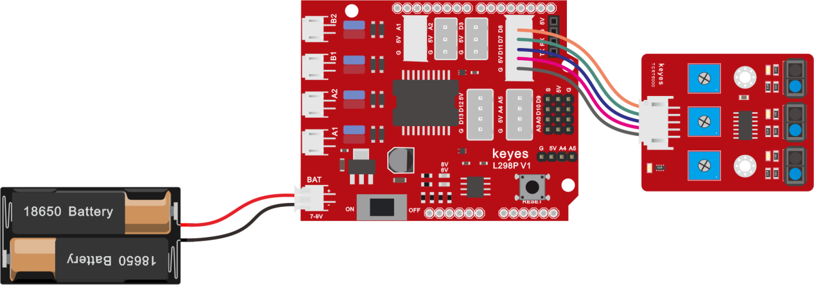

循迹传感器接扩展板的D11、D7、D8引脚（左11，中7，右8）。

（5）项目程序： 

可以直接打开我们编写好的程序：

|文件路径|文件名|
|Scartch 教程\4.实验课程\第3课 循迹传感器项目\程序|3-1.sb3|

在事件栏拖出Arduino启动模块

在串口栏拖出设置串口波特率模块，波特率为9600

在控制栏拖出重复执行模块

在串口栏拖出串口打印模块，设置打印文字“L：”不换行

在串口栏拖出串口打印模块，添加串口模块中的读取数字引脚模快引脚为11脚，不换行

在以上面步骤同样的方法添加“M：”“R：”引脚为7，8

在控制栏拖出延时模块并设置延时为0.1秒

完整代码：

（6）项目结果： 

上传代码带开发板，打开串口监视，可以看到左中右三个循迹传感器的状态，如果我们用白纸去遮挡传感器，传感器的状态都是0。在没有接收到信号的时候，三个传感器都是高电平状态，显示的数值是1。

项目拓展： 

上面我们了解了循迹传感器的工作原理，接下来我们在第9脚接上一个LED
灯，然后通过读取循迹传感器的状态，来控制LED的亮和灭。如下图接线：

可以直接打开我们编写好的程序：

|文件路径|文件名|
|-|-|
|Scartch 教程\4.实验课程\第3课 循迹传感器项目\程序|3-2.sb3|

上传代码到开发板，用我们的手去一个个的靠近传感器，我们看看LED灯的状态发生了改变没有？当我们用手去遮挡循迹传感器的时候，我们可以看到LED灯亮起来了。

### 第4课 舵机控制项目 

（1）项目介绍：

舵机是一种位置伺服的驱动器，主要是由外壳、电路板、无核心马达、齿轮与位置检测器所构成。其工作原理是由接收机或者单片机发出信号给舵机，其内部有一个基准电路，产生周期为20ms，宽度为1.5ms
的基准信号，将获得的直流偏置电压与电位器的电压比较，获得电压差输出。

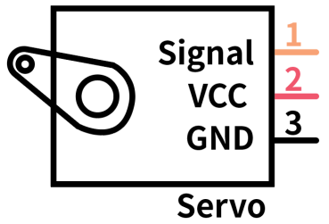舵机有很多规格，但所有的舵机都有外接三根线，分别用棕、红、橙三种颜色进行区分，由于舵机品牌不同，颜色也会有所差异，棕色为接地线，红色为电源正极线，橙色为信号线。

舵机的转动的角度是通过调节PWM（脉冲宽度调制）信号的占空比来实现的，标准PWM（脉冲宽度调制）信号的周期固定为20ms（50Hz），理论上脉宽分布应在1ms到2ms
之间，但是，事实上脉宽可由0.5ms 到2.5ms
之间，脉宽和舵机的转角0°～180°相对应。

对应的舵机角度值如下:

（2）舵机参数： 

工作电压：DC 4.8V〜6V

可操作角度范围：大约 About 180°(在 500→2500 μsec)

脉波宽度范围：500→2500 μsec

空载转速：0.12±0.01 sec/60（DC 4.8V） 0.1±0.01 sec/60（DC 6V）

空载电流：200±20mA（DC 4.8V） 220±20mA（DC 6V）

停止扭力：1.3±0.01kg·cm（DC 4.8V） 1.5±0.1kg·cm（DC 6V）

停止电流：≦850mA（DC 4.8V） ≦1000mA（DC 6V）

待机电流：3±1mA（DC 4.8V） 4±1mA（DC 6V）

（3）项目组件： 

|keyes UNO Plus 开发板*1|Keyes brick L298P 电机驱动扩展板 V1*1|Keyes SG90 9G 舵机|
|-|-|-|
||||
|USB线*1|18650双节电池盒*1|18650电池*2 （电池自配）|
|||

（4）接线图： 

接线注意：舵机连接到G（GND）、V（VCC）、10，舵机的棕色线是与Gnd(G)相连，红色线与5v(V)相连，橙色线是与数字10相连的。接舵机的时候必须要外接供电，因为驱动舵机的电流要求比较大，一般峰值的情况下接近1A，开发板的电流远远不够。如果不接外接电源，很有可能烧坏开发板。

项目程序：

可以直接打开我们编写好的程序：

|文件路径|文件名|
|-|-|
|Scartch 教程\4.实验课程\第4课 舵机控制项目\程序|4-1.sb3|

也可以自己通过拖动代码块来编写代码程序，操作步骤如下：

先点击左下角的添加舵机代码块

在事件栏拖出Arduino启动模块

初始化舵机：在舵机栏拖出设置舵机模块，引脚为10，角度为90延时为500

在控制栏拖出重复执行模块

在舵机栏拖出设置舵机模块，引脚为10，角度为0延时为500

在舵机栏拖出设置舵机模块，引脚为10，角度为180延时为500

在舵机栏拖出设置舵机模块，引脚为10，角度为0延时为500

\*\*\*\*\*\*\*\*\*\*\*\*\*\*\*\*\*\*\*\*\*\*\*\*\*\*\*\*\*\*\*\*完整的代码如下\*\*\*\*\*\*\*\*\*\*\*\*\*\*\*\*\*\*\*\*\*\*\*\*\*\*\*\*\*\*\*\*

在上传代码成功，我们可以看到舵机在0°到180°角度范围来回摆动。

(6)实验结果 

在上传代码成功，我们可以看到舵机在0°到180°角度范围来回摆动。

### 第5课 超声波模块项目 

（1）项目介绍： 

超声波传感器，它可以检测前方是否存在障碍物，并且检测出传感器与障碍物的详细距离。它的原理和蝙蝠飞行的原理一样，就是超声波模块发送出一种频率很高，人体无法听到的超声波信号。这些超声波的信号若是碰到障碍物，就会立刻反射回来，在接收到返回的信息之后，通过判断发射信号和接收信号的时间差，计算出传感器和障碍物的距离。

（2）超声波参数： 

工作电压：DC 5V

工作电流：15mA

工作频率：40khz

最大探测距离：3-4m

最小探测距离：2cm

感应角度：不大于15度

高精度：可达3mm

（3）项目组件： 

|keyes UNO Plus 开发板*1|Keyes brick L298P 电机驱动扩展板 V1*1|keyes 草帽LED白发红模块*1|HC-SR04超声波传感器*1|
|-|-|-|-|
|||||
|HX-2.54 4P 双头 连接线*1|3Pin 双母头杜邦线*1|USB线*1|18650双节电池盒*1|18650电池*2 （电池自配）|
|||||

（4）超声波模块知识： 

原理：看超声波的图可知，像是有两个眼睛，其一边是发射超声的，一边是接收超声波的，然后检测从发射遇到障碍物返回被接收到所需的时间t，再根据声音在空气中的传播速度大概是343m/s,
距离 = 速度 \* 时间 ，
由于超声波发射返回是两段路程了，所以需要除以2，故超声波测到的 距离
=（速度 \* 时间）/2

超声波模块的使用方法及时序图：

1、使用GPIO引脚给SR04的Trig引脚至少10μs的高电平信号，触发SR04模块测距功能；

2、触发后，模块会自动发送8个40KHz的超声波脉冲，并自动检测是否有信号返回。这步会由模块内部自动完成。

3、如有信号返回，Echo引脚会输出高电平，高电平持续的时间就是超声波从发射到返回的时间。

超声波模块的电路图

（5）接线图： 

接线注意：超声波传感器模块的VCC引脚连接至keyestudio V5
传感器扩展板的5v(V)，Trig引脚至数字12(S)，Echo引脚至数字13(S)，Gnd引脚至Gnd(G)。

项目代码： 

可以直接打开我们编写好的程序：

|文件路径|文件名|
|-|-|
|Scartch 教程\4.实验课程\第5课 超声波模块项目\程序|5-1.sb3|

也可以自己通过拖动代码块来编写代码程序，操作步骤如下：

先点击左下角的添加舵机代码块

在事件栏拖出Arduino启动模块

在串口栏拖出设置串口波特率模块，波特率为9600

在控制栏拖出重复执行模块

在串口栏拖出串口打印模块，设置不换行；在超声波栏拖出设置超声波模块，设置tirg为12脚，echo为13脚，单位为CM

在串口栏拖出串口打印模块，设置打印内容为“CM”换行

在控制栏拖出延时模块，设置延时为0.25秒

\*\*\*\*\*\*\*\*\*\*\*\*\*\*\*\*\*\*\*\*\*\*\*\*\*\*\*\*\*\*\*\*完整的代码如下\*\*\*\*\*\*\*\*\*\*\*\*\*\*\*\*\*\*\*\*\*\*\*\*\*\*\*\*\*\*\*\*

（7）项目结果： 

上传好测试代码到开发板，打开串口监视器，设置波特率为9600，我们可以看到超声波模块显示的距离，单位是厘米和英寸。用手阻挡超声波模块，我们看到显示距离的数值变小了。

(注意：上传好程序，把驱动板上的拨码开关拨到ON的位置，因为USB供电过低，超声波传感器无法正常工作)

（9）项目拓展： 

我们刚刚测出了超声波显示的距离，那我们动动脑筋，能不能用测出的距离来做一些控制呢，如果控制一个LED灯的亮和灭。我们来试一下，在D9脚接上一个LED灯模块。

可以直接打开我们编写好的程序：

|文件路径|文件名|
|-|-|
|Scartch 教程\4.实验课程\第5课 超声波模块项目\程序|5-2.sb3|

上传好测试代码到开发板，我们用手去靠近超声波传感器，看LED
灯亮起来了没有。

### 第6课 红外接收原理及应用

（1）项目介绍 

红外遥控在日常生活中随处可见，它被用来控制各种家电，如电视、音响、录影机和卫星信号接收器。红外遥控是由红外发射和红外接收系统组成的，也就是一个红外遥控器和红外接收模块和一个能解码的单片机组成的。 

红外发射的遥控器发射的38K红外载波信号是由遥控器里的编码芯片对其进行编码。它是以一段引导码，用户码，数据码，数据反码组成，利用脉冲的时间间隔来区别是0还是1信号(高电平低电平之比约为1:1时被认为是信号0)，而编码就是由这些0
、1信号组成。同一个遥控器的用户码是不变的，用数据吗不同来分辨遥控器按的键不同。当按下遥控器按键时，遥控器发送出红外载波信号，红外接收器接收到信号时程序对载波信号进行解码，通过数据码的不同来判断按下的是哪个键。单片机由接收到的01信号进行解码，由此判断遥控器按下的是什么键。

红外接收我们用的是一个红外接收模块，主要由红外接收头组成，它是集接收、放大、解调一体的器件，它内部IC就已经完成了解调，能够完成从红外线接收到输出与TTL电平信号兼容的所有工作，输出的就是数字信号。他适用于红外线遥控和红外线数据传输。接收器做成的红外接收模块只有三个引脚，信号线，VCC，GND。与arduino和其他单片机连接通信非常方便。

（2）红外接收的参数： 

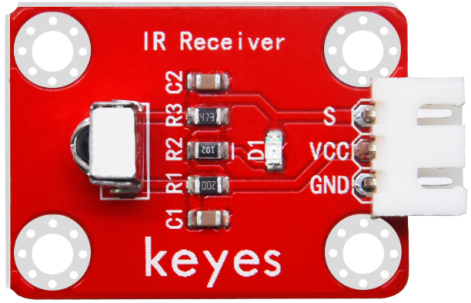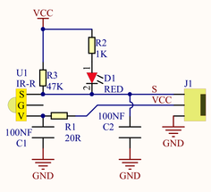工作电压：3.3-5V（DC）

接口：3PIN接口

输出信号：数字信号

接收角度：90度

频率：38khz  
接收距离：3米

右图为红外接收模块的实物图和电路图

项目组件： 

|keyes UNO Plus 开发板*1|Keyes brick L298P 电机驱动扩展板 V1*1|keyes 草帽LED白发红模块*1|keyes brick 红外接收传感器*1|JMP-1 17键红外遥控*1|
|-|-|-|-|-|
||||||
|USB线*1|3Pin 双母头杜邦线*1|XH2.54-3Pin+杜邦母双*1|18650双节电池盒*1|18650电池*2 （电池自配）|
||||||

（4）接线图： 

接线注意：由于红外接收传感器输入的数字信号，将红外接收传感器模块的“-”、“+”和S引脚分别用导线连接到keyestudio传感器扩展板G（GND）、V（VCC）、A1，模拟口在数字口不够的情况下，模拟口也可以当数字口使用，模拟口A0相当于数字口14，A1相当于数字口15，以此类推。

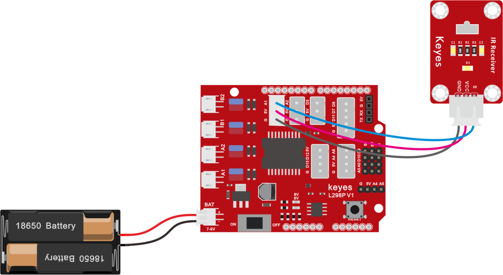

（5）项目代码： 

可以直接打开我们编写好的程序：

|文件路径|文件名|
|-|-|
|Scartch 教程\4.实验课程\第6课 红外接收原理及应用 \实验程序|6-1.sb3|

也可以自己通过拖动代码块来编写代码程序，操作步骤如下：

添加红外接收代码块

在事件栏拖出Arduino启动模块

在串口栏拖出设置串口波特率模块，设置波特率为9600

在红外接收栏拖出初始化红外接收模块，设置引脚为A1

在控制栏拖出重复执行模块

在控制栏拖出判断模块，并在红外接收栏拖出红外接收遥控器数据模块，加在判断条件上

在串口栏拖出串口打印模块，并在红外接收栏拖出读取红外数据模块，加在打印模块上，换行打印

在红外接收栏拖出刷新红外接收数据模块

在控制栏拖出延时模块，设置延时为0.1秒

\*\*\*\*\*\*\*\*\*\*\*\*\*\*\*\*\*\*\*\*\*\*\*\*\*\*\*\*\*\*\*\*完整的代码如下\*\*\*\*\*\*\*\*\*\*\*\*\*\*\*\*\*\*\*\*\*\*\*\*\*\*\*\*\*\*\*\*

（6）项目结果： 

上传好测试代码，打开串口监视器，设置波特率为9600，拿出遥控器，对准红外接收传感器发送信号，即可看相应按键的键值，如果按键时间过长，容易出现乱码。

我们通过测试得出的数值，做了一个遥控器按键值表，方便以后使用。

（7）项目拓展： 

我们刚刚解码了红外遥控器的按键值，那我们能不能用测出的按键值来做一些控制呢，如果控制一个LED灯的亮和灭。我们来试一下，在9脚接上一个LED灯模块。红外接收器的脚位不变,当有遥控器的按键按下时,接在数字引脚9上的发光LED就会点亮，再按一下按键，led熄灭，接线图如下：

上传代码带开发板,当遥控器按下OK按键时,LED就会亮，再按一下LED就会灭,同时电脑的串口会出现按键的命令编码.

可以直接打开我们编写好的程序：

|文件路径|文件名|
|-|-|
|Scartch 教程\4.实验课程\第6课 红外接收原理及应用 \实验程序|6-2.sb3|

上传代码带开发板,当遥控器按下OK按键时,LED就会亮，再按一下LED就会灭,同时电脑的串口会出现按键的命令编码.

### 第7课 蓝牙遥控的原理及应用

（1）项目介绍：

蓝牙是一种无线数据传输方法。蓝牙技术是一种无线标准技术，可实现固定设备、移动设备和楼宇个人域网之间的短距离数据交换，DX-
-BT24 5. 1蓝牙模块采用英国 DAILOG公司14531芯片，配置256Kb 空间，遵循V5.1 BLE蓝牙规范。支持AT指令，用户可根据需要更改串口波特率、设备名称等参数，使用灵活。.本模块支持UART接口,并支持蓝牙串口透传，具有成本低、体积小、功耗低、收发灵敏性高等优点，只需配备少许的外围元件就能实现其强大功能。

蓝牙参数：

蓝牙协议：Bluetooth Specification V5.1 BLE

工作距离：在开放环境中，实现40m超远距离通讯

工作频率：2.4GHz ISM频段

通信接口：UART

蓝牙认证：符合FCC CE ROHS REACH认证标准

串口参数：9600、8数据位、1停止位、无效位、无流控

电源：5V DC

工作温度：–10至+65摄氏度

（3）项目组件：

|keyes UNO Plus 开发板*1|Keyes brick L298P 电机驱动扩展板 V1*1|keyes 草帽LED白发红模块*1|DX-BT24 V5. 1 BLE蓝牙模块|
|-|-|-|-|
|||||
|3Pin 双母头杜邦线*1|USB线*1|18650双节电池盒*1|18650电池*2 （电池自配）|
||||

（4）接线图：

1.STATE：状态测试引脚，连接到内部LED，通常保持其未连接。

2.RXD：串行接口，接收终端。

3.TXD：串行接口，传输终端。

4.GND：接地。

5.VCC：电源的正极。

6.EN/BRK：断开连接，表示断开蓝牙连接，一般情况下，保持断开连接。

蓝牙是直接插在电机驱动扩展板上的，注意一下方向，而且在上传代码之前不要插上蓝牙。

实验程序：

可以直接打开我们编写好的程序：

|文件路径|文件名|
|-|-|
|Scartch 教程\4.实验课程\第7课 蓝牙遥控的原理及应用\实验程序|7.1.sb3|

也可以自己通过拖动代码块来编写代码程序，操作步骤如下：

在事件栏拖出Arduino启动

在串口栏拖出设置串口波特率模块，设置波特率为9600

在控制栏拖出重复执行模块

在控制栏拖出判断模块

在算数栏拖出大于模块，并在串口栏拖出拖出串口可读取字节数模块，设置串口可读取字节数大于0

在串口栏拖出串口打印模块，并添加串口读取数据在串口打印模块里

\*\*\*\*\*\*\*\*\*\*\*\*\*\*\*\*\*\*\*\*\*\*\*\*\*\*\*\*\*\*\*\*完整的代码如下\*\*\*\*\*\*\*\*\*\*\*\*\*\*\*\*\*\*\*\*\*\*\*\*\*\*\*\*\*\*\*\*

（上传代码之前不要连接蓝牙模块，因为代码的上传也是用的串口通信，跟蓝牙的串口通信会有冲突，导致代码上传不成功）

上传代码到开发板，然后再插上蓝牙模块，等待手机发出的指令。

这是读取到abcABC的ASCII码值

ASCII码对照表：

（6）下载蓝牙测试APP：

安卓系统手机APP

1.  扫码下载或者进入APP下载链接：http://8.210.52.206/Turtle_Car.apk

注意：当我们扫码下载的时候需要使用浏览器打开，使用微信扫可能无效。

2.  下载后安装，安装成功，显示图标如下。

3.点击上图图标，进入APP，显示如下图。

4.REV4板上传代码成功后，连接蓝牙，上电后，蓝牙模块上LED闪烁。点击APP图标，搜索到蓝牙，显示如下图。

5.点击连接，蓝牙连接成功，显示如下图，蓝牙模块上LED变为常亮。

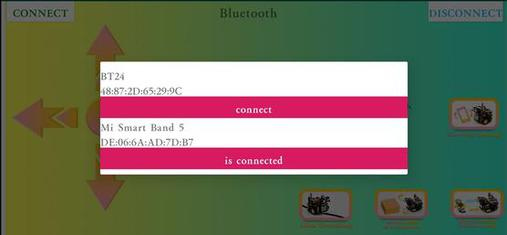

苹果系统手机APP

1.打开App Store。

2.点击搜索，搜索keyestudio，下载搜索到的keyes BT car。

3.打开keyes BT car。

4.开启手机蓝牙，点击左上角的connect按钮，进行蓝牙搜索和连接。

5.点击桌面小车的图片按钮，进入控制桌面小车的界面

（7）项目拓展：

上面的项目，我们讲解了蓝牙接收到手机发送的信号并且在开发板的串口显示出来，比如我们按下，然后我们就会接收到‘B’，当我们松开的时候又接收到‘S’。那接下来我们就要想一下了，我们可以利用接收到的信号去做一些事情吗，答案是肯定的，我们这里就利用手机发送的命令去打开或者关闭一个LED灯。看接线图，在D9脚接了一个LED。

可以直接打开我们编写好的程序：

|文件路径|文件名|
|-|-|
|Scartch 教程\4.实验课程\第7课 蓝牙遥控的原理及应用\实验程序|7.1.sb3|

上传代码完成后，点击手机APP
上以控制LED。当您按下发送\`\`B''时，LED将打开，而当您松开发送\`\`S''时，LED将关闭。

### 第8课 电机的驱动和调速 

（1）项目介绍： 

驱动电机的方法有很多，我们这个智能车用到的是最常用的L298P这个方案，
L298P是ST意法半导体公司出品的优秀大功率电机专用驱动芯片，可直接驱动直流电机、二相、四相步进电机，驱动电流达2A，电机输出端采用8只高速肖特基二极管作为保护。

我们根据L298P的电路设计了一款扩展板，叠层的设计可直接插接到开发板上使用，降低了用户使用和驱动电机的技术难度。我们来看一下这个板子的电路图和示意图：

为了调节小车上的4个电机，使得电机电机的驱动方向与后续的课程代码描述一致。驱动板上自带8个跳线帽，也可用于控制电机转向，例如当MA电机接口前方2个跳线帽由横向连接改为纵向连接时，MA电机的转动方向就和原来的转动方向相反。

（2）规格参数： 

逻辑部分输入电压：DC 5V

驱动部分输入电压：DC 7-12V

逻辑部分工作电流：\<36mA

驱动部分工作电流：\<2A

最大耗散功率：25W（T=75℃）

控制信号输入电平：高电平2.3V\<Vin\<5V  ，低电平-0.3V\<Vin\<1.5V  
工作温度：-25＋130℃

（3）驱动小车运行原理： 

根据上面电机驱动板的电路图和示意图，我们让A电机的方向引脚在D2,调速引脚在D6,B电机的方向引脚在D4，调速引脚在D5，按照以下表格的运动逻辑，我们就可以知道如何通过控制数字口，PWM口控制2个电机转动，从而实现智能小车的行走。其中PWM值范围为0-255，设置数字越大，电机转动越快。（左边A电机，右边B电机）

||D2|D6（PWM）|电机（A）|D4|D5（PWM）|电机（B）|
|-|-|-|-|-|-|-|
|前进|LOW|200|正转|LOW|200|正转|
|后退|HIGH|200|反转|HIGH|200|反转|
|右旋转|LOW|200|正转|HIGH|200|反转|
|左旋转|HIGH|200|反转|LOW|200|正转|
|停止|/|0|停止|/|0|停止|

项目组件：

|keyes UNO Plus 开发板*1|Keyes brick L298P 电机驱动扩展板 V1*1|Keyes quick connectors 12FN20电机连接板A*1|Keyes quick connectors 12FN20电机连接板B*1|
|-|-|-|-|
||||
|双头JST-PH2.0MM-2P*2|USB线|18650双节电池盒*1|18650电池*2 （电池自配）|
||||

（5）接线图： 

（6）项目代码： 

可以直接打开我们编写好的程序：

|文件路径|文件名|
|-|-|
|Scartch 教程\4.实验课程\第8课 电机的驱动和调速\实验程序|8.1.sb3|

也可以自己通过拖动代码块来编写代码程序，操作步骤如下：

在事件栏拖出Arduino启动模块

在控制栏拖出重复循环模块

在引脚栏拖出两个设置引脚高低电平，设置4，2脚为高电平；两个设置引脚PWM，设置5，6脚PWM值为255；在拖出一个延时模块延时1秒（前进代码）

在引脚栏拖出两个设置引脚高低电平，设置4，2脚为低电平；两个设置引脚PWM，设置5，6脚PWM值为255；在拖出一个延时模块延时1秒（后退代码）

在引脚栏拖出两个设置引脚高低电平，设置4脚为低电平，2脚为高电平；两个设置引脚PWM，设置5，6脚PWM值为255；在拖出一个延时模块延时1秒（左转代码）

在引脚栏拖出两个设置引脚高低电平，设置4脚为高电平，2脚为低电平；两个设置引脚PWM，设置5，6脚PWM值为255；在拖出一个延时模块延时1秒（右转代码）

（7）项目结果： 

上传代码成功，上电后，智能车前进1秒，后退1秒，左转1秒，右转1秒，停止1秒，循环。

（注意：程序上传成功后驱动板的拨码开关拨到NO位置，USB供电过低电机无法正常工作）

（8）项目拓展： 

我们来通过调整PWM控制电机的速度，PWM调节150，接线不变

上传代码成功，怎么样，电机转动的速度是不是慢了很多？

### 第9课 点亮8\*8点阵屏 

（1）项目介绍： 

制作小型显示器的一个有趣方法是使用8x8矩阵或4位7段显示器。像这样的矩阵是“多路复用的”——要控制64个LED，需要16个引脚。这需要很多引脚，还有像MAX7219这样的驱动芯片，可以为您控制矩阵，但是需要设置很多布线，它们占用了大量空间。毕竟，如果你能在没有大量布线的情况下控制一个矩阵，那不是很棒吗？这就是这些可爱的LED矩阵背包的用武之地。

在8X8点阵模块中，我们用HT16K33芯片来驱动点阵，有了它，我们只需要利用一个I2C通信接口（A4 SDA和A5 SCL）就可以控制一个8X8点阵了，不但方便了接线，而且节约可单片机资源。

项目组件： 

|keyes UNO Plus 开发板*1|Keyes brick L298P 电机驱动扩展板 V1*1|Keyes brick 乌龟车用8X8点阵模块*1|
|-|-|-|
||||
|USB线*1|HX-2.54 4P 双头 26AWG*1|18650双节电池盒*1|18650电池*2 （电池自配）|
||||

（3）8\*8点阵屏介绍 LED点阵屏由LED发光二极管组成，通过控制LED亮灭来显示文字、图片、动画、视频等，被广泛应用于公共场合做信息展示，如广告屏、公告牌等。

LED点阵屏按照LED发光颜色可分为单色、双色、三色灯等，可显示红、黄、绿甚至是真彩色。根据LED的数量又分为4×4、8×8、16×16等不同类型。这里我们通过单色8×8点阵屏来了解其原理。

不同点阵屏封装不同，8×8点阵屏由8行8列共64个LED灯组成，其内部结构如下图：

每个LED放置在行线和列线的交叉点上，当对应的某一行电平拉高，某一列电拉低，则对应交叉点的LED就会点亮。8×8点阵屏有16个管脚，将有丝印的一边朝下，逆时针编号为1.8，9.16。

其对应内部管脚定义如下如所示：

比如我们要点亮第一行第一列LED灯，则对应将点阵屏的第9脚拉高，第13脚拉低，其他LED控制以此类推即可。

（4）HT16K33 8X8点阵驱动模块 

上面介绍了8\*8点阵的原理，想控制8\*8点阵需要多达16个单片机的引脚。这样既浪费资源也浪费时间。我们这里用了一个驱动点阵屏的芯片：HT16K33。THT16K33是一款内存映射和多功能LED控制器驱动器。该设备的最大显示段数为128个模式（16个段和8个公共区），带有13\*3（最大）矩阵键扫描电路。HT16K33的软件配置功能使其适用于多个LED应用，包括LED模块和显示子系统。HT16K33与大多数微控制器兼容，并通过双线双向I2C总线进行通信。下图是HT16K33
芯片工作原理图。

我们基于以上原理设计了一个8X8点阵驱动模块，从上图我们可以看出，我们只要通过I2C
通讯利用单片机的2个引脚就可以很好的控制点阵显示。

（5）8X8点阵模块的参数 

工作电压: 5V    

额定输入频率: 400KHZ 

功率: 2.5W  

工作电流: 500mA  

（6）接线图： 

接线注意：点阵屏模块的G、V、SDA、SCL引脚分别用导线连接到堆叠在keyes UNO Plus板上的电机驱动扩展板上的G、5V、A4、A5，电源接到BAT接口。

实验程序： 

可以直接打开我们编写好的程序：

|文件路径|文件名|
|-|-|
|Scartch 教程\4.实验课程\第9课 使用点阵屏\实验程序|9-1.sb3|

也可以自己通过拖动代码块来编写代码程序，操作步骤如下：

先点击左下角的添加点8\*8阵模块

在事件栏拖出Arduino启动模块

在点阵栏拖出初始化点阵模块和清屏模块

在控制栏拖出重复执行模块

在点阵栏拖出点阵显示模块和刷新显示模块，并设置显示图案为微笑

\*\*\*\*\*\*\*\*\*\*\*\*\*\*\*\*\*\*\*\*\*\*\*\*\*\*\*\*\*\*\*\*完整的代码如下\*\*\*\*\*\*\*\*\*\*\*\*\*\*\*\*\*\*\*\*\*\*\*\*\*\*\*\*\*\*\*\*

（8）测试结果 

上传代码成功，上电后，拨码开关拨打到“ON”端，8X8点阵显示笑脸图案。

（9）项目拓展： 

我们利用刚刚学到的知识,让点阵循环显示心型、前进图案，后退图案，左转图案，右转图案然后清除图案，时间间隔为1秒。

### 第10课 画地为牢小乌龟 

项目介绍：

前面我们详细的介绍了智能车上各个传感器、模块、扩展板的使用方法。在这里我们可以结合前面课程中知识制作一个循迹小乌龟智能车。实验中，我们通过循迹传感器检测智能车底部是否存在黑线，然后根据检测结果控制两个电机的转动，从而把智能车关在黑线圈中即画地为牢。

流程图：

画地为牢智能车具体逻辑如下表格。

|检测|中循迹传感器|检测到黑线：高电平|
|-|-|-|
|检测|中循迹传感器|检测到白线：低电平|
|检测|左循迹传感器|检测到黑线：高电平|
|检测|左循迹传感器|检测到白线：低电平|
|检测|右循迹传感器|检测到黑线：高电平|
|检测||检测到白线：低电平|
|条件|状态||
|左循迹传感器没检测到黑线 且中循迹传感器没检测到黑线且右循迹传感器没检测到黑线|前进（PWM设为200）|
|左循迹传感器检测到黑线 或者中循迹传感器检测到黑线 或者右循迹传感器检测到黑线|后退（PWM设为200） 然后左旋转（PWM设为200）|

按照前面思路设计好智能车后，我们就需要按照设计思路开始制作智能车。我们需要设计对应的接线，测试代码，然后接线上传代码，运行，确保智能车能够实现理想中的功能。

接线图：循迹模块+电机

接线注意：用导线把循迹模块连接到电机驱动扩展板上P1接口的G、V、D11、D7、D8；A、B两电机分别对应的连接到电机驱动扩展板上的接口A和接口B，电源接到BAT接口。

测试代码：

可以直接打开我们编写好的程序：

|文件路径|文件名|
|-|-|
|Scartch 教程\4.实验课程\第10课 画地为牢小乌龟\实验程序|10.sb3|

也可以自己拖动功能块编写程序：

在事件栏拖出Arduino启动

在变量类型栏拖出设置变量模块，分别设置L_val、M_val、R_val三个变量

在控制栏拖出重复执行模块

设置三个变量L_val、M_val、R_val分别赋值11、7、8脚读取的值

设置条件L_val == 0或 M_val == 0 或 R_val == 0时执行前进代码

否则执行后退代码500ms；在执行左转代码800ms

（在上传程序代码前，需要把蓝牙模块取下，否则代码会上传失败。）

完整代码：

(5)测试结果：

当小车行驶过程中检测到黑线立即撤退，然后左转继续行驶。

### 第11课 循线小乌龟智能车 

（1）项目介绍： 

前面我们详细的介绍了画地为牢智能车的实现方法。在这里我们可以结合前面课程中知识制作一个循迹智能车。实验中，我们还是通过循迹传感器检测智能车底部是否存在黑线，然后根据检测结果控制两个电机的转动，从而控制智能车沿着黑线行走。

（2）流程图： 

循迹智能车具体逻辑如下表格。

|检测|中循迹传感器|检测到黑线：高电平|
|-|-|-|
|检测|中循迹传感器|检测到白线：低电平|
|检测|左循迹传感器|检测到黑线：高电平|
|检测|左循迹传感器|检测到白线：低电平|
|检测|右循迹传感器|检测到黑线：高电平|
|检测|右循迹传感器|检测到白线：低电平|
|条件|状态||
|中循迹传感器检测到黑线|左循迹传感器检测到黑线并且 右循迹传感器检测到白线|左旋转（PWM设为200）|
|中循迹传感器检测到黑线|左循迹传感器检测到白线并且 右循迹传感器检测到黑线|右旋转（PWM设为200）|
|中循迹传感器检测到黑线|左循迹传感器检测到白线并且 右循迹传感器检测到白线|前进|
|中循迹传感器检测到黑线|左循迹传感器检测到黑线并且 右循迹传感器检测到黑线|前进|
|中循迹传感器检测到白线|左循迹传感器检测到黑线并且 右循迹传感器检测到白线|左旋转（PWM设为200）|
|中循迹传感器检测到白线|左循迹传感器检测到白线并且 右循迹传感器检测到黑线|右旋转（PWM设为200）|
|中循迹传感器检测到白线|左循迹传感器检测到白线并且 右循迹传感器检测到白线|停止|
|中循迹传感器检测到白线|左循迹传感器检测到黑线并且右循迹传感器检测到黑线|停止|

按照前面思路设计好智能车后，我们就需要按照设计思路开始制作智能车。我们需要设计对应的接线，测试代码，然后接线上传代码，运行，确保智能车能够实现理想中的功能。

（3）接线图： 

巡线模块+电机

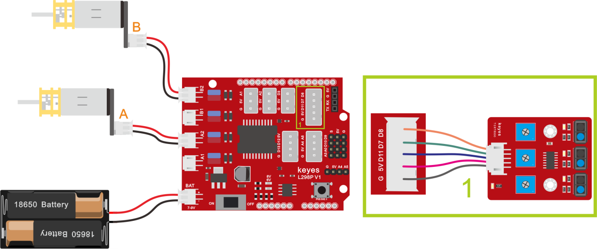

接线注意：用导线把循迹模块连接到电机驱动扩展板上P1接口的G、V、D11、D7、D8；A、B两电机分别对应的连接到电机驱动扩展板上的接口A和接口B，电源接到BAT接口。

测试代码： 

可以直接打开我们编写好的程序：

|文件路径|文件名|
|-|-|
|Scartch 教程\4.实验课程\第11课 循线小乌龟智能车\实验程序|11.sb3|

也可以自己拖动功能块编写程序：

在事件栏拖出Arduino启动

在变量类型栏拖出设置变量模块，分别设置L_val、M_val、R_val三个变量

在控制栏拖出重复执行模块

设置三个变量L_val、M_val、R_val分别赋值11、7、8脚读取的值

在控制栏拖出如果...否则模块，并判断M_val是否等于1

在控制栏拖出如果...否则模块，并判断L_val是否等于1且R_val是否等于0，满足条件则执行左转代码

在控制栏拖出如果...否则模块，并判断L_val是否等于0且R_val是否等于1，满足条件则执行右转代码，不满足条件执行前进代码

在控制栏拖出如果...否则模块，并判断L_val是否等于1且R_val是否等于0，满足条件则执行左转代码

在控制栏拖出如果...否则模块，并判断L_val是否等于0且R_val是否等于1，满足条件则执行右转代码，不满足条件执行停止代码

完整代码：

（5）测试结果： 

将驱动扩展板堆叠在UNO Plus板上，上传好代码，按照接线图接线，将拨码开关拨至ON端后，智能车能够沿着黑线行走。

### 第12课 超声波跟随小乌龟 

（1）项目介绍：

实验中，我们通过避障传感器检测智能车左右两方是否存在障碍物，检测智能车和前方障碍物的距离，然后根据这三个数据控制两个电机的转动，从而控制智能车的运动状态。

（2）流程图：

跟随智能车具体逻辑如下表格。

|检测|超声波测试前方物体距离|distance（单位：cm）|
|-|-|-|
|条件|distance<8||
|状态|后退（PWM设为100）||
|条件|8＜distance≤13||
|状态|停止||
|条件|13≤distance≤35并且l_val=1并且r_val=1||
|状态|前进（PWM设为100）||
|条件|distance＞35||
|状态|停止||

按照前面思路设计好智能车后，我们就需要按照设计思路开始制作智能车。我们需要设计对应的接线，测试代码，然后接线上传代码，运行，确保智能车能够实现理想中的功能。

（3）接线图：超声波模块+电机+点阵+舵机

接线注意：A、B两电机分别对应的连接电机驱动扩展板上的接口A和接口B；超声波传感器模块的V引脚至V，T（Trig）引脚至数字12(S)，E（Echo）引脚至数字13(S)，舵机接D10，电源接到BAT接口。

测试代码：

可以直接打开我们编写好的程序：

|文件路径|文件名|
|-|-|
|Scartch 教程\4.实验课程\第12课 超声波跟随小乌龟\实验程序|12.sb3|

也可以自己拖动功能块编写程序：

添加超声波传感器的代码块和舵机的代码块

在事件栏拖出Arduino启动模块

  
在舵机栏拖出设置舵机模块，并设置引脚为10，角度为90度，延时为200ms

声明一个全局变量，整形，变量名为distance，赋值为0

在控制栏拖出重复执行语句

将超声波感应的距离赋值给变量distance，超声波trig脚为12，echo为13

使用如果否则模块，单端distance是否大于13且小于35，如果是则执行前进代码

使用如果否则模块，单端distance是否大于8且小于13，如果是则执行停止代码

使用如果否则模块，单端distance小于8，如果是则执行后退代码，如果不是则执行停止代码

完整代码：

好了，
桌面迷你蓝牙智能车跟随功能效果的代码全部编写好了，上传程序，看看精彩的效果！（在上传程序前，需要把蓝牙模块取下，否则代码会上传失败。需要上传程序成功后，再连接蓝牙模块。）

（5）测试结果：

将驱动扩展板堆叠在UNO Plus板上，上传好代码，按照接线图接线，将拨码开关拨至ON端后，智能车能够随着前方障碍物的移动而移动。

### 第13课 走迷宫智能车 

（1）项目介绍： 

在上课程中，我们制作了一个跟随智能车。实际上，利用同样的电子元件，同样的接线方法，我们只需要更改一个测试代码就可以将跟随智能车变为避障智能车。

（2）流程图： 

避障智能车具体逻辑如下表格。

|检测|左边障碍物距离|distance_l（单位：cm）|
|-|-|-|
|右边障碍物距离|distance_r（单位：cm）||
|中间障碍物距离|distance（单位：cm）||
|条件|状态||
|0<distance<10|distance_l > distance_r 如果左边大于右边|向左转|
|distance_l<=distance_r 如果左边不大于右边|向右转||
|distance>=20|前进||

使用的电子元件，接线方法和课程四一样，更换测试代码，运行，确保智能车能够实
现理想中的功能。

接线图：超声波模块+电机+舵机+点阵 

接线注意：A、B两电机分别对应的连接电机驱动扩展板上的接口A和接口B；超声波传感器模块的V引脚至V，T（Trig）引脚至数字13(S)，E（Echo）引脚至数字12(S)，G引脚至G；舵机接D10；电源接到BAT接口。

测试程序 

|文件路径|文件名|
|-|-|
|Scartch 教程\4.实验课程\第13课 自动避障智能车\实验程序|13.sb3|

 

也可以自己拖动功能块编写程序：

先添加点阵、超声波、8\*8点阵

在事件栏拖出Arduino启动模块

在变量类型栏拖出声明全局变量模块定义distance、distance_R、distance_L三个变量

设置舵机初始化为90度

在点阵栏中拖出初始化点阵和显示心型

在控制栏拖出重复执行模块

将超声波的值赋值给distance

在控制栏拖出如果...否则模块，判断distance是否大于0且小于20

小车停止，延时100ms

舵机转向180度，延时500ms，然后将超声波的值赋值给distance_L,延时100ms

舵机转向0度，延时500ms，然后将超声波的值赋值给distance_R,延时100ms

在控制栏拖出如果...否则模块，判断distance_L是否大于distance_R，如果是则执行左转代码，延时300ms，舵机转回90度，

如果distance_L不大于distance_R那么执行右转代码，延时300ms，舵机转回90度，

如果以上条件都不满足则执行前进代码，点阵显示向前箭头

完整程序：

（6）测试结果 

将驱动扩展板堆叠在UNO Plus板上，上传好代码，按照课程接线图接线，将拨码开关拨至ON端后，智能车能够自动避开障碍物行走。

### 第14课 红外遥控智能车

（1）项目介绍： 

前面的学习中我们详细的介绍了智能车上各个传感器、模块、扩展板的使用方法。在这里我们可以再结合前面课程中知识制作一个红外控制智能车。在传感器项目第四课中，我们已经测试出红外遥控器各个按键对应的键值。实验中，我们可以通过代码设置（键值），让对应的按键控制智能车对应的运动状态。

（2）流程图： 

循迹智能车具体逻辑如下表格：

|按键：|键值：FF629D|状态：前进|
|-|-|-|
|按键：|键值：FFA857|状态：后退|
|按键：|键值：FF22DD|状态：左转|
|按键：|键值：FFC23D|状态：右转|
|按键：|键值：FF02FD|状态：停止|

按照前面思路设计好智能车后，我们就需要按照设计思路开始制作智能车。我们需要设计对应的接线，测试代码，然后接线上传代码，运行，确保智能车能够实现理想中的功能。

（3）接线图：电机+红外接收模块+点阵 

接线注意：由于红外接收传感器输入的数字信号，将红外接收传感器模块用导线连接到电机驱动扩展板上的G、V、A1，A、B两电机分别对应的连接到堆叠在UNO Plus板上的电机驱动扩展板上的接口A和接口B，点阵接IIC（A4、A5）接口，电源接到BAT接口。

（4）实验程序： 

可以直接打开我们编写好的程序：

|文件路径|文件名|
|-|-|
|Scartch 教程\4.实验课程\第14课 红外遥控智能车\实验程序|14.sb3|

也可以自己通过拖动代码块来编写代码程序，操作步骤如下：

先添加红外接收模块和点阵模块:

在事件栏拖出Arduino启动模块

在红外栏拖出舒适化红外接收模块，设置引脚为A1并通过串口打印出来，然后刷新接收数据。

初始化点阵并显示心型

在控制栏拖出重复执行模块

在控制栏拖出判断模块，判断是否有接收到红外遥控的数据

在控制栏拖出判断模块，并判断“读取红外数据”是否等于“16736925”如果是则执行小车前进代码，点阵显示前进箭头

在控制栏拖出判断模块，并判断“读取红外数据”是否等于“16754775”如果是则执行小车后退代码，点阵显示后退箭头

在控制栏拖出判断模块，并判断“读取红外数据”是否等于“16720605”如果是则执行小车左转代码，点阵显示左转箭头（由于左右箭头的代码块是按照点阵面向自己的方向做的，所以左右箭头在指示小车状态的时候刚好相反）

在控制栏拖出判断模块，并判断“读取红外数据”是否等于“16761405”如果是则执行小车右转代码，点阵显示右转箭头（由于左右箭头的代码块是按照点阵面向自己的方向做的，所以左右箭头在指示小车状态的时候刚好相反）

在控制栏拖出判断模块，并判断“读取红外数据”是否等于“16712445”如果是则执行小车停止代码，点阵显示“心型”

\*\*\*\*\*\*\*\*\*\*\*\*\*\*\*\*\*\*\*\*\*\*\*\*\*\*\*\*\*\*\*\*\*\*\*\*\*\*\*\*\*完整程序\*\*\*\*\*\*\*\*\*\*\*\*\*\*\*\*\*\*\*\*\*\*\*\*\*\*\*\*\*\*\*\*\*\*\*\*\*

好了，上传程序，红外遥控器对准红外接收器，按下红外遥控器对应按键，看看效果吧！（注意：在上传测试代码前，需要把蓝牙模块取下，否则测试代码会上传失败。需要上传代码成功后，再连接蓝牙模块。）

（6）测试结果： 

将驱动扩展板堆叠在UNO Plus板上，上传好代码，按照接线图接线，将拨码开关拨至ON端后，我们就能用红外遥控控制智能车运动了。

|按键：|键值：FF629D|状态：前进|
|-|-|-|
|按键：|键值：FFA857|状态：后退|
|按键：|键值：FF22DD|状态：左转|
|按键：|键值：FFC23D|状态：右转|
|按键：|键值：FF02FD|状态：停止|

### 第15课 蓝牙遥控智能车 

（1）项目介绍： 

前面课程中，我们利用红外控制智能车运动，在这课程中我们可以做一个蓝牙控制智能车。既然是控制智能车，那就有一个控制端和被控制端。课程中我们把手机当做控制端（主机），BT-24
蓝牙模块（从机）连接的智能车当做被控制端。使用时，我们需要在手机上安装一个APP，然后连接BT-24
蓝牙模块，然后我们利用蓝牙APP上各个按钮，控制智能车实现各种运动状态。

（2）流程图： 

先取下蓝牙模块，程序代码上传后，再连接蓝牙模块和打开串口监视器，设置波特率为9600。对准蓝牙模块按下手机APP按钮，我们可以看到APP按钮对应的控制字符，如下图。

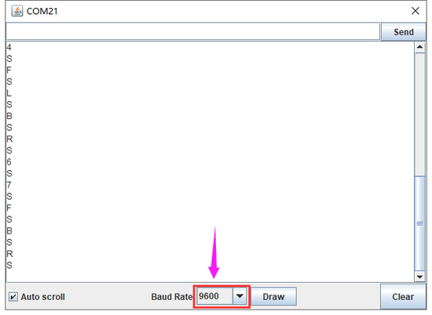

经过测试，我们得出了手机APP上各个按钮对应的控制字符和各个按钮对应的功能，这里我们整理了一个表格如下：

|按钮:|功能：配对连接BT24蓝牙模块||
|-|-|-|
|按钮:|功能：进入蓝牙控制界面||
|按钮:|功能：断开蓝牙连接||
|按钮:|控制字符：按下：F；松开：S|功能：按下，小车前进；松开就停止|
|按钮:|控制字符：按下：B；松开：S|功能：按下，小车后退；松开就停止|
|按钮:|控制字符：按下：L；松开：S|功能：按下，小车左旋转；松开就停止|
|按钮:|控制字符：按下：R；松开：S|功能：按下，小车右旋转；松开就停止|
|按钮:|控制字符： 点击发送：S|功能：小车停止，停止所有功能|
|按钮:|控制字符：|功能：点击一下开启手机方向感应控制，再点击一下退出方向感应控制|
|按钮:|控制字符： 点击发送：U|功能：开启避障功能，点击退出|
|按钮:|控制字符： 点击发送：X|功能：开启循线功能，点击退出|
|按钮:|控制字符： 点击发送：Y|功能：开启超声波跟随功能，点击退出|

（4）接线图：蓝牙+电机+点阵 

接线注意：
蓝牙模块的RXD、TXD、GND、VCC分别对应的接到电机驱动扩展板上的TX、RX、-（GND）、+（VCC），而蓝牙模块的STATE和BRK两引脚不需要接，电源接到BAT接口。

1.  B两电机分别对应的连接到电机驱动扩展板上的接口A和接口B；蓝牙模块的RXD、TXD、GND、VCC分别对应的接到电机驱动扩展板上的TX、RX、-（GND）、+（VCC），而蓝牙模块的STATE和BRK两引脚不需要接，点阵接IIC（A4、A5）接口，电源接到BAT接口。

实验代码： 

|文件路径|文件名|
|-|-|
|Scartch 教程\4.实验课程\第15课 蓝牙遥控智能车\实验程序|15.sb3|

在事件栏拖出Arduino启动模块

在串口栏拖出设置串口波特率为9600

在变量类型栏拖出声明全局变量，整形，变量名为bluetooth_val，赋值0

在点阵栏中拖出初始化点阵并显示 “笑脸”

在控制栏拖出重复执行模块

在控制栏拖出判断模块，判断可读取字节数大于0

将串口读取数字赋给bluetooth_val

在控制栏拖出判断语句，判断“Bluetooth_val”是否等于“70”如果是则执行前进代码

在控制栏拖出判断语句，判断“Bluetooth_val”是否等于“66”如果是则执行后退代码

在控制栏拖出判断语句，判断“Bluetooth_val”是否等于“76”如果是则执行左转代码

在控制栏拖出判断语句，判断“Bluetooth_val”是否等于“82”如果是则执行右转代码

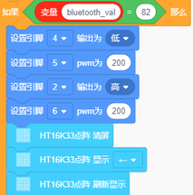

在控制栏拖出判断语句，判断“Bluetooth_val”是否等于“83”如果是则执行停止代码

\*\*\*\*\*\*\*\*\*\*\*\*\*\*\*\*\*\*\*\*\*\*\*\*\*\*\*\*\*\*\*\*\*\*完整程序\*\*\*\*\*\*\*\*\*\*\*\*\*\*\*\*\*\*\*\*\*\*\*\*\*\*

好了，按住蓝牙APP的前进、后退、左转弯、右转弯、停止、左旋转、右旋转的按钮控制桌面迷你蓝牙智能车分别前进、后退、左转弯、右转弯、停止、左旋转、右旋转的程序代码全编写完了。上传程序，看看效果。（在上传测试代码前，需要把蓝牙模块取下，否则代码会上传失败。需要上传代码成功后，再连接蓝牙模块。）

（7）测试结果： 

将驱动扩展板堆叠在UNO Plus板上，上传好代码，按照接线图接线，将拨码开关拨至ON端后，手机APP连接蓝牙成功后，我们就能用手机APP控制智能车运动了。

按下按钮，小车前进；按下按钮，小车后退；按下按钮，小车左旋转；按下按钮，小车右旋转；点击按钮，小车停止；点击一下按钮，开启手机方向感应控制，再点击一下按钮，退出方向感应控制。

### 第16课 多功能乌龟小车 

（1）项目介绍： 

在前面课程中，我们只是让智能车实现单个功能，那我们能不能把所有功能合在一起呢？能，在这一课程中，我们利用一个代码测试智能车，智能车包含前面课程中讲到的所有功能，我们利用手机蓝牙APP上按钮自动切换各种功能,简单方便。

（2）流程图： 

按照前面思路设计好智能车后，我们就需要按照设计思路开始制作智能车。我们需要设计对应的接线，测试代码，然后接线上传代码，运行，确保智能车能够实现理想中的功能。

（3）接线图： 

接线注意：

循迹模块连接到电机驱动扩展板上P1接口的G、V、D11、D7、D8；

超声波传感器模块的VCC引脚连接至连接到电机驱动扩展板上，V引脚至V，T（Trig）引脚至数字12(S)，E（Echo）引脚至数字13(S)，G引脚至G；

舵机连接到电机驱动扩展板上的接口（G、V、D10），

红外接收传感器模块用导线连接到电机驱动扩展板上的G、V、A1；A、B两电机分别对应的连接到电机驱动扩展板上的接口A和接口B；

LED点阵模块G、V、CDA、SCL引脚分别对应的连接到电机驱动扩展板上的G（GND）、5V、A4、A5（S）；

蓝牙模块的RXD、TXD、GND、VCC分别对应的接到电机驱动扩展板上的TX、RX、-（GND）、+（VCC），而蓝牙模块的STATE和BRK两引脚不需要接，电源接到BAT接口。

实验程序： 

实验程序较长这里就不做说明了，可以直接打开我们的编写好的程序，文件目录如下：

|文件路径|文件名|
|-|-|
|Scartch 教程\4.实验课程\第16课 多功能乌龟小车\实验程序|16.sb3|

好了，蓝牙多功能控制智能车的程序都已经编写好了，上传程序，实际操作下看看效果。（在上传程序代码前，需要把蓝牙模块取下，否则代码会上传失败。需要上传代码成功后，再连接蓝牙模块。）

（5）测试结果： 

将驱动扩展板堆叠在UNO Plus板上，上传好代码，按照接线图接线，将拨码开关拨至ON端后，手机APP连接蓝牙成功后，我们就能用手机APP控制智能车运动了。我们可以通过按下对应按钮实现对应功能，通过停止钮来停止功能,点击会退出APP。

|按钮:|功能：配对连接BT-24蓝牙模块||
|-|-|-|
|按钮:|功能：进入蓝牙控制界面||
|按钮:|功能：断开蓝牙连接||
|按钮:|控制字符：按下：F；松开：S|功能：按下，小车前进；松开就停止|
|按钮:|控制字符：按下：B；松开：S|功能：按下，小车后退；松开就停止|
|按钮:|控制字符：按下：L；松开：S|功能：按下，小车左旋转；松开就停止|
|按钮:|控制字符：按下：R；松开：S|功能：按下，小车右旋转；松开就停止|
|按钮:|控制字符： 点击发送：S|功能：小车停止，停止所有功能|
|按钮:|控制字符：|功能：点击一下开启手机方向感应控制，再点击一下退出方向感应控制|
|按钮:|控制字符： 点击发送：U|功能：开启避障功能，点击退出|
|按钮:|控制字符： 点击发送：X|功能：开启循线功能，点击退出|
|按钮:|控制字符： 点击发送：Y|功能：开启超声波跟随功能，点击退出|

