# 多功能小乌龟智能车安装

安装1

安装所需零件

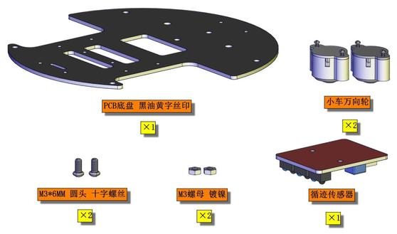

安装（丝印A,B字母朝上）

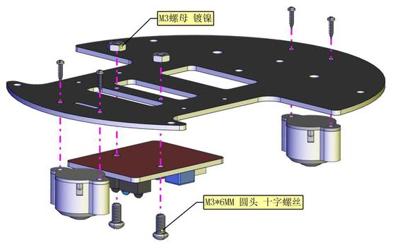

完成


安装2

安装所需零件

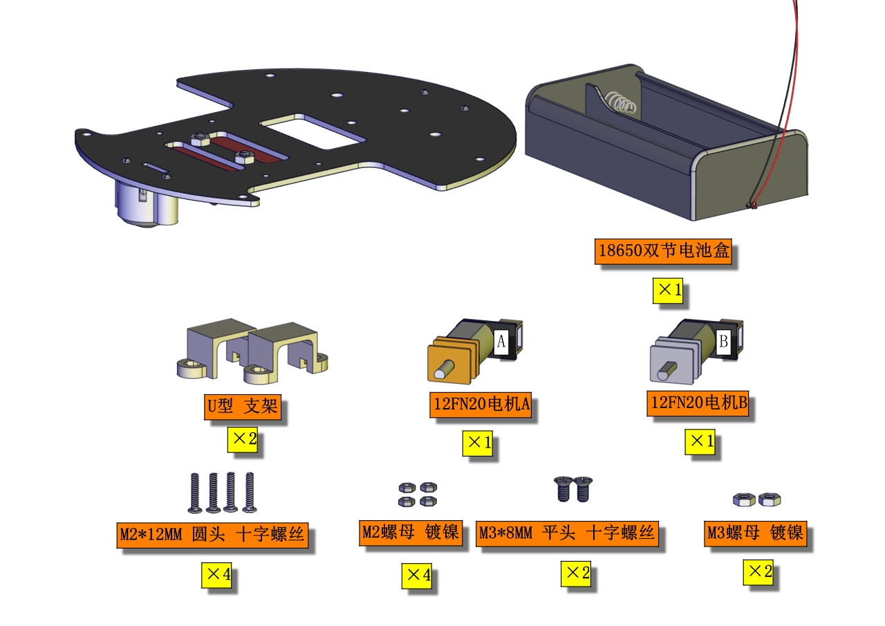

安装（注意电机对应位置）


完成 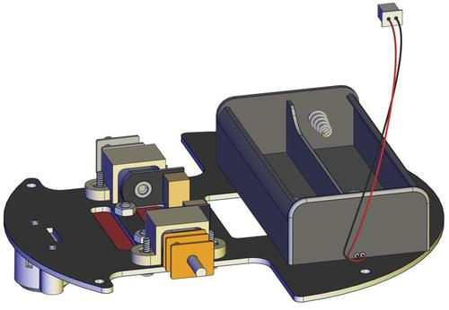
安装3

安装所需零件 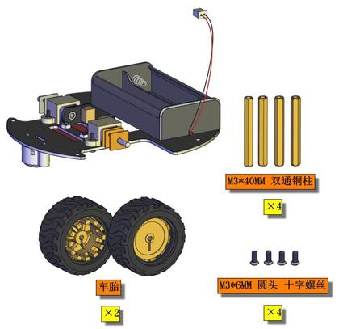

安装 

完成

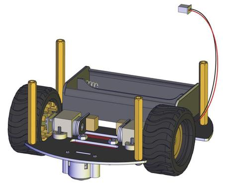

安装完后需先给A，B电机插线


循迹传感器插线


安装4

安装所需零件


安装 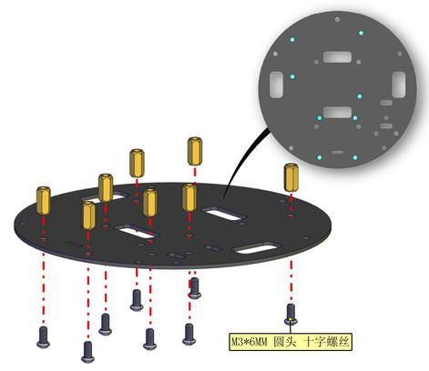

完成

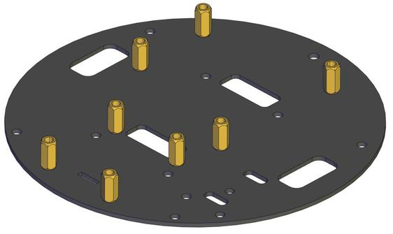

安装5

安装所需零件


**重要：安装前需要将舵机的角度初始化为90度**，操作如下：把舵机接到驱动板的10号引脚后叠加到PULS控制板上如下图

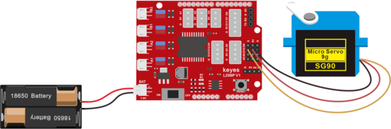

上传程序

(1)Arduino ide 教程：复制下面的程序或者打开资料下的servo程序

```c
#define servoPin 10  //舵机接数字口10
int pos; //舵机的角度变量
int pulsewidth; //舵机的脉宽变量
void setup() {
  pinMode(servoPin, OUTPUT);  //舵机引脚设置为输出
  procedure(90); //设置舵机的角度为90度
}
void loop() {
   procedure(90);              // 转动到pos角度
}
//控制舵机的函数
void procedure(int myangle) {
  pulsewidth = myangle * 11 + 500;  //计算出脉宽值
  digitalWrite(servoPin, HIGH);
  delayMicroseconds(pulsewidth);   //高电平持续的时间，就是脉宽
  digitalWrite(servoPin, LOW);
  delay((20 - pulsewidth / 1000));  //周期是20ms，所以低电平持续剩下的时间
}
```

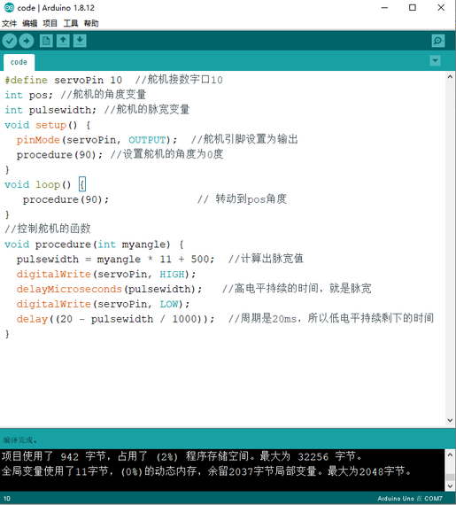

开发板连接好电脑，选择好开发板和串口，点击上传程序，程序上传成功后舵机自动转到90度的位置

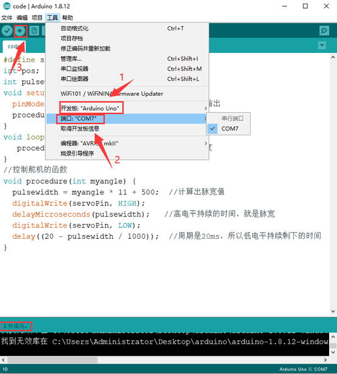

(2)Mixly教程：

我们先导入KEYES智能小车 mixly库文件

打开米思奇软件，点击设置----\>导入库


点击本地导入


选择我们文件里提供的keyes智能小车文件，这样米思奇库文件就导入完成了。

随后找到并拖出智能小乌龟栏里的舵机，设置舵机90


把控制板连接好电脑，选择好开发板(Arduino uno)和串口，点击上传，程序上传成功后舵机自动转到90度的位置


（3）Scartch教程：

打开资料下的舵机复位程序

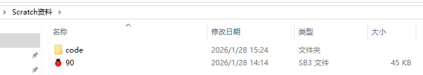

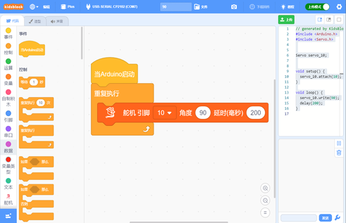

开发板连接好电脑，选择好开发板和串口，点击上传程序，程序上传成功后舵机自动转到90度的位置


舵机复位成90°后可继续往下操作

分步安装1

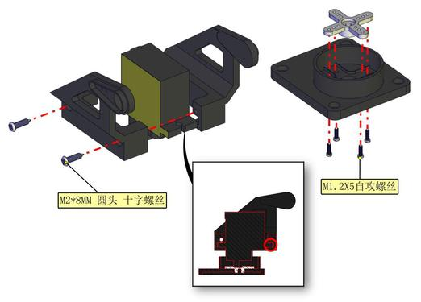

分步安装2（安装时需要安图所示90°朝前安装）

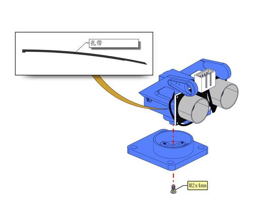

完成

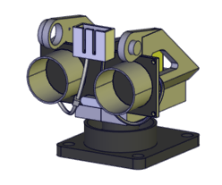

安装6

安装所需零件

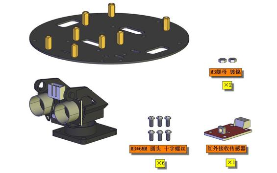

安装

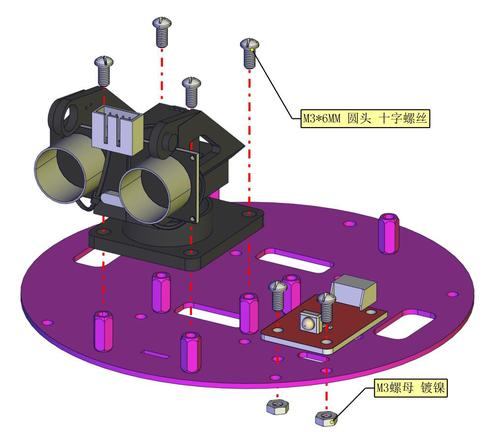

完成

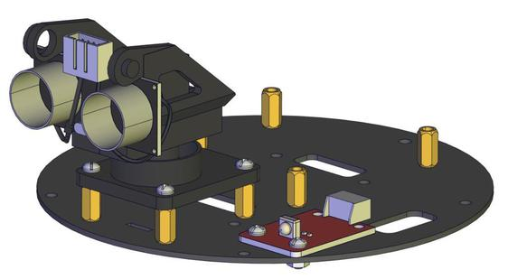

安装7

安装所需零件

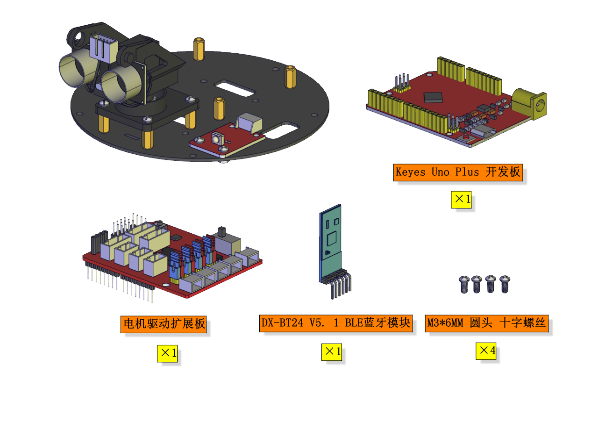

安装

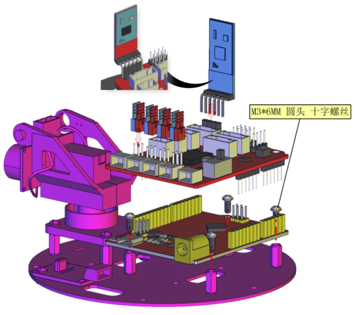

完成

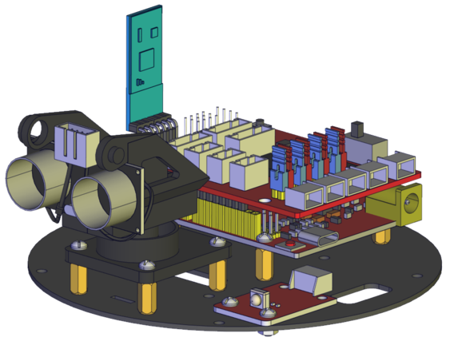

安装8

安装所需零件

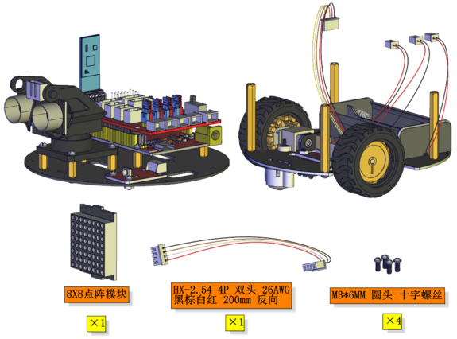

安装（安装前先按图穿线）


完成

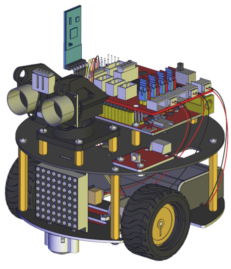

安装部分完成后进行接线

电机A接线图

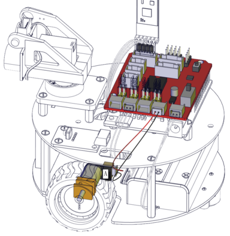

电机B接线图

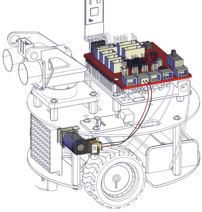

循迹传感器接线图


超声波接线图


点阵接线图

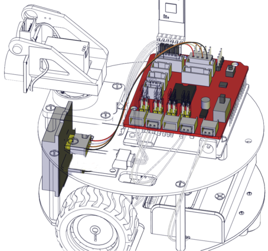

舵机接线图


红外接收传感器接线图

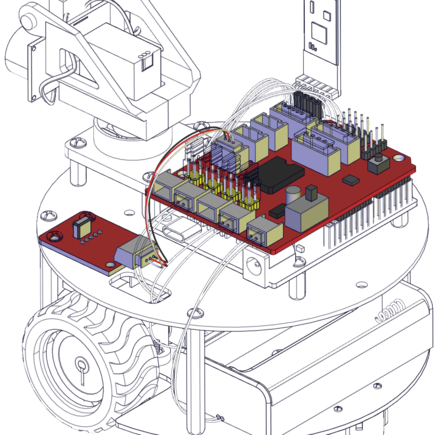

电池盒接线图


完成渲染效果图

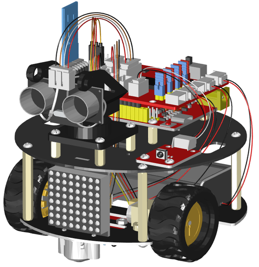

