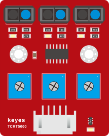

多功能小乌龟智能小车

# 多功能小乌龟智能车简介

提及编程，很多人都会觉得是一件令人非常头疼的事情。然而，KEYES团队推出的智能小乌龟编程机器人，可以让孩子们轻松学习编程。是的，你没有听错，这款小乌龟机器人可以让你的孩子获得有关编程，电子，机械，控制逻辑和计算机科学的实践知识。

智能小乌龟机器人是一款经济实惠，易于操控和开源的机器人。他的安装和接线也十分简单，组件都通过螺钉和铜柱连接，只需要几个简单的组装步骤来构建自己的机器人，然后全面了解怎么编程去控制循迹传感器，超声波传感器，蓝牙模块，电机驱动模块等这些基础的电子部件，直到完成复杂的机器人项目。我们设置了十个机器人课程，由简单到复杂，一步一步，和大家一起学习编程。

智能小乌龟编程机器人，除了常用的循迹，避障，跟踪，红外遥控，重力控制，蓝牙遥控等功能外，还添加了一个8\*8点阵屏，您可以自己给小乌龟机器人DIY可爱的面部表情，如果您认为这还不够，你还可以通过修改代码自己拓展一些项目，或者也可以添加其他传感器，丰富小乌龟的功能，完成您的奇妙探索旅程。

# 多功能小乌龟智能车特点

1.功能多多：避障功能，跟随功能，红外遥控，蓝牙控制，循迹功能，显示面部表情等。

2.组装简单：无需焊接电路，只需几个简单的步骤即可组装该机器人。

3.结构坚固：构成车体的部分是优质亚克力材质，电机用是优质的N20金属电机。

4.扩展性强：配置了电机驱动扩展板，可以扩展其他的传感器和模块。

5.多种控制：红外遥控器控制，手机遥控控制（苹果和安卓手机都可）。

6.学习基础编程：使用Arduino IDE的C语言编程，可以接触底层代码。

# 多功能小乌龟智能车参数

工作电压：5v

输入电压：7-12V

最大输出电流：2A

最大耗散功率：25W（T=75℃）

电机转速：5V 63 rpm / min

电机驱动形式：双路H桥驱动

超声波感应角度：\<15度

超声波探测距离：2cm-400cm

红外遥控距离：3米

蓝牙遥控距离：空旷无干扰环境下最大40米

蓝牙APP控制：支持Android和IOS系统

7.可接入外部DC 7~12V的电压。

# 多功能小乌龟智能车清单

当收到这个智能车套件的时候，首先看到是一个包装精美的外盒，每个配件被安全且有序的装在外盒里面的小盒子里，先来清点一下：

|序号|规格|数量|图片|
|-|-|-|-|
|1|keyestudio 乌龟车用8X8点阵模块 黑色 环保|1||
|2|Keyes Uno Plus 开发板 红色环保|1||
|3|Keyes brick L298P 电机驱动扩展板 V1|1||
|4|keyes brick 红外接收传感器|1||
|5|Keyes connectors 循迹传感器|1||
|6|Keyestudio quick connectors 12FN20电机连接板A|1||
|7|Keyestudio quick connectors 12FN20电机连接板B|1||
|8|Keyestudio Smart small turle robot V2.0 底盘黑油黄字丝印，直径120mm，板厚1.6mm|1||
|9|Keyestudio Smart small turle robot V2.0 顶盘黑油黄字丝印，直径120mm，板厚1.6mm|1||
|10|HC-SR04超声波传感器|1||
|11|DX-BT24 V5. 1 BLE蓝牙模块|1||
|12|母对母20CM/40P/2.54/10股铜包铝 24号线BL 环保|0.1||
|13|XH2.54转PH2.0 5P 黑红棕白黄 200mm 反向|1||
|14|HX-2.54 4P 双头 26AWG 黑棕白红 200mm 反向|2||
|15|HX-2.54 3P 双头 26AWG 黑红白 100mm 同向|1||
|16|双头JST-PH2.0MM-2P 正反 24AWG 红黑线 160mm|2||
|17|18650双节15CM露线适用DIY小车+双头PH2.0MM-2P 红黑线(总线长115MM)|1||
|18|4节5号带线15CM 4排小孔+双头JST-PH2.0MM-2P 红黑线(总线长115MM)环保|1||
|19|M2*12MM 圆头 十字|4||
|20|M2 镀镍|6||
|21|M3*6MM 圆头|30||
|22|M3*8MM 平头|3||
|23|M3 镀镍|8||
|24|双通M3*40MM|4||
|25|双通M3*10MM|8||
|26|云台支架（黑色）配套 固定孔3MM|1||
|27|SG90 9G 23*12.2*29mm 蓝色 辉盛 180度 环保|1||
|28|直径：43mm 宽度：19mm 孔径：3mm D型孔 ABS塑料+橡胶 黄色|2||
|29|N20电机 白色短 U型 支架 塑胶|2||
|30|3*40MM 红黑色 十字螺丝刀|1||
|31|USB2.0对TYPE C 白色 L:1M OD：4.0MM|1||
|32|Arduino 3PI miniQ小车万向球 304不锈钢 W22*H15MM 孔距15MM|2||
|33|JMP-1 17键86*40*6.5MM|1||
|34|keyes 草帽LED白发红模块|1||
|35|3Pin 双母头杜邦线 长20CM 2.54mm|1||
|36|黑色 扎带 3*100MM|5||

