多功能小乌龟智能小车

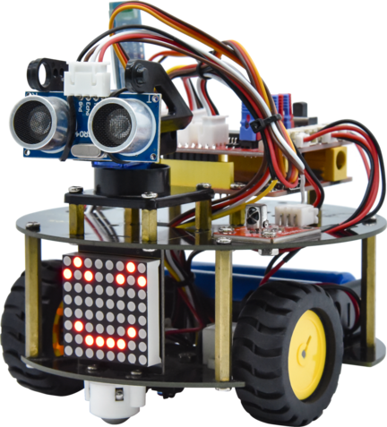

多功能小乌龟智能车简介
======================

提及编程，很多人都会觉得是一件令人非常头疼的事情。然而，KEYES团队推出的智能小乌龟编程机器人，可以让孩子们轻松学习编程。是的，你没有听错，这款小乌龟机器人可以让你的孩子获得有关编程，电子，机械，控制逻辑和计算机科学的实践知识。

智能小乌龟机器人是一款经济实惠，易于操控和开源的机器人。他的安装和接线也十分简单，组件都通过螺钉和铜柱连接，只需要几个简单的组装步骤来构建自己的机器人，然后全面了解怎么编程去控制循迹传感器，超声波传感器，蓝牙模块，电机驱动模块等这些基础的电子部件，直到完成复杂的机器人项目。我们设置了十个机器人课程，由简单到复杂，一步一步，和大家一起学习编程。

智能小乌龟编程机器人，除了常用的循迹，避障，跟踪，红外遥控，重力控制，蓝牙遥控等功能外，还添加了一个8*8点阵屏，您可以自己给小乌龟机器人DIY可爱的面部表情，如果您认为这还不够，你还可以通过修改代码自己拓展一些项目，或者也可以添加其他传感器，丰富小乌龟的功能，完成您的奇妙探索旅程。

多功能小乌龟智能车特点
======================

1.功能多多：避障功能，跟随功能，红外遥控，蓝牙控制，循迹功能，显示面部表情等。

2.组装简单：无需焊接电路，只需几个简单的步骤即可组装该机器人。

3.结构坚固：构成车体的部分是优质亚克力材质，电机用是优质的N20金属电机。

4.扩展性强：配置了电机驱动扩展板，可以扩展其他的传感器和模块。

5.多种控制：红外遥控器控制，手机遥控控制（苹果和安卓手机都可）。

6.学习基础编程：使用Arduino IDE的C语言编程，可以接触底层代码。

多功能小乌龟智能车参数
======================

工作电压：5v

输入电压：7-12V

最大输出电流：2A

最大耗散功率：25W（T=75℃）

电机转速：5V 63 rpm / min

电机驱动形式：双路H桥驱动

超声波感应角度：<15度

超声波探测距离：2cm-400cm

红外遥控距离：3米

蓝牙遥控距离：空旷无干扰环境下最大40米

蓝牙APP控制：支持Android和IOS系统

7.可接入外部DC 7~12V的电压。

多功能小乌龟智能车清单
======================

当收到这个智能车套件的时候，首先看到是一个包装精美的外盒，每个配件被安全且有序的装在外盒里面的小盒子里，先来清点一下：

+-----------------+-----------------+-----------------+-----------------+
| 序号            | 规格            | 数量            | 图片            |
+=================+=================+=================+=================+
| 1               | keyes           | 1               | |image1|        |
|                 | 乌龟            |                 |                 |
|                 | 车用8X8点阵模块 |                 |                 |
|                 | 黑色 环保       |                 |                 |
+-----------------+-----------------+-----------------+-----------------+
| 2               | Keyes Uno Plus  | 1               | |image2|        |
|                 | 开发板 红色环保 |                 |                 |
+-----------------+-----------------+-----------------+-----------------+
| 3               | Keyes brick     | 1               | |image3|        |
|                 | L298P           |                 |                 |
|                 | 电机驱动扩展板  |                 |                 |
|                 | V1              |                 |                 |
+-----------------+-----------------+-----------------+-----------------+
| 4               | keyes brick     | 1               | |image4|        |
|                 | 红外接收传感器  |                 |                 |
+-----------------+-----------------+-----------------+-----------------+
| 5               | Keyes           | 1               | |image5|        |
|                 | connectors      |                 |                 |
|                 | 循迹传感器      |                 |                 |
+-----------------+-----------------+-----------------+-----------------+
| 6               | keyes quick     | 1               | |image6|        |
|                 | connectors      |                 |                 |
|                 | 12              |                 |                 |
|                 | FN20电机连接板A |                 |                 |
+-----------------+-----------------+-----------------+-----------------+
| 7               | keyes quick     | 1               | |image7|        |
|                 | connectors      |                 |                 |
|                 | 12              |                 |                 |
|                 | FN20电机连接板B |                 |                 |
+-----------------+-----------------+-----------------+-----------------+
| 8               | keyes Smart     | 1               | |image8|        |
|                 | small turle     |                 |                 |
|                 | robot V2.0      |                 |                 |
|                 | 底盘黑油        |                 |                 |
|                 | 黄字丝印，直径1 |                 |                 |
|                 | 20mm，板厚1.6mm |                 |                 |
+-----------------+-----------------+-----------------+-----------------+
| 9               | keyes Smart     | 1               | |image9|        |
|                 | small turle     |                 |                 |
|                 | robot V2.0      |                 |                 |
|                 | 顶盘黑油        |                 |                 |
|                 | 黄字丝印，直径1 |                 |                 |
|                 | 20mm，板厚1.6mm |                 |                 |
+-----------------+-----------------+-----------------+-----------------+
| 10              | HC-S            | 1               | |image10|       |
|                 | R04超声波传感器 |                 |                 |
+-----------------+-----------------+-----------------+-----------------+
| 11              | DX-BT24 V5. 1   | 1               | |image11|       |
|                 | BLE蓝牙模块     |                 |                 |
+-----------------+-----------------+-----------------+-----------------+
| 12              | 母对母20CM/40P/ | 0.1             | |image12|       |
|                 | 2.54/10股铜包铝 |                 |                 |
|                 | 24号线BL 环保   |                 |                 |
+-----------------+-----------------+-----------------+-----------------+
| 13              | XH2.54转PH2.0   | 1               | |image13|       |
|                 | 5P 黑红棕白黄   |                 |                 |
|                 | 200mm 反向      |                 |                 |
+-----------------+-----------------+-----------------+-----------------+
| 14              | HX-2.54 4P 双头 | 2               | |image14|       |
|                 | 26AWG 黑棕白红  |                 |                 |
|                 | 200mm 反向      |                 |                 |
+-----------------+-----------------+-----------------+-----------------+
| 15              | HX-2.54 3P 双头 | 1               | |image15|       |
|                 | 26AWG 黑红白    |                 |                 |
|                 | 100mm 同向      |                 |                 |
+-----------------+-----------------+-----------------+-----------------+
| 16              | 双头            | 2               | |image16|       |
|                 | JST-PH2.0MM-2P  |                 |                 |
|                 | 正反 24AWG      |                 |                 |
|                 | 红黑线 160mm    |                 |                 |
+-----------------+-----------------+-----------------+-----------------+
| 17              | 18650双节15CM   | 1               | |image17|       |
|                 | 露线适用DIY小车 |                 |                 |
|                 | +双头PH2.0MM-2P |                 |                 |
|                 | 红黑            |                 |                 |
|                 | 线(总线长115MM) |                 |                 |
+-----------------+-----------------+-----------------+-----------------+
| 18              | 4节5号带线15CM  | 1               | |image18|       |
|                 | 4排小孔+双头    |                 |                 |
|                 | JST-PH2.0MM-2P  |                 |                 |
|                 | 红黑线(总       |                 |                 |
|                 | 线长115MM)环保  |                 |                 |
+-----------------+-----------------+-----------------+-----------------+
| 19              | M2*12MM 圆头    | 4               | |image19|       |
|                 | 十字            |                 |                 |
+-----------------+-----------------+-----------------+-----------------+
| 20              | M2 镀镍         | 6               | |image20|       |
+-----------------+-----------------+-----------------+-----------------+
| 21              | M3*6MM 圆头     | 30              | |image21|       |
+-----------------+-----------------+-----------------+-----------------+
| 22              | M3*8MM 平头     | 3               | |image22|       |
+-----------------+-----------------+-----------------+-----------------+
| 23              | M3 镀镍         | 8               | |image23|       |
+-----------------+-----------------+-----------------+-----------------+
| 24              | 双通M3*40MM     | 4               | |image24|       |
+-----------------+-----------------+-----------------+-----------------+
| 25              | 双通M3*10MM     | 8               | |image25|       |
+-----------------+-----------------+-----------------+-----------------+
| 26              | 云台支          | 1               | |image26|       |
|                 | 架（黑色）配套  |                 |                 |
|                 | 固定孔3MM       |                 |                 |
+-----------------+-----------------+-----------------+-----------------+
| 27              | SG90 9G         | 1               | |image27|       |
|                 | 2               |                 |                 |
|                 | 3\ *12.2*\ 29mm |                 |                 |
|                 | 蓝色 辉盛 180度 |                 |                 |
|                 | 环保            |                 |                 |
+-----------------+-----------------+-----------------+-----------------+
| 28              | 直径：43mm      | 2               | |image28|       |
|                 | 宽度：19mm      |                 |                 |
|                 | 孔径：3mm D型孔 |                 |                 |
|                 | ABS塑料+橡胶    |                 |                 |
|                 | 黄色            |                 |                 |
+-----------------+-----------------+-----------------+-----------------+
| 29              | N20电机 白色短  | 2               | |image29|       |
|                 | U型 支架 塑胶   |                 |                 |
+-----------------+-----------------+-----------------+-----------------+
| 30              | 3*40MM 红黑色   | 1               | |image30|       |
|                 | 十字螺丝刀      |                 |                 |
+-----------------+-----------------+-----------------+-----------------+
| 31              | USB2.0对TYPE C  | 1               | |image31|       |
|                 | 白色 L:1M       |                 |                 |
|                 | OD：4.0MM       |                 |                 |
+-----------------+-----------------+-----------------+-----------------+
| 32              | Arduino 3PI     | 2               | |image32|       |
|                 | miniQ小车万向球 |                 |                 |
|                 | 304不锈钢       |                 |                 |
|                 | W22*H15MM       |                 |                 |
|                 | 孔距15MM        |                 |                 |
+-----------------+-----------------+-----------------+-----------------+
| 33              | JMP-1           | 1               | |image33|       |
|                 | 17键            |                 |                 |
|                 | 86\ *40*\ 6.5MM |                 |                 |
+-----------------+-----------------+-----------------+-----------------+
| 34              | keyes           | 1               | |image34|       |
|                 | 草              |                 |                 |
|                 | 帽LED白发红模块 |                 |                 |
+-----------------+-----------------+-----------------+-----------------+
| 35              | 3Pin            | 1               | |image35|       |
|                 | 双母头杜邦线    |                 |                 |
|                 | 长20CM 2.54mm   |                 |                 |
+-----------------+-----------------+-----------------+-----------------+
| 36              | 黑色 扎带       | 5               | |image36|       |
|                 | 3*100MM         |                 |                 |
+-----------------+-----------------+-----------------+-----------------+

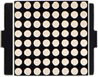
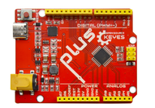
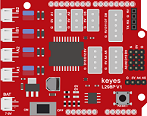
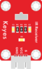
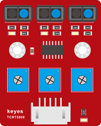

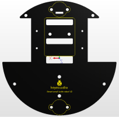
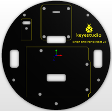
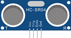
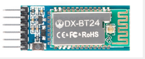
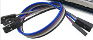
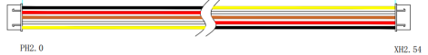

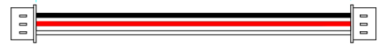
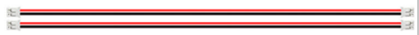
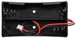
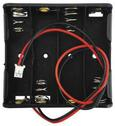
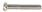

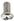
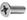

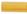
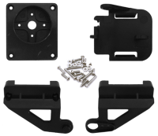
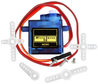
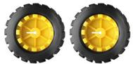
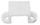
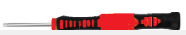
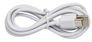
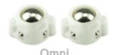

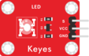
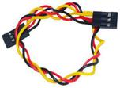
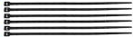
